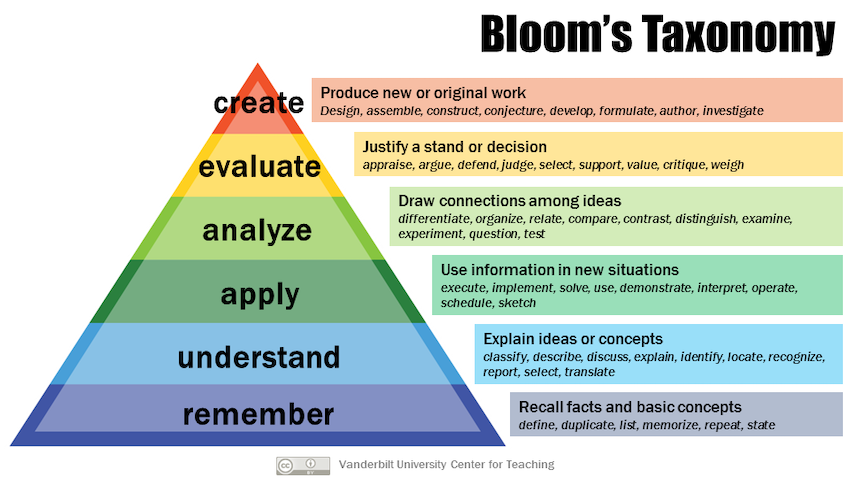

# Biostatistics and Machine Learning Lesson Hackathon

Working repo for the ELIXIR lesson hackathon on Machine Learning and Biostatistics

## Hackathon Leads

_in alphabetical order_

1. Shakuntala Baichoo (University of Mauritius, H3ABioNet)
2. Alexandros Dimopoulos (Institute for Fundamental Biomedical Science, BSRC Al. Fleming / ELIXIR - GR)
3. Wandrille Duchemin
4. Van Du T. Tran (Vital-IT, SIB Swiss Institute of Bioinformatics)
5. Pedro L. Fernandes
6. Alireza Khanteymoori
7. Anmol Kiran (Malawi-Liverpool-Wellcome Trust, H3ABionet)
8. Claudio Mirabello (Linköping University, NBIS)
9. Fotis Psomopoulos (Institute of Applied Biosciences, Centre for Research and Technology Hellas / ELIXIR-GR)
10. Bengt Sennblad (Uppsala University, NBIS)

## Timeline

| Time | Scope |
|------|-------|
| Before day #1 of Hackathon | Setup GitHub repo:   - CC-BY license   - Lesson to be published in zenodo   - Leads as "lesson" editors   - All contributors as co-authors    Lesson Preparation:   - Collate material from similar/relevant events   - Provide examples of Learning Objectives, Learning Outcomes and Learning Profiles    Outreach & Engagement:   - Date to be communicated to the ELIXIR Training Coordinators mailing list, the ELIXIR Machine Learning Focus Group mailing list, H3ABioNet, etc |
|  **Day #1 of Hackathon**   | Goals are:   - Specify learners’ profiles (i.e. target audience)   - Specify Learning objectives and,   - Specify Learning outcomes   Near the end of the day, decide on the date of Day #2  |
| Before day #2 of Hackaton | - Reformat / Restructure all notes   - Create a skeleton structure of the material (pending approval) |
|  **Day #2 of Hackathon** | Goals are:   - confirm structure and flow of the content   - Sprepare the first set of hands-on exercises that target specific learning outcomes (one or more)   - Identify potential timeline for final release |

## Day #1

- Connection details: https://us02web.zoom.us/j/81069686116?pwd=dFdRVkVSeEk0RW81M1NvWXIwUmVQQT09
- Collaborative notes: https://hackmd.io/R0w6bcWTTBGiCEGoym7M4w

## Resources

- [12 Decisions to run an online Hackathon](https://hackathon-planning-kit.org/)
- [Collaborative note-taking using HackMD](https://hackmd.io/)

## Existing material

_@all: feel free to add related content you are already aware of here:_

_content should be open (i.e. under CC license), and practical (i.e. hands-on exercises, rather than slides)_

1. [SIB "Introduction to Machine Learning" course](https://fpsom.github.io/2020-07-machine-learning-sib/)
  - **Notes**: Practical ML using R. Introductory level. Requires programming knowledge in R (`dplyr, tidyverse`). Covers Exploratory Data Analysis, k-means, hierarchical clustering, decision trees, random forests, linear regression, glm

2. [BC2 Introduction to Machine Learning](https://fpsom.github.io/IntroToMachineLearning/)
  - **Notes**: Practical ML using R. Introductory level. Requires programming knowledge in R (`dplyr, tidyverse`). Covers Exploratory Data Analysis, k-means, hierarchical clustering, decision trees, random forests, linear regression, glm

3. [Galaxy Training Material on Statistics and machine learning](https://training.galaxyproject.org/training-material/topics/statistics/)
  - **Notes**: Practical ML using Galaxy. Covers a wide range of topics (Supervised, Unsupervised, Regression, Classification, Deep Learning). Does not offer any coding aspects.

4. [Cambridge Coding Academy GitHub repo](https://github.com/cambridgecoding)  ([Cambridge Coding Academy website](https://cambridgecoding.com/))
  - **Notes**:

5. [Cambridge bioinformatics training GitHub repo](https://github.com/cambiotraining)  ([Cambridge Coding Academy website](http://cambiotraining.github.io/))
  - **Notes**: Contains various relevant courses that can be re-used / adapted [Course materials for An Introduction to Machine Learning 2019](https://bioinformatics-training.github.io/intro-machine-learning-2019/), [Basic statistics and data handling](https://github.com/cambiotraining/stats-intro)
  
6. [esci web dances](https://www.esci-dances.thenewstatistics.com/?s=09)
  
7. [seeing theory](https://seeing-theory.brown.edu/frequentist-inference/index.html?s=09#section2)

8. [Introduction to Probability and Statistics for Engineers](https://stanford.edu/~shervine/teaching/cme-106/)

9. [NBIS Workshop in Biostatistics and Machine Learning](https://github.com/NBISweden/workshop-mlbiostatistics)
  - **Notes**: Contains the teaching material (lectures/tutorials/labs) for the different course sessions, see [link to course info and schedule](https://nbisweden.github.io/workshop-mlbiostatistics/) for how these sessions are structured in the course. This workshop will be given in November 2020 and material above is in the process of being updated from the 2019 workshop and reformatted into a common format, in other words *Work in progress*. 

10. [NBIS Workshop in Omics Integration](https://github.com/NBISweden/workshop_omics_integration)
  - **Notes**: Contains the teaching material (lectures/tutorials/labs) for the different course sessions, see [link to course info and schedule](https://nbisweden.github.io/workshop_omics_integration/) for how these sessions are structured in the course. This workshop is currently being given (October 2020) and material above is still being updated, in other words *Work in progress*
  
## Lesson templates

1. [The Turing Way](https://the-turing-way.netlify.app/)
 - **Notes**: Uses [JupyterBook](https://jupyterbook.org/intro.html), in GitHub looks like [this](https://github.com/alan-turing-institute/the-turing-way/tree/master/book).

2. [The Carpentries Template](https://github.com/carpentries/lesson-example)
 - **Notes**: Custom created template.

3. [The Open Science Training Handbook](https://book.fosteropenscience.eu/en/)
  - **Notes**: Based on [Gitbook](https://docs.gitbook.com/)

4. [Open Science Open Data Open Science Book](https://pfern.github.io/OSODOS/gitbook/)
  - **Notes**: Based on [Gitbook](https://docs.gitbook.com/)

## Curriculum Development

Reverse Instructional Design
- based on research summarised in The Carpentries Instructor Training
- determine target audience
- determine practical skill(s) they need to learn
- create concept maps to guide curriculum design
- design exercises to assess learner progress towards objectives*
- write connecting material*

_* I don't expect us to reach this point during day #1_

## Learner's Profiles

To teach effectively, you have to know who you are teaching. Your audience can be identified in many ways. Frequently people who are hosting a workshop have a specific audience in mind, based on their own experience.

One "creative" way to think deeply about the audience for a workshop is to take a few moments to write _learner profiles_. Learner profiles have three parts: the person’s general background, the problem they face, and how the course will help them. One example of a learner profile for a Software Carpentry workshop might be:

**Learner Profile Example** (_copied from the [The Carpentries Instructor Training curriculum](https://carpentries.github.io/instructor-training/)_)

> João is an agricultural engineer doing his masters in soil physics. His programming experience is a first year programming course using C. He was never able to use this low-level programming in his activities, and never programmed after the first year.
> 
> His work consists of evaluating physical properties of soil samples from different conditions. Some of the soil properties are measured by an automated device that sends logs in a text format to his machine. João has to open each file in Excel, crop the first and last quarters of data values, and calculate an average.
> 
> Software Carpentry will show João how to write shell scripts to count the lines and crop the right range for each file, and how to use R to read these files and calculate the required statistics. It will also show him how to put his programs and files under version control so that he can re-run analyses and figure out which results may have been affected by changes.

## What Are The Learning Objectives?

Once you have an idea of your intended audience, the next step is to think through the goals for your workshop. These goals are usually communicated through _learning objectives_. We need to be realistic about what audience can learn in the time available (1-2 days). Having specific objectives helps avoid creep in lesson scope. Bloom's Taxonomy can help with this:

_"By the end of the [lesson|section], learners will be able to..."_

### Concept Maps

Our tool of choice for representing someone’s mental model is a concept map, in which facts are bubbles and connections are labeled connections. 

Link from the [Carpentries Instructor Training](https://carpentries.github.io/instructor-training/05-memory/index.html)

## Learning Outcomes

**Objectives vs. Outcomes**

> A learning objective is what a lesson strives to achieve. A learning outcome is what it actually achieves, i.e. what learners actually take away. The role of summative assessment is therefore to compare learning outcomes with learning objectives.

From the [Teaching Tech Togehter](https://teachtogether.tech/en/#s:process-objectives) handbook

