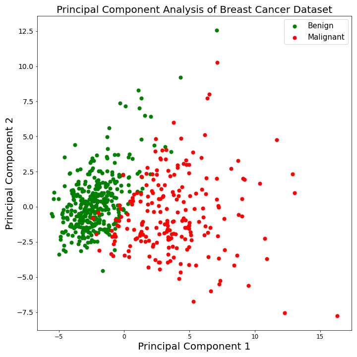

# Episode 1: Introduction to Machine Learning

## Learning outcomes
1. Mention the components of machine learning (data, features and models)
2. Argue what the role of statistics is in AI/DL/ML
3. Explain the difference between supervised and unsupervised methods
    - _Internal Note_: Mention also other types such as Reinforcement learning, Deep learning & semi-supervised learning
4. State the different categories of ML techniques
    - list some ML techniques: Linear Regression, Logistic Regression, K-Nearest Neighbors, Support Vector Machines, Naive Bayes, Decision Tree, Random Forest, K-means Clustering 
5. Explain the difference between classification and regression
6. Explain the difference between clustering and dimensionality reduction 
7. Explain the difference between continuous and discrete space
8. Explain the difference between linear and non-linear methods
9. Explain the difference between structured vs. unstructured data

## Data

In general, machine learning (ML) is a category of algorithms that allows software applications to become more accurate in predicting outcomes without being explicitly programmed. The basic premise of machine learning is to build algorithms that can receive input data and use statistical analysis to predict an output, while updating outputs as new data becomes available. [[1]](#1) Let's take it step by step to explain what this actually means in practise.\
We are going to download the [Breast Cancer Wisconsin (Diagnostic) Data Set](http://archive.ics.uci.edu/ml/datasets/breast+cancer+wisconsin+%28diagnostic%29) from the [UCI Machine Learning repository](http://archive.ics.uci.edu/ml/index.php) to see how it looks like. You need to switch to your working directory and open up a new Python 3 Jupyter Notebook. The first thing we need to do is to import the [dataset](https://pypi.org/project/dataset/) toolkit in our code, which will help us read datasets from online databases.

~~~
import dataset
~~~
{: .language-python}

In fact, we only need a single function from the toolkit, so it's better to use the following code instead.

~~~
from dataset import Dataset
~~~
{: .language-python}

In this way, we only import the `Dataset()` function from `dataset` toolkit. In order to download our data, we use the following lines of code. - Note that if we don't specify which function to load from `dataset` toolkit, we need to call the `Dataset()` function in this way: `dataset.Dataset()` -

~~~
# Downloading data file
URL_data = "https://archive.ics.uci.edu/ml/machine-learning-databases/breast-cancer-wisconsin/wdbc.data"
breastCancerData = Dataset(URL_data, delimiter=',', header=None)
~~~
{: .language-python}

In the first line of our code we state the [URL](https://archive.ics.uci.edu/ml/machine-learning-databases/breast-cancer-wisconsin/wdbc.data) from which the data will be dowloaded. Basically, if you attempt open up the specified URL in your browser, you will notice that data is separated by comma `,` character. So, in the second line, we use the `Dataset()` function to download data. Apart from URL argument, `Dataset()` function takes two more arguements (basically, it may take more than those, you can check its documentation [here](https://dataset.readthedocs.io/en/latest/)). The first one is the `delimiter` argument, which specifies the character that separates the data. The second argument specifies whether the first row should be read as headers. Actually, this dataset contains no headers, so we pass the `None` value and we're going to dowload the corresponding headers from a different URL.\
The output of the `Dataset()` function is an object of class `Dataset`. In order to check this up, we need to use the `type()` command:

~~~
type(breastCancerData)
~~~
{: .language-python}

~~~
dataset.dataset.Dataset
~~~
{: .output}

Our data table is stored inside `.features` attribute of `breastCancerData` object. In order to store the data table at a different variable, we need to use the following line of code.

~~~
# assigning .features attribute to separate variable
data = breastCancerData.features
~~~
{: .language-python}

The new `data` object is a `DataFrame` object.

~~~
type(data)
~~~
{: .language-python}

~~~
pandas.core.frame.DataFrame
~~~
{: .output}

The `DataFrame` class is pretty useful in handling data tables in Python and is widely used for this purpose. Hence, we'll constantly refer to it as the course goes on. Now, let's have a look at our `data` object. By typing `print(data.head())` we print only the first rows of our data table in our console.

~~~
# Printing data table
print(data.head())
~~~
{: .language-python}

~~~
           x0 x1     x2     x3      x4      x5       x6       x7      x8  \
0    842302.0  M  17.99  10.38  122.80  1001.0  0.11840  0.27760  0.3001   
1    842517.0  M  20.57  17.77  132.90  1326.0  0.08474  0.07864  0.0869   
2  84300903.0  M  19.69  21.25  130.00  1203.0  0.10960  0.15990  0.1974   
3  84348301.0  M  11.42  20.38   77.58   386.1  0.14250  0.28390  0.2414   
4  84358402.0  M  20.29  14.34  135.10  1297.0  0.10030  0.13280  0.1980   

        x9  ...    x22    x23     x24     x25     x26     x27     x28     x29  \
0  0.14710  ...  25.38  17.33  184.60  2019.0  0.1622  0.6656  0.7119  0.2654   
1  0.07017  ...  24.99  23.41  158.80  1956.0  0.1238  0.1866  0.2416  0.1860   
2  0.12790  ...  23.57  25.53  152.50  1709.0  0.1444  0.4245  0.4504  0.2430   
3  0.10520  ...  14.91  26.50   98.87   567.7  0.2098  0.8663  0.6869  0.2575   
4  0.10430  ...  22.54  16.67  152.20  1575.0  0.1374  0.2050  0.4000  0.1625   

      x30      x31  
0  0.4601  0.11890  
1  0.2750  0.08902  
2  0.3613  0.08758  
3  0.6638  0.17300  
4  0.2364  0.07678  

[5 rows x 32 columns]

~~~
{: .output}

If all goes well, we can see that our dataset contains 569 observations across 32 variables. As it was previously mentioned, this data table doesn't contain any header at all, and the default headers are `x0, x1 ... x31`. We need to download the headers from a different URL. We use the following commands for this purpose.

~~~
# Downloading headers
URL_colnames = "https://raw.githubusercontent.com/fpsom/IntroToMachineLearning/gh-pages/data/wdbc.colnames.csv"
breastCancerDataColNames = Dataset(URL_colnames, delimiter = '\n', header = None)
col_names = breastCancerDataColNames.features.iloc[:,0].tolist()
~~~
{: .language-python}

The `.iloc()` attribute-function of a `DataFrame` object locates a specified area inside a data matrix. For more details, you can check out the documentation [here](https://pandas.pydata.org/pandas-docs/stable/reference/api/pandas.DataFrame.iloc.html). In order to store the elements of this area to a list, we need to use the `.tolist()` function. Now, the `col_names` list contains the headers of our data, and we use the following command for them to be assigned on the table. 

~~~
# Specifying data column names
data.columns = col_names

# Printing data table
print(data.head())
~~~
{: .language-python}

~~~
  Diagnosis  Radius.Mean  Texture.Mean  Perimeter.Mean  Area.Mean  \
0         M        17.99         10.38          122.80     1001.0   
1         M        20.57         17.77          132.90     1326.0   
2         M        19.69         21.25          130.00     1203.0   
3         M        11.42         20.38           77.58      386.1   
4         M        20.29         14.34          135.10     1297.0   

   Smoothness.Mean  Compactness.Mean  Concavity.Mean  Concave.Points.Mean  \
0          0.11840           0.27760          0.3001              0.14710   
1          0.08474           0.07864          0.0869              0.07017   
2          0.10960           0.15990          0.1974              0.12790   
3          0.14250           0.28390          0.2414              0.10520   
4          0.10030           0.13280          0.1980              0.10430   

   Symmetry.Mean  ...  Radius.Worst  Texture.Worst  Perimeter.Worst  \
0         0.2419  ...         25.38          17.33           184.60   
1         0.1812  ...         24.99          23.41           158.80   
2         0.2069  ...         23.57          25.53           152.50   
3         0.2597  ...         14.91          26.50            98.87   
4         0.1809  ...         22.54          16.67           152.20   

   Area.Worst  Smoothness.Worst  Compactness.Worst  Concavity.Worst  \
0      2019.0            0.1622             0.6656           0.7119   
1      1956.0            0.1238             0.1866           0.2416   
2      1709.0            0.1444             0.4245           0.4504   
3       567.7            0.2098             0.8663           0.6869   
4      1575.0            0.1374             0.2050           0.4000   

   Concave.Points.Worst  Symmetry.Worst  Fractal.Dimension.Worst  
0                0.2654          0.4601                  0.11890  
1                0.1860          0.2750                  0.08902  
2                0.2430          0.3613                  0.08758  
3                0.2575          0.6638                  0.17300  
4                0.1625          0.2364                  0.07678  

[5 rows x 31 columns]
~~~
{: .output}

Basically, this dataset will be widely used in this tutorial and, thus, we are going to save it in our working direcoty at a CSV (Comma Separated Value) format, using the following command.

~~~
# storing data frame to csv file
data.to_csv('breast_cancer_data.csv')
~~~
{: .language-python}

Now, let's analyze our data set. The Breast Cancer data set is a real-valued multivariate data that consists of 569 samples (patients) that are classified into two classes, where each class signifies whether a patient is diagnosed with breast cancer or not. The two categories are malignant (M) and benign (B). Each row of the data matrix refers to a single patient. while the columns of each row are the characteristics (features) of our patient. The `Diagnosis` column is the one that indicates the nature of tumor, where M stands for malignant and B stands for benign.\
We will first remove the `ID` column, which is the unique identifier of each row. The reason for this is that the ID of each sample is given randomly during the sampling process (in most cases even prior to the analyis) and does not determine anything about the characteristics of the tumor - More or less like the name of a person -. Then we will separate the `Diagnosis` column from the main matrix and rename them as `X` and `y` tables respectively.

~~~
# Removing the first column
data = data.iloc[:,1:]

# Separating Diagnosis column
tumors = data.pop('Diagnosis')

# Renaming
X, y = data, tumors
~~~
{: .language-python}

In machine learning, we often refer to the `X` table as the samples/features table and to the `y` table as the labels/outputs. So, the reason for the renaming is more or less symbolic, to follow the conventional ML terminology. \

## Supervised and Unsupervised Machine learning

At this stage we should define the two basic categories of ML problems that will concern us: supervised and unsupervised. Generally speaking, supervised problems are those that include `y` table and unsupervised are those that do not. **Unsupervised learning** (which will be addressed later in depth), is the machine learning task of uncovering hidden patterns and structures from unlabeled data. For example, a researcher might want to group their samples into distinct groups, based on their gene expression data without in advance what these categories maybe. This is known as clustering, one branch of unsupervised learning. Another common aspect of unsupervised learning is dimensionality reduction. Both [clustering and dimensionality reduction](#clustering-and-dimensionality-reduction) will be discussed later. \
On the other hand, **Supervised learning**  is the branch of machine learning that involves predicting discrete labels or continuous values given samples as inputs. Supervised learning problems are generally divided into two groups: Regression and Classification problems. Our problem here focuses on finding patterns to distinguish malignant from benign tumors and, moreover, on the assessment of a tumor based on its features and patterns detected. In other words, we want to classify tumors into groups and, thus, we are talking about a **classification problem**.
The second wide category of problems are those trying to predict continuous output values and are called Regression problems. In order to have a look at them, we're going to load the Boston house-prices dataset from [scikit-learn](https://scikit-learn.org/stable/) package in Python. `Scikit-learn` package is a set of simple and efficient tools or predictive data analysis, implemented in Python; this package is widely used in Machine Learning applications and, thus, we will find it really useful throughout this tutorial. We are using the following lines of code.

~~~
# Packages
from sklearn.datasets import load_boston
import pandas as pd

# Loading boston-houses package
boston_houses = load_boston()

# Converting to data frame
boston_houses_df = pd.DataFrame(boston_houses.data, columns=boston_houses.feature_names)
prices_df = pd.DataFrame(boston_houses.target, columns = ['Av. Price'])
~~~
{: .language-python}

Probably too many questions so let's analyze the code. In the first line of code we import the `load_boston()` function, which lies inside `datasets` subpackage, which in turn belongs to the `scikit-learn` main package. Apart from `scikit-learn` package, we also import [pandas](https://pandas.pydata.org/), which will be discussed in a bit. After that, we call the function and store its result to the `boston_houses` variable. The function returns an object of class `sklearn.utils.Bunch`; however we would prefer our data to be stored in a `DataFrame` object, that contains a bunch of useful functionalities. For this reason, we import `pandas` package as `pd`, meaning that after the initial import, rather than writing `pandas.function(...)`, you can now write `pd.function(...)`. . Some people prefer this as it is quicker to type and results in shorter lines of code - especially for libraries with long names! You will frequently see Python code online using a Pandas function with `pd`, and it's because they've used this shortcut. Pandas is another widely used library in python that contains many useful functionalitites to handle `DataFrames`. In the last line we use the `Dataframe()` function of `pandas` package to transform our data into `DataFrame` format. Targets in this example are stored in `prices_df` object as well. The input data looks like this.

~~~
print(boston_houses_df.head())
~~~
{: .language-python}

~~~
      CRIM    ZN  INDUS  CHAS    NOX     RM   AGE     DIS  RAD    TAX  \
0  0.00632  18.0   2.31   0.0  0.538  6.575  65.2  4.0900  1.0  296.0   
1  0.02731   0.0   7.07   0.0  0.469  6.421  78.9  4.9671  2.0  242.0   
2  0.02729   0.0   7.07   0.0  0.469  7.185  61.1  4.9671  2.0  242.0   
3  0.03237   0.0   2.18   0.0  0.458  6.998  45.8  6.0622  3.0  222.0   
4  0.06905   0.0   2.18   0.0  0.458  7.147  54.2  6.0622  3.0  222.0   

   PTRATIO       B  LSTAT  
0     15.3  396.90   4.98  
1     17.8  396.90   9.14  
2     17.8  392.83   4.03  
3     18.7  394.63   2.94  
4     18.7  396.90   5.33  

[506 rows x 13 columns]

~~~
{: .output}

Where as the targets data.

~~~
print(prices_df.head())
~~~
{: .language-python}

~~~
   Av. Price
0       24.0
1       21.6
2       34.7
3       33.4
4       36.2

[506 rows x 13 columns]

~~~
{: .output}
in
Full details concerning this dataset could be found [here](https://scikit-learn.org/stable/datasets/toy_dataset.html#boston-house-prices-dataset). Actually, we are refering to this specific dataset to mention that the target values might certainly take continuous values, like the average price of the house in thousand dollars. These are called **Regression Problems** and our goal is to define a set of rules to connect inputs with outputs; in other words, we attempt to define an optimized function, such that given a house with specific features to predict its expected price. \
Apparently,  this discretion - continuity property can be passed into our feature space, meaning that the values of each feature could be either a continuous or a discrete value. For instance, a parient in our data could be either a smoker or non-smoker, hence this attribute is a boolean one. The size of his/her tumor, thouhg, is definetely a feature that can take any value inside a continuous interval. Keep in mind, however, that the discretion - continuity of feature space does not denote anything about the category of our problem; this can be only implied by the target values.\

> ## Note 1: Other types of Machine Learning
>
> Apart from supervised and unsupervised methods, there are also other types of Machine learning problems, such as Semi-supervised learning, Deep learning and Reinforcement learning. To illustrate,
> **Semi-supervised learning** is an approach to machine learning that combines a small amount of labeled data with a large amount of unlabeled data during training. Semi-supervised learning falls
> between unsupervised learning (with no labeled training data) and supervised learning (with only labeled training data)[[2]](#2). **Deep learning** (also known as deep structured learning) is 
> part of a broader family of machine learning methods based on artificial neural networks, in which learning can be supervised, semi-supervised or unsupervised. It uses multiple layers to 
> progressively extract higher-level features from the raw input. For example, in image processing, lower layers may identify edges, while higher layers may identify the concepts relevant to 
> a human such as digits or letters or faces[[3]](#3). Lastly, **Reinforcement learning** is concerned with how intelligent agents ought to take actions in an environment in order to maximize the
>  notion of cumulative reward. The agent learns to achieve a goal in an uncertain, potentially complex environment and make a sequence of decisions. A typical example of reinforcement learning 
>  problems is an autonomous driving car.[[4]](#4)

> ## Note 2: Structured vs Unstructured Data
> So far, we have been though two datasets, Breast Cancer Wisconsin (Diagnostic) and and Boston houses price Data Set. Both were well defined and pretty organized, meaning that they were stored in
> a data table format, matrices `X` and `y` were well specified, we had no missing values, linear dependencies between features had been possibly removed (we will check that in the following
> episodes) etc. In most cases, this is the latest version of datasets, because in fact we are one step before applying machine learning algorithms to it. A few prior steps are (raw) data 
> collection, feature extraction and data filtering. Concerning collecting data, there is a bunch it on the internet, from videos to audio tracks, from websites to online articles, from genome
> databases to Google images. And at this point the difference between structured and unstructered data is detected. **Structured data** is comprised of clearly defined data types whose pattern
> makes them easily searchable. It is usually resides in relational databases ([RDBMS](https://www.goskills.com/Development/Resources/RDBMS-basics)). This format is eminently searchable both with
> human generated queries and via algorithms using type of data and field names, such as alphabetical or numeric, currency or date. **Unstructured data** is essentially everything else. Unstructured
> data has internal structure but is not structured via pre-defined data models or schema. It may be textual or non-textual, and human- or machine-generated. It may also be stored within a 
> non-relational database like NoSQL. Typical human-generated unstructured data includes: emails, text files, websites, etc. [[5]](#5)

## What is a model?

For beginners, this is very confusing as often “machine learning algorithm” is used interchangeably with “machine learning model.” Are they the same thing or something different?. When we talk about an **algorithm** in machine learning, we mean a procedure that is run on data to create a machine learning model. So actually, the **model** is the output of the algorithm, in other words the set of rules/parameters that link input with output data.[[6]](#6) In classification problems, a model could be function that takes as inputs feature vectors (i.e. vectors of the same dimensionality as the number of columns of input data matrix) and these vectors are classified into the corresponding groups based on the output's sign. In regression problems, on the other hand, the output of the function is the predicted value, in our case, the average price of the house. \
Evidently, to define this optimized model that fits well in our data, we first need to apply a machine learning algorithm. In fact, there are many machine learning algorithms. Some of them are:
- Linear Regression
- Logistic Regression
- K-Nearest Neighbors
- Support Vector Machines
- Naive Bayes 
- Decision Tree
- Random Forest 
- K-means

A **linear model** uses a linear function for its prediction function or as a crucial part of its prediction function. A linear function takes a fixed number of numerical inputs, let's call them x1,x2,…,xn (which in our case are the feature values of the sample) and returns y = w0+∑ni=1wixi where the weights w0,…,wn are the parameters of the model. \
If the prediction function is a linear function, we can perform regression, i.e. predicting a numerical label. We can also take a linear function, return the sign of the result (whether the result is positive or not) and perform binary classification that way, as it was previously described: all samples with a positive output receive label A, all others receive label B. There are various other (more complex) options for a response function on top of the linear function, the logistic function is very commonly used (which leads to logistic regression, predicting a number between 0 and 1, typically used to learn the probability of a binary outcome in a noisy setting). \
A **non-linear model** is a model which is not a linear model, and it evidently contains more complex rules. Typically these are more powerful (they can represent a larger class of functions) but much harder to train.[[7]](#7)

## Clustering and Dimensionality Reduction
As already mentioned, both clustering and dimensionality reduction are aspects of unsupervised leanring. **Clustering** is the assignment of objects to homogeneous groups (called clusters) while making sure that objects in different groups are not similar. Clustering is considered an unsupervised task as it aims to describe the hidden structure of the objects. Defining an adequate distance measure between samples is crucial for the success of the clustering process. Moreover, most of the times the number of clusters isn't obvious at all, so its important to select a sufficient metric to measure the stability of them and extract an optimal number.\ 
Another form of unsupervised learning, is **dimensionality reduction**. We will attempt to explain this subject by writing some more code to give the reader a practical sense. The purpose of this process is to reduce the number of features under consideration, where each feature is a dimension that partly represents the objects[[8]](#8). For instance, in the Breast Cancer Dataset, the input data table consists of 30 features; so let's say that we want project each sample in a 2-dimensional space. And why is dimensionality reduction important? The technical answer is that as more features are added, the data becomes very sparse and analysis suffers from the curse of dimensionality. Additionally, it is easier to process smaller data sets. A more intuitive answer, however, is that the lower the number of dimensions, the easier is to visualise them. In fact, if data lie in a 2D space, they can definetely be visualised in a 2D plot. \
The main technique for feature extraction is the Principle Component Analysis (PCA). PCA guarantees finding the best linear transformation that reduces the number of dimensions with a minimum loss of information. We will not deepen more into the this topic at the moment, but let's take a look at the following code. 

~~~
from sklearn.decomposition import PCA
import matplotlib.pyplot as plt
from sklearn.preprocessing import StandardScaler

# You start by Standardizing the data. 
# PCA's output is influenced based on the scale of the features of the data.
X_scaled = StandardScaler().fit_transform(X)

# Dimensionality Reduction, PCA
pca = PCA(n_components = 2 , svd_solver = 'auto')
X_pca = pca.fit_transform(X_scaled)

# Principal components as data frame
X_pca_df = pd.DataFrame(data = X_pca, columns = ['principal component 1', 'principal component 2'])

# Categorical to numeric variables
y_category = y.astype('category')
y_numeric = y_category.cat.codes # It assigns 1 for Malignant, 0 for Benign

# Plotting
plt.figure(figsize=(10,10))
plt.xticks(fontsize=12)
plt.yticks(fontsize=14)
plt.xlabel('Principal Component 1',fontsize=20)
plt.ylabel('Principal Component 2',fontsize=20)
plt.title("Principal Component Analysis of Breast Cancer Dataset",fontsize=20)
cancer_types = ['B', 'M']
legend_list = ['Benign', 'Malignant']
colors = ['g', 'r']
for cancer_type, color in zip(cancer_types,colors):
    indicesToKeep = y == cancer_type
    plt.scatter(X_pca_df.loc[indicesToKeep, 'principal component 1'], X_pca_df.loc[indicesToKeep, 'principal component 2'], c = color, s = 50)

plt.legend(legend_list,prop={'size': 15})
plt.show()
~~~
{: .language-python}

At first we load `PCA` and `StandardScaler` functions from `sklearn` package (*scikit-learn*) and `matplotlib.pyplot` function as `plt`. Then we scale our input data by utilizing `StandardScaler`, becuase PCA's output is influenced based on the scale of the feature. We initialize our PCA algorithm with the parameter `n_components = 2`, meaning that the algorithm should project our samples in a 2D space. PCA is applied in our data; the output of PCA algorithm is a `numpy.array` object, so we convert it, for our convenience, to a `pandas.DataFrame` object. Then we transform the labels of the output vector into numerical values, assigning 1 for Malignant, 0 for Benign (for plotting reasons). The rest of the code constructs the following plot. 

  

It's clear that our data are separated, in some way, into two groups. The two axis refer to the first and second principal components. These two components are a linear combinations of our initial features and are constructed, in such a way, so that the maximun of the initial variance of the features is maintained. We will definetely analyze PCA with further detail later in the course. Finally, we have to mention here that a big chapter of dimensionality reduction is **feature selection**. The key difference is that feature selection is simply selecting and excluding the most informative features (whatever does it mean) without changing them, while dimensionality reduction transforms features into a lower dimension. The decision whether we should use dimensionality reduction or feature seleciton essentially depends on many parameters, such as the problem itself and the nature of features.

## Role of statistics in Machine learning

Statistics is generally considered a prerequisite to the field of applied machine learning. Statistical methods are required to find answers to the questions that we have about data. Data raises questions, such as:

- What is the most common or expected observation?
- What are the limits on the observations?
- What does the data look like?

Although they appear simple, these questions must be answered in order to turn raw observations into information that we can use and share. Beyond raw data, we may design experiments in order to collect observations. From these experimental results we may have more sophisticated questions, such as:

- What variables are most relevant?
- What is the difference in an outcome between two experiments?
- Are the differences real or the result of noise in the data?

Questions of this type are important. The results matter to the project, to stakeholders, and to effective decision making. We can see that in order to both understand the data used to train a machine learning model and to interpret the results of testing different machine learning models, that statistical methods are required.[[9]](#9)

## References

<a id="1">[1]</a> 
Ayush Pant (2019)
Introduction to Machine Learning for Beginners
Towards Data Science, [Link](https://towardsdatascience.com/introduction-to-machine-learning-for-beginners-eed6024fdb08)

<a id="2">[2]</a> 
https://en.wikipedia.org/wiki/Semi-supervised_learning#cite_ref-1

<a id="3">[3]</a> 
https://en.wikipedia.org/wiki/Deep_learning

<a id="4">[4]</a> 
https://en.wikipedia.org/wiki/Reinforcement_learning

<a id="5">[5]</a> 
Christine Taylor (2018)
Structured vs. Unstructured Data
Datamation, [Link](https://machinelearningmastery.com/difference-between-algorithm-and-model-in-machine-learning/)

<a id="6">[6]</a> 
Jason Brownlee (2020)
Difference Between Algorithm and Model in Machine Learning
Machine Learning Mastery, [Link](https://www.datamation.com/big-data/structured-vs-unstructured-data/)

<a id="7">[7]</a> 
Michael Ashcroft
Linear Models, Non-Linear Models & Feature Transformations
Future Learn, [Link](https://www.futurelearn.com/info/courses/advanced-machine-learning/0/steps/49532)

<a id="8">[8]</a> 
Guy Shtar, Shiri Margel (2017)
Clustering and Dimensionality Reduction: Understanding the “Magic” Behind Machine Learning
Imperva, [Link](https://www.imperva.com/blog/clustering-and-dimensionality-reduction-understanding-the-magic-behind-machine-learning/)

<a id="9">[9]</a> 
Jason Brownlee (2018)
What is Statistics (and why is it important in machine learning)?
Machine Learning Mastery, [Link](https://machinelearningmastery.com/what-is-statistics/)
