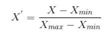
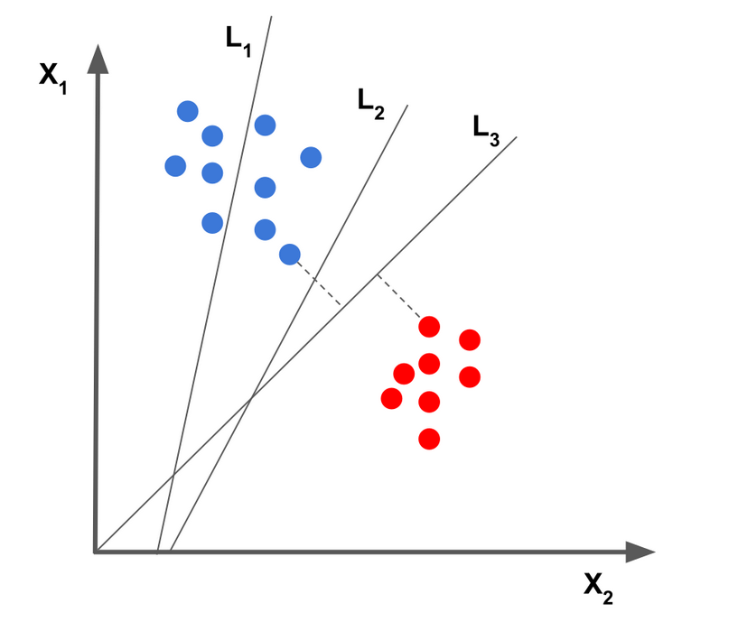
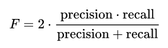

# Episode 2: Components and Evaluation of a Machine Learning Pipeline

_Learning Outcomes_
1. Explain the different steps in an ML pipeline
    - _Internal Note_: Pre-processing / Feature Selection / Training/ Validation /Testing / Evaluation
2. Explain and critically argue about the criteria for evaluating an ML model
    - _Internal Note_: Referring to F-measure, accuracy, recall, specificity, sensitivity, silhouette, confusion matrix, etc
3. Evaluate and compare ML models for a particular dataset;  what could you do to improve your model ?
    - _Internal Note_: Referring to training, testing, validation/cross-validation, dangers of overfitting/underfitting
   

## What is a pipeline?
In computer science, a pipeline is a set of data processing elements connected in series, where the output of one element is the input of the next one. The elements of a pipeline are often executed in parallel or in time-sliced fashion. Some amount of buffer storage is often inserted between elements. Pipelining is a commonly used concept in everyday life. For example, in the assembly line of a car factory, each specific task is often done by a separate work station. Suppose that assembling a car requires three tasks that take 20, 10, and 15 minutes, respectively. Then, if all three tasks were performed by a single station, the factory would output one car every 45 minutes. By using a pipeline of three stations, the factory would output the first car in 45 minutes, and then a new one every 20 minutes. [[1]](#1)

The pipeline of an ML procedure isn't always constant. It varies, depending on the problem, the dataset, the algorithms used etc. The diagram of the pipeline that we'll mostly use in this course consists of the following steps: Data Pre-processing, Feature Selection, Model Training, Model Validation, Model Testing, Model Evaluation.

*How beautiful would be if I had a picture here to insert! :/*

## Data pre-processing
Before thinking about modeling, let's have a look at our data. There is no point in throwing a 10000 layer convolutional neural network (whatever that means) at our data before we even know what we’re dealing with.[[2]](#2). So let's load again the Breast Cancer Data set from the CSV file created in the first episode.

```python
# Importing pandas package
import pandas as pd

# Loading file
breast_cancer_data = pd.read_csv('breast_cancer_data.csv', header=0, index_col=0)

# Removing the first column (ID)
breast_cancer_data = breast_cancer_data.iloc[:,1:]

# separating X and Y matrix
tumors = breast_cancer_data.pop('Diagnosis')
X, y = breast_cancer_data, tumors
```


Data Pre-Processing is a bit fuzzy term. That's because it involves a bunch of different processes, either used or not, with the aim to understanding our data. Usually, the first step of data pre-prosessing is Data Clensing. **Data cleansing** or data cleaning is the process of detecting and correcting (or removing) corrupt or inaccurate records from a record set, table, or database and refers to identifying incomplete, incorrect, inaccurate or irrelevant parts of the data and then replacing, modifying, or deleting the dirty or coarse data [[3]](#3). Luckily, there is no need to perform this step here, at least in terms of deleting corrupt records, because our data table seems complete; however, it's pretty possible to detect inaccurate samples as we proceed further in the analysis.

The next important step that should never be ignored is **Feature Scaling**. There two different methods to scale our features: **Normalization** and **Standardization**. To understand the need of scaling our features, let's use the following code to calculate the mean value and standard deviation of each feature separately: (In the following code, we set the parameter `axis = 0` to indicate that we want to calculate the means and STDs of columns. If we wanted do the same calculation for rows, we should set `axis = 1`, which is however meaningless.)

```python
# Names of features
feature_names = X.columns

# Calculatinf mean values
mv_vector = X.mean(axis = 0)

# Calculating standard deviations
std_vector = X.std(axis = 0)

# Printing code
for i in range(len(mv_vector)):
    feature_name = str(feature_names[i])
    mv_str = "Mean: " + str(mv_vector[i])
    std_str = "STD: " + str(std_vector[i])
    
    # String Alignment
    print("{0:<30}{1:<30}{2:<30}".format(feature_name, mv_str, std_str))
```

~~~
Radius.Mean                   Mean: 14.127291739894563      STD: 3.524048826212078        
Texture.Mean                  Mean: 19.28964850615117       STD: 4.301035768166949        
Perimeter.Mean                Mean: 91.96903339191566       STD: 24.2989810387549         
Area.Mean                     Mean: 654.8891036906857       STD: 351.9141291816527        
Smoothness.Mean               Mean: 0.096360281195079       STD: 0.01406412813767362      
Compactness.Mean              Mean: 0.10434098418277686     STD: 0.0528127579325122       
Concavity.Mean                Mean: 0.08879931581722322     STD: 0.0797198087078935       
Concave.Points.Mean           Mean: 0.048919145869947236    STD: 0.03880284485915359      
Symmetry.Mean                 Mean: 0.181161862917399       STD: 0.027414281336035712     
Fractal.Dimension.Mean        Mean: 0.06279760984182778     STD: 0.007060362795084458     
Radius.SE                     Mean: 0.4051720562390161      STD: 0.2773127329861041       
Texture.SE                    Mean: 1.2168534270650269      STD: 0.5516483926172023       
Perimeter.SE                  Mean: 2.8660592267135288      STD: 2.021854554042107        
Area.SE                       Mean: 40.33707908611603       STD: 45.49100551613178        
Smoothness.SE                 Mean: 0.007040978910369071    STD: 0.003002517943839067     
Compactness.SE                Mean: 0.025478138840070306    STD: 0.017908179325677377     
Concavity.SE                  Mean: 0.031893716344463946    STD: 0.03018606032298839      
Concave.Points.SE             Mean: 0.011796137082601056    STD: 0.0061702851740468665    
Symmetry.SE                   Mean: 0.020542298769771532    STD: 0.008266371528798399     
Fractal.Dimension.SE          Mean: 0.0037949038664323383   STD: 0.0026460709670891942    
Radius.Worst                  Mean: 16.269189806678394      STD: 4.833241580469324        
Texture.Worst                 Mean: 25.677223198594014      STD: 6.146257623038323        
Perimeter.Worst               Mean: 107.2612126537786       STD: 33.60254226903635        
Area.Worst                    Mean: 880.5831282952545       STD: 569.3569926699492        
Smoothness.Worst              Mean: 0.13236859402460469     STD: 0.022832429404835458     
Compactness.Worst             Mean: 0.25426504393673144     STD: 0.15733648891374194      
Concavity.Worst               Mean: 0.27218848330404205     STD: 0.20862428060813232      
Concave.Points.Worst          Mean: 0.11460622319859404     STD: 0.0657323411959421       
Symmetry.Worst                Mean: 0.29007557117750454     STD: 0.06186746753751869      
Fractal.Dimension.Worst       Mean: 0.08394581722319855     STD: 0.01806126734889399      
~~~


**Feature scaling** refers to putting the values in the same range or same scale so that no variable is dominated by the other. And why this is important? Because, most of the times like here, your dataset will contain features highly varying in magnitudes, units and range. But since, most of the machine learning algorithms use Euclidean distance between two data points in their computations, this is a problem. The features with high magnitudes will weigh in a lot more in the distance calculations than features with low magnitudes. To suppress this effect, we need to bring all features to the same level of magnitudes. [[4]](#4) 

**Normalization** is a scaling technique in which values are shifted and rescaled so that they end up ranging between 0 and 1. It is also known as Min-Max scaling. Here’s the formula for normalization:

<p align="center">
  
</p>

**Standardization**, on the other hand, is a scaling technique where the values are centered around the mean with a unit standard deviation. This means that the mean of the attribute becomes zero and the resultant distribution has a unit standard deviation. Here’s the formula for standardization:

<p align="center">
  
</p>

*Question: Normalize or Standardize?*

Quick answer: Normalization vs. standardization is an eternal question among machine learning newcomers. The answer is simple:
- Normalization is good to use when you know that the distribution of your data does not follow a Gaussian distribution. This can be useful in algorithms that do not assume any distribution of the data like K-Nearest Neighbors and Neural Networks.
- Standardization, on the other hand, can be helpful in cases where the data follows a Gaussian distribution. However, this does not have to be necessarily true. Also, unlike normalization, standardization does not have a bounding range. So, even if you have outliers in your data, they will not be affected by standardization.[[5]](#5)

Remember last lecture we used Standarization in the same dataset, before applying PCA algorithm, and it seemed to work pretty well. This time, however, we're going to normalize our data, because we don't know the distribution of it, and so it's a safer choice. Feature normalization in Python is accomplished by `MinMaxScaler()` function in `sklearn.preprocessing` library:

```python
from sklearn.preprocessing import MinMaxScaler

# Feature Normalization
min_max_scaler = MinMaxScaler()
X_normalized = min_max_scaler.fit_transform(X)

# The output of MinMaxScaler() is a numpy array
# So we convert it to pandas.DataFrame
X_normalized = pd.DataFrame(X_normalized, columns = feature_names)
```

After running this code, each element in the data matrix will definetely lie inside the interval (0,1) (ISSUE 2, HAVE TO FIX THIS). The last step of data pre-processing is getting a better sense of the relationship between the features themselves or features and targets. This can be achieved either by applying some statistical tests (e.g. ANOVA, Interquantile Analysis) or by vizualizing the data. For now, we are going to visualize some stuff, as an image worths a thousand words. We'll return to the statistical part in the [Feature Selection](#feature-selection) section.

The following code stores the values of `Radius.Mean` and `Symmetry.Worst` columns in objects `x1` and `x2` respectively (The two features were carefully picked for the purpose of the following example). After that, we are going to plot the Probability Density Functions (PDFs) for the values of the two columns (features) for both Benign and Malignant samples. The PDFs are plotted in a histogram form. The point here is that we would like to check whether, for example, the `Radius.Mean` values for Benign samples and for Malignant ones lie in different intervals, because in that case, data are perfectly separated. Obviosly, this scenario rarely happens in ML applications. but let's check how lucky we are.

```python
import matplotlib.pyplot as plt

# Features Selected
x1 = X_normalized['Radius.Mean']
x2 = X_normalized['Symmetry.Worst']

# Plotting the two pdf's in the same plot for feature 'Radius.Mean'
plt.figure(figsize=(10,8))
plt.xlabel('Radius Mean',fontsize=20)
plt.ylabel('Probability',fontsize=20)
plt.title("Probability Density Functions",fontsize=20)
plt.xlim([0,1])
plt.ylim([0,8])
cancer_types = ['B', 'M']
legend_list = ['Benign', 'Malignant']
colors = ['g', 'r']
for cancer_type, color in zip(cancer_types,colors):
    indicesToKeep = y == cancer_type
    plt.hist(x1.loc[indicesToKeep], color = color, bins = 50, density=True)

plt.legend(legend_list,prop={'size': 15})
plt.show()

# Plotting the two pdf's in the same plot for feature 'Symmetry.Worst'
plt.figure(figsize=(10,8))
plt.xlabel('Symmetry Worst',fontsize=20)
plt.ylabel('Probability',fontsize=20)
plt.title("Probability Density Functions",fontsize=20)
plt.xlim([0,1])
plt.ylim([0,8])
cancer_types = ['B', 'M']
legend_list = ['Benign', 'Malignant']
colors = ['g', 'r']
for cancer_type, color in zip(cancer_types,colors):
    indicesToKeep = y == cancer_type
    plt.hist(x2.loc[indicesToKeep], color = color, bins = 50, density=True)

plt.legend(legend_list,prop={'size': 15})
plt.show()
```

<p align="center">
  
</p>

<p align="center">
  
</p>


*How would you interpret the two plots?*

Answer: Take a look at the overlapping region between the two PDFs in both plots. This regionn brings us ambiguity, meaning that unclassified samples -samples without labels, in this case, new patients - that happen to fall inside this region are hard to be categorized. The smaller this region is, the better the confidence. Regarding the previous plots, the overlapping region is much shorter in `Radius.Mean` feature than `Symmetry.Worst`. So, if for some reason we had to select only between the two features to classify our data, we would definetely choose `Radius.Mean`. And that's the point of feature selection.

## Feature Selection
As discussed in the previous episode, feature seleciton is the process of identifying an "optimal" subset of them that describe the initial dataset. Quotation marks around the word optimal highlight that the word is being somehow misused; there is no one-size-fits-all approach to reducing the features that can be applied to any dataset. The way optithe mal is defined depends on the size of dataset, the problem itself, the nature and significance of features, how flexible we are and many other parameters.

Moreover, feature selection process varies significantly when talking about Supervised and Unsupervised problems. Just to refresh some stuff, in the previos episode we made a decent attempt to reduce dimensions in the Breast Cancer dataset by applying PCA. There are two comments here. The first one is that the principal components occured were a linear combination of the initial features; hence, we talk about a dimensionality reduction technique rather than feature selection. The second thing is that we faced the problem completely un-supervisely (this is what PCA does by the way). The only moment that we utilized the information from targets was during the plotting process, for coloring purposes. In contrast, here we will attempt to detect the most significant features by taking into consideration the targets' information. Feature seleciton may also work for unsupervised problems, but we'll deepen more into this field in the fourth episode.

Let's present some **theory** stuff at first, concerning **feature selection in supervised problems**, and then we'll proceed to the application. Feature selection methods in supervised problems can be summarized into three categories:
- Wrapper Methods: Wrapper feature selection methods create many models with different subsets of input features and select those features that result in the best performing model according to a performance metric. These methods are unconcerned with the variable types, although they can be computationally expensive. RFE is a good example of a wrapper feature selection method.
- Filter Methods: Filter feature selection methods use statistical techniques to evaluate the relationship between each input variable and the target variable, and these scores are used as the basis to choose (filter) those input variables that will be used in the model.
- Intrinsic: There are some machine learning algorithms that perform feature selection automatically as part of learning the model. We might refer to these techniques as intrinsic feature selection methods.[[6]](#6)

In this lecture we will mainly focus on filter based methods, which are are the most popular and widely used techniques. In fact, there are a bunch of statistical tests that can measure the correlation of features with target values. The disadvantage here is that different tests should be applied in different variable types. In order to avoid confusion, it's important to memorize the following graph:

<p align="center">
  
</p>

The features table of Breast Cancer dataset (`X` table) consists only of numerical values, while the output vector values are categorical. So, the proposed statistical tests are ANOVA and Kendall's ones. We are going to analyze and use ANOVA in this episode.

**ANOVA** is an acronym for “analysis of variance” and is a parametric statistical hypothesis test for determining whether the means from two or more samples of data (often three or more) come from the same distribution or not. An F-statistic, or **F-test**, is a class of statistical tests that calculate the ratio between variances values, such as the variance from two different samples or the explained and unexplained variance by a statistical test, like ANOVA. The ANOVA method is a type of F-statistic referred to here as an ANOVA f-test.[[7]](#7)

Intuitively, let's think of a scenario that we have two classes and we want to find a score for each feature saying "how well this feature discriminates between two classes". Now look at the figure bellow. There are two classes red and blue and two features on x and y axes.

<p align="center">
  
</p>

Evidently, as we previously discussed, `x` feature is a better separator than `y`. But What makes `x` better than `y`? As you see in the figure above:
- In `x` axis the two classes are far from each other. (*Math Translation: The distance between means of class distributions on x is greater than on y*)
- In `x` axis, there is no overlap between the two classes, something that does not hold for `y` axis (*Math Translation: The variance of each single class according to x is less than those of y.*)

Now we can easily define the **F-score** as F = distance_between_classes / compactness_of_classes (ISSUE 3: HAVE TO FIX THIS)! The higher this score is, the better the corresponding feature discriminates between classes[[8]](#8).

The `scikit-learn` machine library provides an implementation of the ANOVA f-test in the `f_classif()` function. This function can be used in a feature selection strategy, such as selecting the top k most relevant features (largest values) via the `SelectKBest` class. At first, we set the k parameter `k ='all'`, just to return the scores of all features.

```python
from sklearn.feature_selection import SelectKBest
from sklearn.feature_selection import f_classif
from operator import itemgetter


# ANOVA - Returning all features, just to calculate their scores

# score_func: Which statistical test to use, f_classif == ANOVA
# k: how many features to select
fs = SelectKBest(score_func=f_classif, k = 'all')

# Applying the model (calculating scores basically)
X_new = fs.fit_transform(X_normalized.values, y.values)

#-------- The rest of the code is for printing and plotting purposes ------------------------

# Sorting features based on scores, indices variable keeps the order of sorted features
indices, scores_sorted = zip(*sorted(enumerate(fs.scores_), key=itemgetter(1), reverse=True))
features_sorted = [feature_names[i] for i in indices]

# Printing scores of features
for i in range(len(scores_sorted)):
    print('{0} : {1}'.format(features_sorted[i], scores_sorted[i]))

# plot the scores
plt.figure(figsize=(15,10))
plt.bar(feature_names, fs.scores_)
plt.xticks(rotation = 'vertical')
plt.title('Featues vs Scores', fontsize = 20)
plt.show()
```

~~~
Concave.Points.Worst : 964.3853934517127
Perimeter.Worst : 897.9442188597812
Concave.Points.Mean : 861.6760200073088
Radius.Worst : 860.7817069850568
Perimeter.Mean : 697.2352724765157
Area.Worst : 661.6002055336236
Radius.Mean : 646.9810209786384
Area.Mean : 573.0607465682353
Concavity.Mean : 533.793126203546
Concavity.Worst : 436.6919394030541
Compactness.Mean : 313.2330785676416
Compactness.Worst : 304.3410629037628
Radius.SE : 268.8403269673444
Perimeter.SE : 253.89739178268033
Area.SE : 243.6515857777416
Texture.Worst : 149.5969046860536
Smoothness.Worst : 122.47288045844547
Symmetry.Worst : 118.86023213619839
Texture.Mean : 118.09605934498053
Concave.Points.SE : 113.26275994492457
Smoothness.Mean : 83.65112340842326
Symmetry.Mean : 69.52744350046054
Fractal.Dimension.Worst : 66.44396064959992
Compactness.SE : 53.2473391281205
Concavity.SE : 39.01448155684741
Fractal.Dimension.SE : 3.4682747570423906
Smoothness.SE : 2.5579678031857522
Fractal.Dimension.Mean : 0.09345929487514902
Texture.SE : 0.03909470231275527
Symmetry.SE : 0.024117406686585498
~~~

<p align="center">
  
</p>

We have sorted features based on their scores and printed them in our console. Moreover, the barplot visualizes the information from scores. The next step is to determine a threshold in scores, to decide which features to keep. Based on our data, a decent choice would be to select features with score higher than `500`, meaning the top-9 features. This is accomplished by the following code:

```python
# ANOVA: setting score cutoff = 500
score_threshold = 500
selected_features = [feature_names[i] for i in indices if fs.scores_[i] > score_threshold]
X_selected = X[selected_features]
print(X_selected)
```

~~~
     Concave.Points.Worst  Perimeter.Worst  Concave.Points.Mean  Radius.Worst  \
0                  0.2654           184.60              0.14710        25.380   
1                  0.1860           158.80              0.07017        24.990   
2                  0.2430           152.50              0.12790        23.570   
3                  0.2575            98.87              0.10520        14.910   
4                  0.1625           152.20              0.10430        22.540   
..                    ...              ...                  ...           ...   
564                0.2216           166.10              0.13890        25.450   
565                0.1628           155.00              0.09791        23.690   
566                0.1418           126.70              0.05302        18.980   
567                0.2650           184.60              0.15200        25.740   
568                0.0000            59.16              0.00000         9.456   

     Perimeter.Mean  Area.Worst  Radius.Mean  Area.Mean  Concavity.Mean  
0            122.80      2019.0        17.99     1001.0         0.30010  
1            132.90      1956.0        20.57     1326.0         0.08690  
2            130.00      1709.0        19.69     1203.0         0.19740  
3             77.58       567.7        11.42      386.1         0.24140  
4            135.10      1575.0        20.29     1297.0         0.19800  
..              ...         ...          ...        ...             ...  
564          142.00      2027.0        21.56     1479.0         0.24390  
565          131.20      1731.0        20.13     1261.0         0.14400  
566          108.30      1124.0        16.60      858.1         0.09251  
567          140.10      1821.0        20.60     1265.0         0.35140  
568           47.92       268.6         7.76      181.0         0.00000  

[569 rows x 9 columns]
~~~


## Training - Validation - Testing
The next parts of ML pipeline are fully interconnected and that's why they are analyzed at the same section. At first, data are randomly shuffled and splitted in three subsets: Training, Validation and Test sets:

1. The model is initially fit on a **training dataset**, which is a set of examples used to fit the parameters of the model. The model is trained on the training dataset using a supervised learning method (example using optimization methods). The current model is run with the training dataset and produces a result, which is then compared with the target, for each input vector in the training dataset. Based on the result of the comparison and the specific learning algorithm being used, the parameters of the model are adjusted.
2. Successively, the fitted model is used to predict the responses for the observations in a second dataset called the **validation dataset**. The validation dataset provides an unbiased evaluation of a model fit on the training dataset while tuning the model's hyperparameters (e.g. the number of hidden layers and units in a neural network). Validation datasets can be used for regularization by early stopping (stopping training when the error on the validation dataset increases, as this is a sign of overfitting to the training dataset).
3. Finally, the **test dataset** is a dataset used to provide an unbiased evaluation of a final model fit on the training dataset. If the data in the test dataset has never been used in training (for example in cross-validation), the test dataset is also called a holdout dataset. The term "validation set" is sometimes used instead of "test set" in some literature (e.g., if the original dataset was partitioned into only two subsets, the test set might be referred to as the validation set). [[9]](#9)

In fact, the score during training and validation of data is much different from the final evaluation in the testing process. Let's discuss a little about how the parameters and hyperparameters are tuned (training and validation), and we'll talk about the final evaluation later, in the correspoding [section](#model-evaluation).

The training of the model is basically an optimization problem. The main idea of optimization is to find an optimal set of parameters that minimize a specific function, called **loss function**. So, when validating our data and measuring the fitness of the model occured in the validation dataset, most of the times its important to use the same "metric" as used in training, in order two values to be instantly comparable. Hence, we often use the loss function again. By repeatedly training our dataset with various values for hyperparameters, we can conclude to an optimal hyperparameter-set which minimizes the loss function for the validation dataset. The advantage of using Python is that, for every algorithm in the `scikit-learn` package, it's provided a well-organized documentation, where the hyperparameters of the model are specified. There are also analytical desciptions and mathimatical stuff regarding loss functions that are automatically used when calling ML algorithms. In the next episode we'll deepen more into this topic and explain some stuff concernig  **Learning curves**. For now, the SVM class-model in Python offers `.score()`, a gift-function that returns the mean accuracy on the given validation data and labels (this is how SVM is evaluated). 

In order to obtain some practical experience of all the things discussed, we are going to apply [SVM algorithm](#svm) in our data. A standard way to separate main dataset is: training set (60% of samples), validation set (20% of samples), and test set (20% of samples). An advantage of Breast Cancer data set is that the distribution of output labels is more or less uniform; around 50% of data are labeled as 'Benign' the rest of it as 'Malignant'. This gives us the benefit to determine training, validation and test dataset only once in the beginning of the process (definetely after shufflng) and not particularly worry about how representative the distributions of these subsets are (meaning how similar their distributions are to the initial one). In most of the cases, however, we have to be really careful about the case of representative subsets. A technique that is widely used to overcome this limitation is k-fold cross validation.

### SVM
In machine learning, **support-vector** machines (SVMs) are supervised learning models with associated learning algorithms that analyze data for classification and regression analysis. Suppose some given data points each belong to one of two classes, and the goal is to decide which class a new data point will be in. In the case of support-vector machines, a data point is viewed as a p-dimensional vector, and we want to know whether we can separate such points with a (p − 1)-dimensional hyperplane. This is called a linear classifier[[10]](#10). Now let's check the following figure. The goal is to "draw" the optimal (straight) line that separates the classes of the 2D points. As we can see, L2 separates our data pretty good (much better than L1), but L3 is actually the best choice. The optimal line is determined by how far it is from the nearest points of the classes; the furthest it is, the better the choice. As we talk about straight lines, the **parameters** that have to be tuned are the positinion and slope. Linear SVD can be generalized in more dimensions, where instead of straight lines as separators, we have planes and hyper-planes.

<p align="center">
  
</p>

However, data is not always linearly separable, like data in the figure on the left. In these cases, it's better either to search for a non-linear separator, or to map features into a higher dimesnional space, where they are linearly separable. **Kernels** are widely used in Support Vector Machines (SVM) model to bridge linearity and non-linearity. They converts non-linear lower dimension space to a higher dimension space thereby we can get a linear classification. So, we are projecting the data with some extra features so that it can convert to a higher dimension space (figure on the right)[[11]](#11). 

<p align="center">
  
</p>

The higher the dimension that features are mapped, the higher the order of Kernel we use. In our case, the order of kernel is one **hyperparameter** that is going to be tuned. The second hyperparameter we are focusing on is the regularization parameter `C`. Generally, the regularization parameter determines the contribution of higher-dimensional features in the final result, so as to avoid overfitting (we'll discuss this scenario in the next episode).

## Coding Time
At the beginning of the following code, we import `train_test_split()` and `SVC()` functions from `scikit-learn` package. The `train_test_split()` function splits the initial dataset into a training a testing subset; the test size percentage is defined in `test_size` parameter, while the `shuffle` parameter indicates whether data should be shuffled or not. The `random_state` parameter is connected with the shuffle process, and the randomness of eah function in general. In fact, to simulate randomness in computers, we use pseudorandom functions that produce pseudorandom sequences. These functions start with an initial number and gradually produce the rest of the sequence. In this way we are telling the algorithm that the initial number in the pseudorandom sequence should be zero, so as the reader to be able to reproduce exactly the same results as the following code does (if we don't set any value here, the pseudorandom sequence uses time as its input argument). The next step is to reuse the `train_test_split()` function to separate train from validation dataaset. This time we set `test_size = 0.25`, because we want validation dataset to be the 20% of total samples and, hence, 20%/80% = 25%. In addition, we define `degrees` and `c_values` sets so as to detect the optimal hyperparameters tuple. Finally, we calculate the score using the `score()` attribute function of the model.

```python
from sklearn.model_selection import train_test_split
from sklearn.svm import SVC
import numpy as np

# Specifying test set
X_train_validation, X_test, y_train_validation, y_test = \
    train_test_split(X_selected, y, test_size=0.2, shuffle = True, random_state = 0)

# Specifying train and validation set
X_train, X_val, y_train, y_val = \
    train_test_split(X_train_validation, y_train_validation, test_size=0.25, shuffle = True, random_state = 0)

# degreees
degrees = [1,2,3,4,5]

# C-values
c_values = [0.01, 0.1, 0.5, 1, 2, 5, 10]

# Validation
scores_table = np.zeros(shape=(len(degrees),len(c_values)), dtype=float)

# Iterate over degree values
for i, deg in enumerate(degrees):
    
    # Iterate over c values:
    for j, c in enumerate(c_values):
        
        # Train
        model = SVC(kernel = 'poly', degree = deg, C = c, random_state = 0)
        model.fit(X_train, y_train)
        
        # Calculating validation score 
        this_score = model.score(X_val, y_val)
        scores_table[i][j] = this_score

# Converting to data frame for printing purposes
col_names = ['c = {0}'.format(str(c)) for c in c_values]
row_names = ['degree = {0}'.format(deg) for deg in degrees]
scores_table_df = pd.DataFrame(scores_table, index = row_names, columns=col_names)

# Printing
scores_table_df
```

<p align="center">
  
</p>

Evidently, an optimal hyperparameters tuple is `(degree, C) = (2, 2)`, because the corresponding element of the above table has a maximum value.

## Model Evaluation
The evaluation of the model is strictly connected with its nature; diyourfferent methods suit for different types of problems. If we talk about **regression problems**, for example, the simplest way for evaluation is to apply the model to the test dataset and measure the **Mean Square Error (MSE)** between the outputs and the actual values; the lower the value, the better the model. Moreover, if we talk about unsupervised probelms and, in particular **clustering**, a sufficient evaluation method is to measure the stability of classes, by calculating some metrics like **silhouette**, **Davies–Bouldin index** etc. Hopefully, we'll talk about it later in the course.

The most interesting type of problems for evaluation are supervised learning problems, because there are a bunch of different metrics to calculate. It's important to mention here that an unsupervised problem can be easily turned into a supervised one, by combining outputs (clusters) with metadata; hence, all these metrics that will be presented here could potentially be used in unsupervised problems too. So, everything starts from the confusion matrix.

A **confusion matrix** is a specific table layout that allows visualization of the performance of an algorithm, typically a supervised learning one (in unsupervised learning it is usually called a matching matrix). Each row of the matrix represents the instances in a predicted class, while each column represents the instances in an actual class (or vice versa)[[12]](#12). The standard structure of a confusion matrix is presented in the following picture[[13]](#13): *-Note: the confusion matrix can be easily generalized into multi-class matrix, check [here](https://stats.stackexchange.com/questions/179835/how-to-build-a-confusion-matrix-for-a-multiclass-classifier)-*

<p align="center">
  
</p>

True positive and true negatives are the observations that are correctly predicted and therefore shown in green. We want to minimize false positives and false negatives so they are shown in red color. On the other hand, false positives and false negatives, these values occur when your actual class contradicts with the predicted class. More explicitly:
- **True Positives (TP)**: These are the correctly predicted "positive" values which means that the value of actual class is M (malignant) and the value of predicted class is also M.
- **True Negatives (TN)**: These are the correctly predicted "negative" values which means that the value of actual class is B (Benign) and value of predicted class is also B.
- **False Positives (FP)**: When actual class is B and predicted class is M.
- **False Negatives (FN)**: When actual class is M but predicted class in B.

Now, let's analyze the standard metrics used in supervised ML problems:

- **Accuracy** : Accuracy is the most intuitive performance measure and it is simply a ratio of correctly predicted observation to the total observations. One may think that, if we have high accuracy then our model is best. Yes, accuracy is a great measure but only when you have symmetric datasets where values of false positive and false negatives are almost same. It is calculated by the following formula:

<p align="center">
  
</p>

- **Precision**: Precision is the ratio of correctly predicted positive observations to the total predicted positive observations. The question that this metric answer is of all tumors that labeled as malignants, how many actually are malignant? High precision relates to the low false positive rate. It is calculated by the following formula:

<p align="center">
  
</p>
 
- **Recall (Sensitivity)**: Recall is the ratio of correctly predicted positive observations to the all observations in actual class - yes. The question recall answers is: Of all the passengers that truly survived, how many did we label? It is calculated by the following formula:

<p align="center">
  
</p>

- **Specificity**: Specificity measures the proportion of negatives (Benign) that are correctly identified (i.e. the proportion of those who do not have the condition (unaffected) who are correctly identified as not having the condition)

<p align="center">
  
</p>

- **F-measure**: A measure that combines precision and recall is the harmonic mean of precision and recall, the traditional F-measure or balanced F-score:

<p align="center">
  
</p>

Fortunately, most of these measures are calculated automatically in Python, using `classification_report()` function. The following code builds again the model for the optimal hyperparameter set and prints the classification report. For your convenience, there is no need to validate your model this time.

```python
from sklearn.metrics import classification_report

opt_degree = 2
opt_C = 2

# Train, validation and test sets are specified previously
# No need to validate the model this time
opt_model = SVC(kernel = 'poly', degree = opt_degree, C = opt_C, random_state = 0)
opt_model.fit(X_train, y_train)
y_pred = opt_model.predict(X_test)

# Print classification report
print(classification_report(y_pred=y_pred, y_true=y_test))
```

~~~
              precision    recall  f1-score   support

           B       0.89      0.99      0.94        67
           M       0.97      0.83      0.90        47

    accuracy                           0.92       114
   macro avg       0.93      0.91      0.92       114
weighted avg       0.93      0.92      0.92       114
~~~

## Discussion: Ways to improve your model
This is a bit tricky question. Improving in terms of what? Of accuracy? Well, that's what an amateur data analyst would suggest, but accuracy is not always the answer in our problems. Just think of a multi-class problem with non-uniform distribution in labels. Supposse that our dataset contains a very short number of samples with label A (5 or 10) and a relatively large number of samples of label B (100 or 1000). If we set our model to classify every sample in class B, our accuracy would be almost 100%; in this way, however, we wouln't find any optimal way to distinguish the two classes. So to succeed that, somebody would think to force the algorithm to strictly fit on our training dataset. This might lead, on the other hand, to overfitting. **Overfitting** happens when a machine learning model has become too attuned to the data on which it was trained and therefore loses its applicability to any other dataset. The opposite scenario of overfitting is **underfitting**, in which the model chosen to get optimized is less complex that it was practically needed. Overfitting and underfitting are visualized in the following plot[[14]].

<p align="center">
  
</p>

Well, the concept of improving our model isn't as obvious as it may seem. Below we are listing some general hints that are necessary to keep in our minds:

1. More data: Having more data is always a good idea. It allows the “data to tell for itself,” instead of relying on assumptions and weak correlations. Try to add more data in classes that have lower percentage of features.
2. Treat missing and Outlier values: The unwanted presence of missing and outlier values in the training data often reduces the accuracy of a model or leads to a biased model. It leads to inaccurate predictions. This is because we don’t analyse the behavior and relationship with other variables correctly. So, it is important to treat missing and outlier values well.
3. Feature Engineering This step helps to extract more information from existing data. New information is extracted in terms of new features. These features may have a higher ability to explain the variance in the training data. More features add definetely more noise. On the other hand, keeping one more dimension (e.g. reducing to 4 rather than 3 dimensions) may have an explicit impact in the performance of the model.
4. Multiple algorithms: Hitting at the right machine learning algorithm is the ideal approach to achieve higher accuracy. But, it is easier said than done.This intuition comes with experience and incessant practice. Some algorithms are better suited to a particular type of data sets than others. Hence, we should apply all relevant models and check the performance.
5. Cross Validation: To find the right answer of this question, we must use cross validation technique. Cross Validation is one of the most important concepts in data modeling. In general, it says: try to leave a sample on which you do not train the model and test the model on this sample before finalizing the model. We'll check this up in the following episode[[15]](#15).
6. Data dredging: Data dredging (also data fishing, data snooping, data butchery, and p-hacking) is the misuse of data analysis to find patterns in data that can be presented as statistically significant, thus dramatically increasing and understating the risk of false positives. This is done by performing many statistical tests on the data and only reporting those that come back with significant results [[16]](#16).

## References

<a id="1">[1]</a> 
https://en.wikipedia.org/wiki/Pipeline_(computing)

<a id="2">[2]</a> 
Fotis Psomopoulos
Introduction to Machine Learning
Overview of the Material for the BC2 2019 workshop, [Link](https://fpsom.github.io/IntroToMachineLearning/episodes/03-eda-unsupervised-learning.html)

<a id="3">[3]</a>
Wu, S. (2013)
A review on coarse warranty data and analysis
Reliability Engineering and System, [Link](https://kar.kent.ac.uk/32972/1/LatestVersionV01.pdf)

<a id="4">[4]</a>
Rahul Saini (2019)
Feature Scaling- Why it is required?
Medium, [Link](https://medium.com/@rahul77349/feature-scaling-why-it-is-required-8a93df1af310)

<a id="5">[5]</a>
Aniruddha Bhandari (2020)
Feature Scaling for Machine Learning: Understanding the Difference Between Normalization vs. Standardization
Analytics Vidhya, [Link](https://www.analyticsvidhya.com/blog/2020/04/feature-scaling-machine-learning-normalization-standardization/)

<a id="6">[6]</a>
Jason Brownlee (2019)
How to Choose a Feature Selection Method For Machine Learning
Machine Learning Mastery, [Link](https://machinelearningmastery.com/feature-selection-with-real-and-categorical-data/)

<a id="7">[7]</a>
Jason Brownlee (2020)
How to Perform Feature Selection With Numerical Input Data
Machine Learning Mastery, [Link](https://machinelearningmastery.com/feature-selection-with-numerical-input-data/)

<a id="8">[8]</a>
https://datascience.stackexchange.com/questions/74465/how-to-understand-anova-f-for-feature-selection-in-python-sklearn-selectkbest-w

<a id="9">[9]</a>
https://en.wikipedia.org/wiki/Training,_validation,_and_test_sets

<a id="10">[10]</a>
https://en.wikipedia.org/wiki/Support-vector_machine

<a id="11">[11]</a>
Siddhartha Sharma (2019)
Kernel Trick in SVM
Medium, [Link](https://medium.com/analytics-vidhya/how-to-classify-non-linear-data-to-linear-data-bb2df1a6b781)

<a id="12">[12]</a>
https://en.wikipedia.org/wiki/Confusion_matrix

<a id="13">[13]</a>
Renuka Joshi (2016)
Accuracy, Precision, Recall & F1 Score: Interpretation of Performance Measures
Exsilio Solutions, [Link](https://blog.exsilio.com/all/accuracy-precision-recall-f1-score-interpretation-of-performance-measures/)

<a id="14">[14]</a>
Underfitting
DataRoot, [Link](https://www.datarobot.com/wiki/underfitting/)

<a id="15">[15]</a>
Sanil Ray (2015)
8 Proven Ways for improving the “Accuracy” of a Machine Learning Model
Analytics Vidhya, [Link](https://www.analyticsvidhya.com/blog/2015/12/improve-machine-learning-results/)

<a id="16">[16]</a>
https://en.wikipedia.org/wiki/Data_dredging
