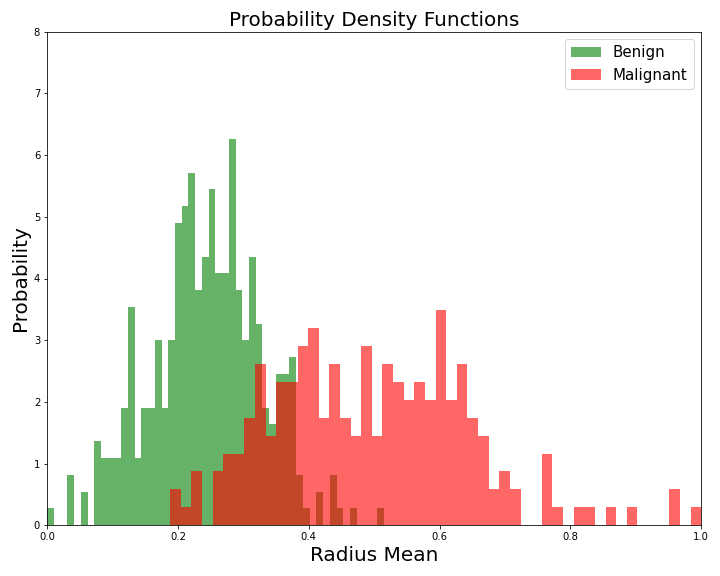

# Episode 2: **Components and Evaluation of a Machine Learning Pipeline**

_Learning Outcomes_
1. Explain the different steps in an ML pipeline
    - _Internal Note_: Pre-processing / Feature Selection / Training /Testing / Evaluation / Validation
2. Explain and critically argue about the criteria for evaluating an ML model
    - _Internal Note_: Referring to F-measure, accuracy, recall, specificity, sensitivity, silhouette, confusion matrix, etc
3. Evaluate and compare ML models for a particular dataset;  what could you do to improve your model ?
    - _Internal Note_: Referring to training, testing, validation/cross-validation, dangers of overfitting/underfitting
   

## What is a pipeline?
In computer science, a pipeline is a set of data processing elements connected in series, where the output of one element is the input of the next one. The elements of a pipeline are often executed in parallel or in time-sliced fashion. Some amount of buffer storage is often inserted between elements. Pipelining is a commonly used concept in everyday life. For example, in the assembly line of a car factory, each specific task is often done by a separate work station. Suppose that assembling a car requires three tasks that take 20, 10, and 15 minutes, respectively. Then, if all three tasks were performed by a single station, the factory would output one car every 45 minutes. By using a pipeline of three stations, the factory would output the first car in 45 minutes, and then a new one every 20 minutes. [[1]](#1)

The pipeline of an ML procedure isn't always constant. It varies, depending on the problem, the dataset, the algorithms used etc. The diagram of the pipeline that we'll mostly use in this course consists of the following steps: Data Pre-processing, Feature Selection, Model Training, Model Testing, Model Evaluation, Model Validation.

*How beautiful would be if I had a picture here to insert! :/*

# Data pre-processing
Before thinking about modeling, let's have a look at our data. There is no point in throwing a 10000 layer convolutional neural network (whatever that means) at our data before we even know what we’re dealing with.[[2]](#2). So let's load again the Bearst Cancer Data set from the CSV file created in the first episode.

~~~
# Importing pandas package
import pandas as pd

# Loading file
bearst_cancer_data = pd.read_csv('breast_cancer_data.csv', header=0, index_col=0)

# Removing the first column (ID)
bearst_cancer_data = bearst_cancer_data.iloc[:,1:]

# separating X and Y matrix
tumors = bearst_cancer_data.pop('Diagnosis')
X, y = bearst_cancer_data, tumors
~~~
{: .language-python}

Data Pre-Processing is a bit fuzzy term. That's because it involves a bunch of different processes, either used or not, with the aim to understanding our data. Usually, the first step of data pre-prosessing is Data Clensing. **Data cleansing** or data cleaning is the process of detecting and correcting (or removing) corrupt or inaccurate records from a record set, table, or database and refers to identifying incomplete, incorrect, inaccurate or irrelevant parts of the data and then replacing, modifying, or deleting the dirty or coarse data [[3]](#3). Luckily, there is no need to perform this step here, at least in terms of deleting corrupt records, because our data table seems complete; however, it's pretty possible to detect inaccurate samples as we proceed further in the analysis.

The next important step that should never be ignored is **Feature Scaling**. There two different methods to scale our features: **Normalization** and **Standardization**. To understand the need of scaling our features, let's use the following code to calculate the mean value and standard deviation of each feature separately: (In the following code, we set the parameter `axis = 0` to indicate that we want to calculate the means and STDs of columns. If we wanted do the same calculation for the rows, we should set `axis = 1`, which is obviously meaningless.)

~~~
# Names of features
feature_names = X.columns

# Calculatinf mean values
mv_vector = X.mean(axis = 0)

# Calculating standard deviations
std_vector = X.std(axis = 0)

# Printing code
for i in range(len(mv_vector)):
    feature_name = str(feature_names[i])
    mv_str = "Mean: " + str(mv_vector[i])
    std_str = "STD: " + str(std_vector[i])
    
    # String Alignment
    print("{0:<30}{1:<30}{2:<30}".format(feature_name, mv_str, std_str))
~~~
{: .language-python}

~~~
Radius.Mean                   Mean: 14.127291739894563      STD: 3.524048826212078        
Texture.Mean                  Mean: 19.28964850615117       STD: 4.301035768166949        
Perimeter.Mean                Mean: 91.96903339191566       STD: 24.2989810387549         
Area.Mean                     Mean: 654.8891036906857       STD: 351.9141291816527        
Smoothness.Mean               Mean: 0.096360281195079       STD: 0.01406412813767362      
Compactness.Mean              Mean: 0.10434098418277686     STD: 0.0528127579325122       
Concavity.Mean                Mean: 0.08879931581722322     STD: 0.0797198087078935       
Concave.Points.Mean           Mean: 0.048919145869947236    STD: 0.03880284485915359      
Symmetry.Mean                 Mean: 0.181161862917399       STD: 0.027414281336035712     
Fractal.Dimension.Mean        Mean: 0.06279760984182778     STD: 0.007060362795084458     
Radius.SE                     Mean: 0.4051720562390161      STD: 0.2773127329861041       
Texture.SE                    Mean: 1.2168534270650269      STD: 0.5516483926172023       
Perimeter.SE                  Mean: 2.8660592267135288      STD: 2.021854554042107        
Area.SE                       Mean: 40.33707908611603       STD: 45.49100551613178        
Smoothness.SE                 Mean: 0.007040978910369071    STD: 0.003002517943839067     
Compactness.SE                Mean: 0.025478138840070306    STD: 0.017908179325677377     
Concavity.SE                  Mean: 0.031893716344463946    STD: 0.03018606032298839      
Concave.Points.SE             Mean: 0.011796137082601056    STD: 0.0061702851740468665    
Symmetry.SE                   Mean: 0.020542298769771532    STD: 0.008266371528798399     
Fractal.Dimension.SE          Mean: 0.0037949038664323383   STD: 0.0026460709670891942    
Radius.Worst                  Mean: 16.269189806678394      STD: 4.833241580469324        
Texture.Worst                 Mean: 25.677223198594014      STD: 6.146257623038323        
Perimeter.Worst               Mean: 107.2612126537786       STD: 33.60254226903635        
Area.Worst                    Mean: 880.5831282952545       STD: 569.3569926699492        
Smoothness.Worst              Mean: 0.13236859402460469     STD: 0.022832429404835458     
Compactness.Worst             Mean: 0.25426504393673144     STD: 0.15733648891374194      
Concavity.Worst               Mean: 0.27218848330404205     STD: 0.20862428060813232      
Concave.Points.Worst          Mean: 0.11460622319859404     STD: 0.0657323411959421       
Symmetry.Worst                Mean: 0.29007557117750454     STD: 0.06186746753751869      
Fractal.Dimension.Worst       Mean: 0.08394581722319855     STD: 0.01806126734889399      
~~~
{: .output}

**Feature scaling** refers to putting the values in the same range or same scale so that no variable is dominated by the other. And why this is important? Because, most of the times like here, your dataset will contain features highly varying in magnitudes, units and range. But since, most of the machine learning algorithms use Euclidean distance between two data points in their computations, this is a problem. The features with high magnitudes will weigh in a lot more in the distance calculations than features with low magnitudes. To suppress this effect, we need to bring all features to the same level of magnitudes. [[4]](#4) 

**Normalization** is a scaling technique in which values are shifted and rescaled so that they end up ranging between 0 and 1. It is also known as Min-Max scaling. Here’s the formula for normalization:

  

**Standardization**, on the other hand, is a scaling technique where the values are centered around the mean with a unit standard deviation. This means that the mean of the attribute becomes zero and the resultant distribution has a unit standard deviation. Here’s the formula for standardization:

  

*Question: Normalize or Standardize?*

Quick answer: Normalization vs. standardization is an eternal question among machine learning newcomers. The answer is simple:
- Normalization is good to use when you know that the distribution of your data does not follow a Gaussian distribution. This can be useful in algorithms that do not assume any distribution of the data like K-Nearest Neighbors and Neural Networks.
- Standardization, on the other hand, can be helpful in cases where the data follows a Gaussian distribution. However, this does not have to be necessarily true. Also, unlike normalization, standardization does not have a bounding range. So, even if you have outliers in your data, they will not be affected by standardization.[[5]](#5)

Remember last lecture we used Standarization in the same dataset, before applying PCA algorithm, and it seemed to work pretty well. This time, however, we're going to normalize our data, because we don't know the distribution of it, and so it's a safer choice. Feature normalization in Python is accomplished by `MinMaxScaler()` function in `sklearn.preprocessing` library:

~~~
from sklearn.preprocessing import MinMaxScaler

# Feature Normalization
min_max_scaler = MinMaxScaler()
X_normalized = min_max_scaler.fit_transform(X)

# The output of MinMaxScaler() is a numpy array
# So we convert it to pandas.DataFrame
X_normalized = pd.DataFrame(X_normalized, columns = feature_names)
~~~
{: .language-python}

After running this code, each element in the data matrix will definetely lie inside the interval [0,1]. The last step of data pre-processing is getting a better sense of the relationship between the features themselves or features and targets. This can be achieved either by calculating some statistical metrics (e.g. ANOVA, Interquantile Analysis) or by vizualizing the data. For now, we are going to visualize some stuff, as an image worths a thousand words. We'll return to the statistical part in the Feature Selection section.

The following code stores the values of `Radius.Mean` and `Symmetry.Worst` columns in objects `x1` and `x2` respectively. After that, the PDF's are plotted (Probability Density Functions) in the form of histogramms, for Benign and Malignant samples separately. 

~~~
import matplotlib.pyplot as plt

# Features Selected
x1 = X_normalized['Radius.Mean']
x2 = X_normalized['Symmetry.Worst']

# Plotting the two pdf's in the same plot for feature 'Radius.Mean'
plt.figure(figsize=(10,8))
plt.xlabel('Radius Mean',fontsize=20)
plt.ylabel('Probability',fontsize=20)
plt.title("Probability Density Functions",fontsize=20)
plt.xlim([0,1])
plt.ylim([0,8])
cancer_types = ['B', 'M']
legend_list = ['Benign', 'Malignant']
colors = ['g', 'r']
for cancer_type, color in zip(cancer_types,colors):
    indicesToKeep = y == cancer_type
    plt.hist(x1.loc[indicesToKeep], color = color, bins = 50, density=True)

plt.legend(legend_list,prop={'size': 15})
plt.show()

# Plotting the two pdf's in the same plot for feature 'Symmetry.Worst'
plt.figure(figsize=(10,8))
plt.xlabel('Symmetry Worst',fontsize=20)
plt.ylabel('Probability',fontsize=20)
plt.title("Probability Density Functions",fontsize=20)
plt.xlim([0,1])
plt.ylim([0,8])
cancer_types = ['B', 'M']
legend_list = ['Benign', 'Malignant']
colors = ['g', 'r']
for cancer_type, color in zip(cancer_types,colors):
    indicesToKeep = y == cancer_type
    plt.hist(x2.loc[indicesToKeep], color = color, bins = 50, density=True)

plt.legend(legend_list,prop={'size': 15})
plt.show()
~~~
: .language-python}

overlapping region!

  

  

## References

<a id="1">[1]</a> 
https://en.wikipedia.org/wiki/Pipeline_(computing)

<a id="2">[2]</a> 
Fotis Psomopoulos
Introduction to Machine Learning
Overview of the Material for the BC2 2019 workshop, [Link](https://fpsom.github.io/IntroToMachineLearning/episodes/03-eda-unsupervised-learning.html)

<a id="3">[3]</a>
Wu, S. (2013)
A review on coarse warranty data and analysis
Reliability Engineering and System, [Link](https://kar.kent.ac.uk/32972/1/LatestVersionV01.pdf)

<a id="4">[4]</a>
Rahul Saini (2019)
Feature Scaling- Why it is required?
Medium, [Link](https://medium.com/@rahul77349/feature-scaling-why-it-is-required-8a93df1af310)

<a id="5">[5]</a>
Aniruddha Bhandari (2020)
Feature Scaling for Machine Learning: Understanding the Difference Between Normalization vs. Standardization
Analytics Vidhya, [Link](https://www.analyticsvidhya.com/blog/2020/04/feature-scaling-machine-learning-normalization-standardization/)
