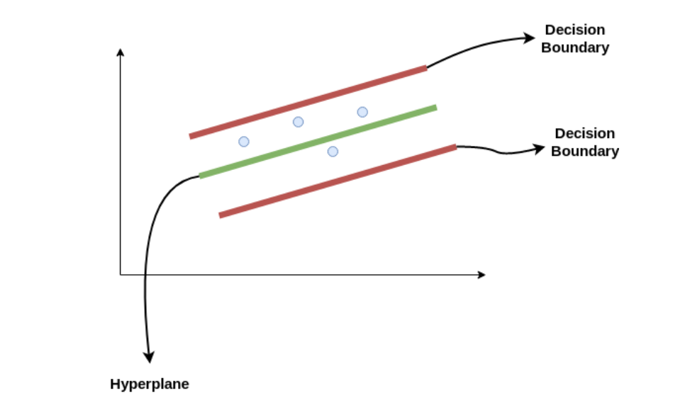
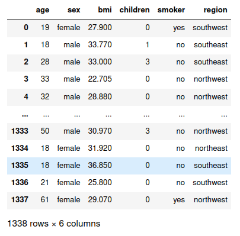
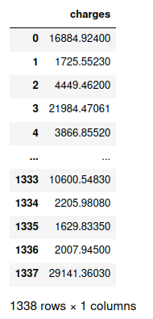
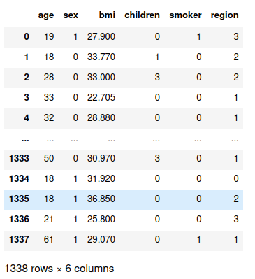
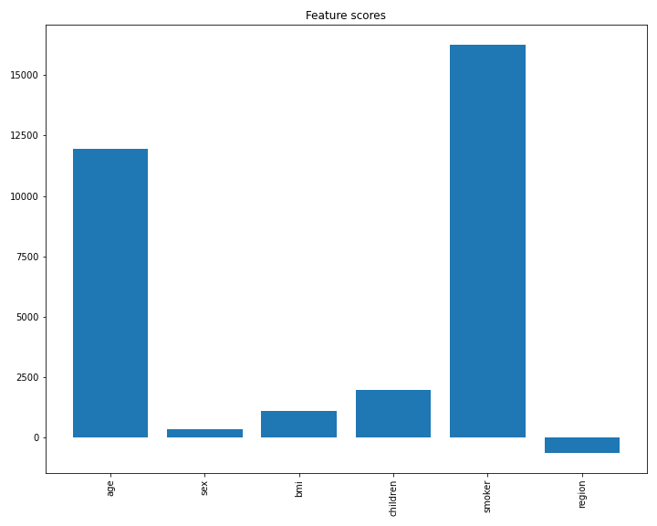
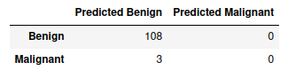
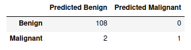
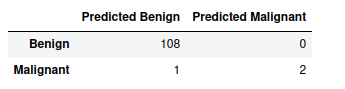

# Episode 3 - Exercises

## Exercise 1
This is a regression exercise. The dataset that we'll use is Medical Cost Personal Datasets which is publicly available with full details [here](https://www.kaggle.com/mirichoi0218/insurance). Each row corresponds to a single patient and consists of 7 columns: `age`, `sex`, `bmi` (Body mass index), `children` (Number of children covered by health insurance), `smoker`, `region` and `charges`(Individual medical costs). We've already stored this dataset in our Github repository as `insurance.csv` The question is whether we can predict insurance costs by utilizing the rest of the features.

### Theory: SVM for regression or SVR (Support Vector Regression)
Support Vector Regression (SVR) uses the same principle as SVM, but for regression problems. The problem of regression is to find a function that approximates mapping from an input domain to real numbers on the basis of a training sample. 

The idea behind SVR is shown on the following figure. Consider these two red lines as the decision boundary and the green line as the hyperplane (in regular SVM). Our objective, when we are moving on with SVR, is to basically consider the points that are within the decision boundary line. Our best fit line is the hyperplane that has a maximum number of points. But what is actually this decision boundary? Consider these lines as being at any distance, say `epsilon`, from the hyperplane. So, these are the lines that we draw at distance `+ epsilon` and `- epsilon` from the hyperplane, and that's basicallly the decision boundary.

<p align="center">
  
</p>

Evidently the SVR model can be generalized to non-linear curves (polynomials of second degree and above) and planes.

### Solution
First of all we import the dataset and distinguish X and y matrices:

```python
import pandas as pd

# Loading file
df = pd.read_csv('insurance.csv')
X = df.iloc[:,0:6]
y = df['charges']
y = pd.DataFrame(y, columns = ['charges'])
```

A general overview of the dataset is the following:

Features             |  Targets
:-------------------------:|:-------------------------:
  |  

We can also extract useful information regarding the dataset, such as the class of features and whether there are null values, by using the `.info()` attribute function of `pandas.DataFrane` objects:

```python
df.info()
```

~~~
<class 'pandas.core.frame.DataFrame'>
RangeIndex: 1338 entries, 0 to 1337
Data columns (total 7 columns):
 #   Column    Non-Null Count  Dtype  
---  ------    --------------  -----  
 0   age       1338 non-null   int64  
 1   sex       1338 non-null   object 
 2   bmi       1338 non-null   float64
 3   children  1338 non-null   int64  
 4   smoker    1338 non-null   object 
 5   region    1338 non-null   object 
 6   charges   1338 non-null   float64
dtypes: float64(2), int64(2), object(3)
memory usage: 73.3+ KB
~~~

The point of this exercise is to apply a regression model to data (SVR), explain why it might not fit the data properly and apply suitable changes in order to increase the performance. For this reason, we're going to skip validation method, because it's meaningless to repeat the total ML pipeline at every exercise; it makes more sense to focus on specific parts each time. The data matrix consists of three categorical values: `sex`, `smoker` and `region` (maybe we could consider children as categorical feature too, because its values are limited, but it has already numerical values, we leave  it as it is). Let's print the distributions of our categorical features:

```python
print("----------------------------")
print("Feature: Smoker")
print(X['smoker'].value_counts())
print("----------------------------")
print("Feature: Sex")
print(X['sex'].value_counts())
print("----------------------------")
print("Feature: Region")
print(X['region'].value_counts())
print("----------------------------")
```

~~~
----------------------------
Feature: Smoker
no     1064
yes     274
Name: smoker, dtype: int64
----------------------------
Feature: Sex
male      676
female    662
Name: sex, dtype: int64
----------------------------
Feature: Region
southeast    364
southwest    325
northwest    325
northeast    324
Name: region, dtype: int64
----------------------------
~~~

We'll now use the dictionary-based assignment method to technically convert features `sex` and `smoker` to numerical:

```python
# replacing sex and smoker with numerical data
sex_and_smoker_replace = {"sex":{"female":1, "male":0} , "smoker":{"yes":1, "no":0}}
X = X.replace(sex_and_smoker_replace)
```

And the label-encoding assignment method to convert feature `region`:

```python
# Replacing region with numerical data
X["region"] = X["region"].astype('category')
X["region"] = X["region"].cat.codes
```

Hence, our new data matrix has the following structure:
	
<p align="center">
  
</p>

So, now, let's normalize our dataset, split it into training and test set, apply SVR and calculate the evaluation parameters (R^2 and MSE). The SVR algorithm is implemented in Python's `sklearn.svm` library.

```python
from sklearn.model_selection import train_test_split
from sklearn.svm import SVR
from sklearn.metrics import mean_squared_error
from sklearn.preprocessing import MinMaxScaler

# feature names
feature_names = X.columns

# scaling
scaler = MinMaxScaler()
X_normalized = scaler.fit_transform(X)
X_normalized = pd.DataFrame(X_normalized, columns = feature_names)

# train - test splot
X_train, X_test, y_train, y_test = train_test_split(X_normalized, y, test_size=0.3, random_state=0)

# model
model = SVR(kernel='linear')
model.fit(X_train, y_train.values.ravel())
y_pred = model.predict(X_test)

#MSE
mse = mean_squared_error(y_test, y_pred)
print('MSE: ' + str(mse))

# R square
r_sq = model.score(X_test, y_test)
print('R^2: ' + str(r_sq))
```

~~~
MSE: 171709778.8315822
R^2: -0.0767564731816972
~~~

Results are obviously awful. In fact, the value of R^2 metric is negative, which means that the model is worse than the baseline! But why?

The first parameter that we typically tune is the `C` parameter, which has a default value `C=1`. The tuning process is usually done using trial and error method, which is characterized by repeated varied attempts which are continued until success. But before beggining to randomly testing values, let's think whether we should increase or decrease C value. C value is the reqularization parameter and it's purpose is to keep the regression coefficients as low as possible, so as to avoid overifitting. The lower the value of C, the lower the coefficients. However, our input values (values of X matrix) lie within [0,1] interval (because of normalization) and the output values are of order 10^3 or 10^4. So, we need large values in coefficients and, thus, we need to increase C value. After testing, we concluded that `C=1e3` is an appropriate value.

```python
# model
model_2 = SVR(kernel='linear', C=1e3)
model_2.fit(X_train, y_train.values.ravel())
y_pred = model_2.predict(X_test)

#MSE
mse = mean_squared_error(y_test, y_pred)
print('MSE: ' + str(mse))

# R square
r_sq = model_2.score(X_test, y_test)
print('R^2: ' + str(r_sq))
```

~~~
MSE: 58402132.49471051
R^2: 0.6337723183897759
~~~

Much much better! Now let's think what we can also do to increase the performace. A good idea would be to drop out `region` and `sex`, because logically speaking it doesn't seem to play any important role in our model. We could possible vertify that by checking the corresponding coefficients:

```python
import matplotlib.pyplot as plt

# plot feature importance
plt.figure(figsize=(10,8))
plt.bar(list(feature_names), list(model_2.coef_[0]))
plt.xticks(rotation = 'vertical')
plt.title('Feature scores')
plt.show()
```

<p align="center">
  
</p>

As we expected, `sex` and `region` play the less singificant role in the final result, so let's drop them out:

```python
# as data frames
X_train = pd.DataFrame(X_train, columns = feature_names)
X_test = pd.DataFrame(X_test, columns = feature_names)

# Drop out sex and region
X_train.drop(columns = ['region', 'sex'], inplace=True)
X_test.drop(columns=['region', 'sex'], inplace=True)

# model
model = SVR(kernel='linear',  C=1e3)
model.fit(X_train, y_train.values.ravel())
y_pred = model.predict(X_test)

#MSE
mse = mean_squared_error(y_test, y_pred)
print('MSE: ' + str(mse))

# R square
r_sq = model.score(X_test, y_test)
print('R^2: ' + str(r_sq))
```

~~~
MSE: 58139554.23566454
R^2: 0.6354188922894595
~~~

Unfortunately, the effect in the final result was tiny. Our last attempt is focused on tuning the `epsilon` parameter (check the theory above for what this parameter is). The default value in `epsilon` parameter is 0.1 and, at the same time, the output values are of order 10^3 or 10^4. This does not make much sense, we have to increase the value. After some tuning, we end up setting `epsilon = 4e3`.

```python
# model
model_3 = SVR(kernel='linear' ,  C=1e3, epsilon = 4e3)
model_3.fit(X_train, y_train.values.ravel())
y_pred = model_3.predict(X_test)

#MSE
mse = mean_squared_error(y_test, y_pred)
print('MSE: ' + str(mse))

# R square
r_sq = model_3.score(X_test, y_test)
print('R^2: ' + str(r_sq))
```

~~~
MSE: 44557039.09459874
R^2: 0.7205920326880368
~~~

The performance is much better! We've begun with a totally unreliable model and by fixing parameters we end up having a decent one.


## Exercise 2
The point of this exercise is to check how the imbalanced data affects the performance of a classification model. We'll use Breast Cancer dataset and apply kNN algorithm. Moewover, we are going to transform the original dataset, so as to artificially create this kind of imbalance.

### Solution
So let's import the Breast cancer dataset and split it into X and y matrices.

```python
import pandas as pd

# Importing breast cancer dataset
breast_cancer_data = pd.read_csv('breast_cancer_data.csv', header=0, index_col=0)

# Removing the first column (ID)
breast_cancer_data = breast_cancer_data.iloc[:,1:]

# separating X and Y matrix
tumors = breast_cancer_data.pop('Diagnosis')
X, y = breast_cancer_data, tumors
```

We'll now randomly select only 10 malignant samples, so as the final dataset will consist of 357 benign and 10 malignant as well:

```python
# separating malignant from benign
X_malignant = X[y == 'M']
X_benign = X[y == 'B']

y_malignant = y[y == 'M']
y_benign = y[y == 'B']

# Merging X and y matrices for sampling
X_malignant['tumor type'] = y_malignant

# subsampling the 'malignant' labels
X_malignant = X_malignant.sample(n = 10, random_state = 0)

# Separating
y_malignant = X_malignant.pop('tumor type')

# Merging in an overall matrix
X = pd.concat([X_benign, X_malignant])
y = pd.concat([y_benign, y_malignant])

# Print count of values
y = pd.DataFrame(y, columns = ['targets'])
print(y['targets'].value_counts())
```

~~~
B    357
M     10
Name: targets, dtype: int64
~~~

Now we're going to split the new dataset (let's call it Breast cancer dataset 2) into train and test set (we'll skip cross validation part because it's out of context of current exercise). The Breast cancer dataset is a pretty imbalanced dataset if we randomly split it into train and test set, there's a big chance for the test set to lack of malignant samples. Hence, we need to split it in a way, so that the distribution of labels remains almost the same in both training and test set. We can accomplish this by setting the argument `stratify = y` in `train_test_split()` function. We can vertify that by running the following code:

```python
from sklearn.model_selection import train_test_split

X_train, X_test, y_train, y_test = train_test_split(X,y,test_size=0.3, stratify=y, random_state=0)

# Printing
print('-------------------------------------------------')
print('Training set:')
y_train = pd.DataFrame(y_train, columns = ['targets'])
print(y_train['targets'].value_counts())
print('-------------------------------------------------')
print('Test set:')
y_test = pd.DataFrame(y_test, columns = ['targets'])
print(y_test['targets'].value_counts())
print('-------------------------------------------------')
```

~~~
-------------------------------------------------
Training set:
B    249
M      7
Name: targets, dtype: int64
-------------------------------------------------
Test set:
B    108
M      3
Name: targets, dtype: int64
-------------------------------------------------
~~~

Indeed, we've requested a 70%:30% train-test split and the train and test sets contain 7 and 3 malignant samples respectively. The idea, now, is to apply kNN algorithm. But, intuitively, how many neighboors should we select to vote? Logically speaking, the training set includes only 7 malignant samples. This means that if we select more than 14 neighboors to vote, all samples will be classified in benign class. We can check the confusion matrix to verity our hypothesis:

```python
from sklearn.neighbors import KNeighborsClassifier
from sklearn.metrics import confusion_matrix

# kNN
classifier = KNeighborsClassifier(n_neighbors=15)
classifier.fit(X_train, y_train.values.ravel())

# Predict
y_pred = classifier.predict(X_test)

conf_matrix = confusion_matrix(y_true=y_test, y_pred=y_pred)
conf_matrix = pd.DataFrame(conf_matrix, columns= ['Predicted Benign', 'Predicted Malignant'], index = ['Benign', 'Malignant'])
conf_matrix
```

<p align="center">
  
</p>

Our model classified none of the three malignant samples correctly. So maybe should we set `n_neighbors=3`?

```python
# kNN
classifier = KNeighborsClassifier(n_neighbors=3)
classifier.fit(X_train, y_train.values.ravel())

# Predict
y_pred = classifier.predict(X_test)

conf_matrix = confusion_matrix(y_true=y_test, y_pred=y_pred)
conf_matrix = pd.DataFrame(conf_matrix, columns= ['Predicted Benign', 'Predicted Malignant'], index = ['Benign', 'Malignant'])
conf_matrix
```

<p align="center">
  
</p>

Here the model classified correctly only one out of three samples. As we discussed at the second exercise of episode 2, the correct classification of malignant samples seems to be more important than the benign ones. So, in order to improve the performance of the model, we need to change the distribution of the training set, by oversampling the minority class and undersampling the majority one. These two techniques are better to be applied collaboratively. The concept of undersampling is relatively easy; just randonmly pick a subset of the majority class. But let's check some theory about oversampling.

### Theory
The challenge of working with imbalanced datasets is that most machine learning techniques will ignore, and in turn have poor performance on, the minority class, although typically it is performance on the minority class that is most important. One approach to to solve this is to oversample the minority class. The simplest approach involves duplicating examples in the minority class, although these examples don’t add any new information to the model. Instead, new examples can be synthesized from the existing examples. This is a type of data augmentation for the minority class and is referred to as the **Synthetic Minority Oversampling Technique**, or **SMOTE** for short. This technique was described by Nitesh Chawla, et al. in their 2002 paper named for the technique titled [“SMOTE: Synthetic Minority Over-sampling Technique”](https://arxiv.org/abs/1106.1813).

In a nutshell, SMOTE works by selecting examples that are close in the feature space, drawing a line between the examples in the feature space and drawing a new sample at a point along that line. Specifically, a random example from the minority class is first chosen. Then k of the nearest neighbors for that example are found (typically k=5). A randomly selected neighbor is chosen and a synthetic example is created at a randomly selected point between the two examples in feature space[[1]](#1).

In the following example, we will use the implementations provided by the `imbalanced-learn` Python library, which can be installed via pip as follows:

```python
pip install imbalanced-learn
```

You can confirm that the installation was successful by printing the version of the installed library:

```python
# check version number
import imblearn
print(imblearn.__version__)
```

~~~
0.8.0
~~~

### Back to code
Having installed the `imbalanced-learn` library, let's apply it on data. Remember, oversampling and undersampling should only be used in training dataset! In the following code, we define a `SMOTE()` instance with `k_neighbors=2` that will balance the minority class and then fit and apply it in one step to create a transformed version of our training dataset. Once transformed, we can summarize the class distribution of the new transformed dataset, which would expect to now be balanced through the creation of many new synthetic examples in the minority class.

```python
from imblearn.over_sampling import SMOTE

# Oversampling
oversample = SMOTE(k_neighbors=2)
X_oversampled, y_oversampled = oversample.fit_resample(X_train, y_train)

# Summary
y_oversampled['targets'].value_counts()
```

~~~
B    249
M    249
Name: targets, dtype: int64
~~~

However, the original paper on SMOTE suggested combining SMOTE with random undersampling of the majority class. The `imbalanced-learn` library supports random undersampling via the `RandomUnderSampler()` function. Thus, we are going to combine `SMOTE()` and `RandomUnderSampler()`. In idea would be to first oversample the minority class to have 20% the number of examples of the majority class (e.g. about 50), then use random undersampling to reduce the number of examples in the majority class to have 50% more than the minority class (e.g. about 100).

To implement this, we can specify the desired ratios as arguments to the SMOTE and RandomUnderSampler classes; for example:

```python
from imblearn.under_sampling import RandomUnderSampler
from imblearn.over_sampling import SMOTE

# initialization
over = SMOTE(sampling_strategy=0.2, k_neighbors=2)
under = RandomUnderSampler(sampling_strategy=0.5)

# oversampling
X_oversampled, y_oversampled = over.fit_resample(X_train, y_train)

# undersampling
X_transformed, y_transforned = under.fit_resample(X_oversampled, y_oversampled)

# Summary
y_transforned['targets'].value_counts()
```

~~~
B    98
M    49
Name: targets, dtype: int64
~~~

Finally, we're going to apply again kNN algorithm in our data. Let's run the code first and then make comments:

```python
# kNN
classifier = KNeighborsClassifier(n_neighbors=16)
classifier.fit(X_transformed, y_transforned)

# Predict
y_pred = classifier.predict(X_test)

conf_matrix = confusion_matrix(y_true=y_test, y_pred=y_pred)
conf_matrix = pd.DataFrame(conf_matrix, columns= ['Predicted Benign', 'Predicted Malignant'], index = ['Benign', 'Malignant'])
conf_matrix
```

<p align="center">
  
</p>

Although we haven't succeded in a correct classification of all malignant samples, for a wide range of `k-neighbors` values (especially when the variable lies within the interval [10,25]), we classify 2 out of 3 samples correctly, which is definitely an improvement. Moreover, for some values (like `n_neighbors=16` in our example), we succeed in classify perfectly all benign samples!

## References

<a id="1">[1]</a> 
Jason Brownlee
SMOTE for Imbalanced Classification with Python
Machine Learning Mastery, [Link](https://machinelearningmastery.com/smote-oversampling-for-imbalanced-classification/)

