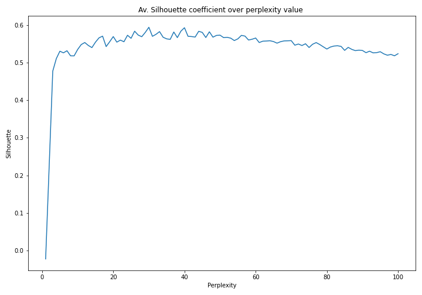
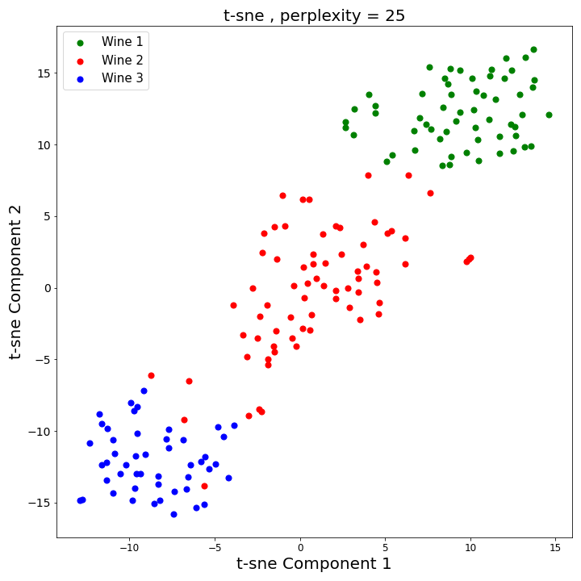
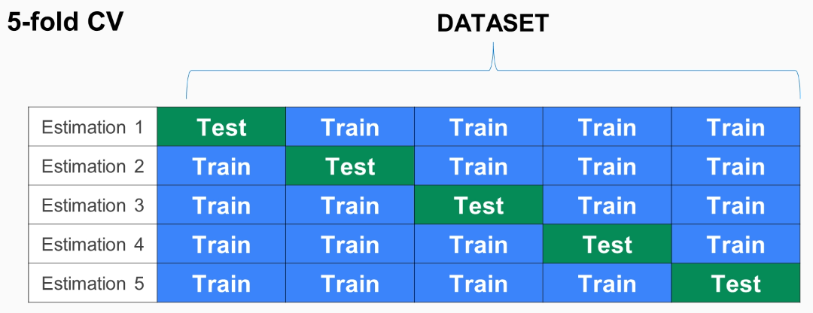
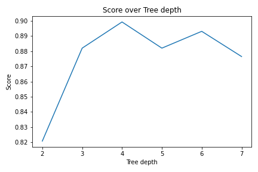
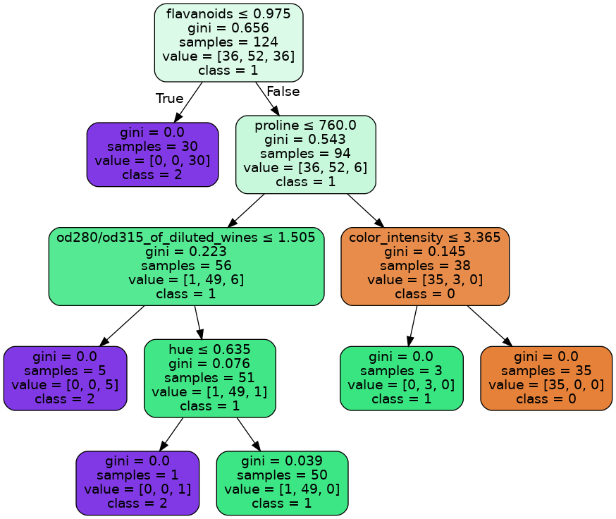

# Episode 3: Optimizing a model

_Learning Outcomes_ : 
1. Choose one or more appropriate ML methods (taught in the course) for the research question / dataset in question
2. For each appropriate ML method A, identify the optimal parameter set (hyperparameter optimization)
    - _Internal Note_: Also define what is hyperparameter optimization
3. Demonstrate the understanding of assumptions pertaining to the associated model of method A, its applicability to data
    - (including how to decide on the number of clusters)
4. Grasp the issue of bias and variance in ML and how ML design choices influence this balance
    - under/over-fitting. can be solved with regularization (GLM,LM), by tuning alogrithm parameters (tree depth, k in KNN)
    - dropout
    - cross-validation
5. Explain the problem of data imbalance and how to solve it properly
    - oversampling (when we have a few data)
    - undersampling (when we have enough data)

## Multi-class problem

In the first part of this lecture we are going to focus on a multi-class dataset and examine some more algorithms: t-sne (dimensionality reduction, visualization), kNN and Decision Trees (supervised problems), while in the second part we'll mainly focus on a regression problem. In the in-between stages we'll introduce more terminology so as to overcome various limitations that might occur. At first, we are going to load [Wine Recognition Dataset](https://scikit-learn.org/stable/datasets/toy_dataset.html#wine-recognition-dataset) from `sklearn.Datasets` package. The wine dataset consists of 178 samples, 13 features each and three classes in total. The targets are [0,1,2] and correpsond to wine-type 1, type 2 and type 3 respectively. We can import and normalize our dataset using the following lines of code. By setting `return_X_y=True` and `as_frame=True` in `datasets.load_wine()` function we import the wine dataset directly in X-y matrix and `DataFrame` format. We are not going to print the matrices in the console, to save some space.

```python
import pandas as pd
from sklearn import datasets
from sklearn.preprocessing import MinMaxScaler

# loading wine dataset -storing directly into X,y dataframes
X,y = datasets.load_wine(return_X_y=True, as_frame=True)

# feature names
feature_names = X.columns

# Normalize
min_max_scaler = MinMaxScaler()
X_normalized = min_max_scaler.fit_transform(X)
X_normalized = pd.DataFrame(X_normalized, columns=feature_names)
```
### Understanding data

Following up the, more or less, standard routine established in the previous episodes, the first thing we do when loading our dataset is to try to get a sense of it, like how well classes are separated, what's the distribution of them, what's the variance of features and other aspects. This time we will attempt to apply **t-sne** algorithm, so as to reduce dimensions and project our samples into a 2D plot (more or less like we did in the last part of the first episode with PCA). We are not going to make good use of the reduced-dimensionality features in the rest of the analysis, because the new features created by t-sne do not have a physical meaning; they are just mathematical objects created from the combination of actual features. This part we'll only contribute to our better understanding of data.

*So what's t-sne?*

**T-Distributed Stochastic Neighbor Embedding (t-SNE)** is an unsupervised, non-linear technique for dimensionality reduction that is particularly well suited for the visualization of high-dimensional datasets. The algorithm calculates a similarity measure between pairs of instances in the high dimensional space and in the low dimensional space. It then tries to optimize these two similarity measures using a cost function. To keep things simple, here’s a brief overview of working of t-SNE:
1. Measures similarities between points in the high dimensional space. For each data point (xi) it centers a Gaussian distribution over that point. Then it measures the density of all points (xj) under that Gaussian distribution and renormalize for all points. This gives us a set of probabilities (Pij) for all points. Those probabilities are proportional to the similarities. All that means is, if data points x1 and x2 have equal values under this gaussian circle then their proportions and similarities are equal and hence you have local similarities in the structure of this high-dimensional space. The Gaussian distribution or circle can be manipulated using what’s called **perplexity**, which influences the variance of the distribution (circle size).
2. Now instead of using a Gaussian distribution we use a Student t-distribution with one degree of freedom, which is also known as the Cauchy distribution. This gives us a second set of probabilities (Qij) in the low dimensional space.
3. The last step is that we want these set of probabilities from the low-dimensional space (Qij) to reflect those of the high dimensional space (Pij) as best as possible. This is implemented by using the KLD divergence as a cost function.

*Question: PCA or t-sne?*

PCA is a linear dimension reduction technique that seeks to maximize variance and preserves large pairwise distances. In other words, things that are different end up far apart. This can lead to poor visualization especially when dealing with non-linear manifold structures. T-SNE differs from PCA by preserving only small pairwise distances or local similarities whereas PCA is concerned with preserving large pairwise distances to maximize variance[[1]](#1).

So, this time we are going to apply t-sne in our dataset. The hyperparameter we would like to tune is **perplexity**; for this reason we'll utilize silhouette coefficient.

### Silhouette coefficient
Silhouette refers to a method of interpretation and validation of consistency within clusters of data. So, although it's mainly used in unsupervised problems, it can definetely be used as an evaluation metric to calculate the stability of classes. For a signle data point i in cluster Ci, the silhouette coefficient is defined as:

<p align="center">
  
</p>

where a(i) is the mean distance between i and all other data points in the same cluster and b(i) the munimum mean distance of i to all points in any other cluster, of which i is not a member. From the above definition it is clear that:

<p align="center">
  
</p>

Thus an s(i) close to one means that the data is appropriately clustered. If s(i) is close to negative one, then by the same logic we see that i would be more appropriate if it was clustered in its neighbouring cluster. An s(i) near zero means that the datum is on the border of two natural clusters. The mean s(i) over all points of a cluster is a measure of how tightly grouped all the points in the cluster are. Thus the mean s(i) over all data of the entire dataset is a measure of how appropriately the data have been clustered[[2]](#2).

In the following code, we are using the mean s(i) - which is calculated by the `sklearn.metrics.silhouette_score()` function - as a metric to evaluate the consistensy of classes and, hence, we are attempting to tune the `perplexity` hyperparameter of t-sne. T-sne algorithm is inmplemented in `sklearn.manifold` library. In the following code, we are facing every positive integer that lie inside [1,100] as a possible perplexity value and we are calculating the corresponding average silhouette score. Let's check the output plot.

```python
# This code may take up to 2 minutes

#-------- Tuning peplexity/
from sklearn.manifold import TSNE
import matplotlib.pyplot as plt
from sklearn.metrics import silhouette_score

# Perplexity values
perplexities = list(range(1,101))

# silhouette scores initialization
silh_matrix = []

for perp in perplexities:
    # Model
    tsne = TSNE(n_components=2, perplexity=perp)
    X_tsne = tsne.fit_transform(X_normalized)

    # t-sne components as data frame
    X_tsne_df = pd.DataFrame(data = X_tsne, columns = ['Tsne component 1', 'Tsne component 2'])
    
    # append score to matrix
    silh_matrix.append(silhouette_score(X_tsne, y))

# Plot
plt.figure(figsize=(10,7))
plt.plot(perplexities, silh_matrix)
plt.title('Av. Silhouette coefficient over perplexity value ')
plt.xlabel('Perplexity')
plt.ylabel('Silhouette')
plt.show()
```
<p align="center">
  
</p>

Silhouette starts from a very low score but almost immediately rises up to 0.5 value. Furthermore, score seems to gradually increase up to 0.6 and find a peak for perplexities around [20,25]. After that, score seems to fall with a very slow rate. The information extracted from the plot is that the perplexity value doesn't play any significant role, as long as it is higher than (around) 5 and lower than (around) 40. The selected value seems to have negligible effect on the final distribution of data in the 2D plot. So, we choose `perplexity = 25` and reduce dimensions:

```python
# Perplexity
perp = 25

# Model
tsne = TSNE(n_components=2, perplexity=perp)
X_tsne = tsne.fit_transform(X_normalized)

# t-sne components as data frame
X_tsne_df = pd.DataFrame(data = X_tsne, columns = ['Tsne component 1', 'Tsne component 2'])

# Plotting - more or less the same code as PCA
plt.figure(figsize=(10,10))
plt.xticks(fontsize=12)
plt.yticks(fontsize=14)
plt.xlabel('t-sne Component 1',fontsize=20)
plt.ylabel('t-sne Component 2',fontsize=20)
plt.title("t-sne , perplexity = 25",fontsize=20)
wine_types = [0,1,2]
legend_list = ['Wine 1', 'Wine 2', 'Wine 3']
colors = ['g', 'r', 'b']
for wine_type, color in zip(wine_types,colors):
    indicesToKeep = y.values == wine_type
    plt.scatter(X_tsne_df.loc[indicesToKeep, 'Tsne component 1'], X_tsne_df.loc[indicesToKeep, 'Tsne component 2'], c = color, s = 50)

plt.legend(legend_list,prop={'size': 15})
plt.tight_layout()
plt.savefig('images/tsne_perp_25_03.png')
plt.show()
```
<p align="center">
  
</p>

*Comment*: MIEX, den paizei na stekei kai polu san analush.

## Multi-class problem: kNN vs Decision Trees
So, data seem to be decently separated in high dimensional space. The next thing is to determine the rules that distringuish the three wine types. For this reason, we are going to apply two different pipelines in our dataset based on two different algorithms: kNN and Decision Trees. Let's start with a brief presentation of both algorithms.

### kNN
The K-nearest neighbors (KNN) algorithm is a type of supervised machine learning algorithms. KNN is extremely easy to implement in its most basic form, and yet performs quite complex classification tasks. It is a lazy learning algorithm since it doesn't have a specialized training phase. The intuition behind the KNN algorithm is really simple. It simply calculates the distance of a new data point to all other training data points. It then selects the K-nearest data points, where K can be any integer. Finally it assigns the data point to the class to which the majority of the K data points belong. 

An advantage is that, since the algorithm requires no training before making predictions, new data can be added seamlessly. Moreover, there is technically only one **hyperparameter** to be tuned, that is the **number of neighboors** taken into account (k). The main disadvantage is that KNN algorithm doesn't work well with high dimensional data because with large number of dimensions, it becomes difficult for the algorithm to calculate distance in each dimension. Additionally, kNN faces difficulties when dealing with categorical features[[3]](#3).

### Decision Trees

A **decision tree** is a flowchart-like tree structure where an internal node represents a single feature (or attribute), the branch represents a decision rule, and each leaf node represents the outcome (i.e. the label). The topmost node in a decision tree is known as the root node. The algorithm learns to partition on the basis of the attribute values. It's visualization like a flowchart diagram which easily mimics the human level thinking (see example below). That is why decision trees are easy to understand and interpret. Decision Trees are **white box type of ML algorithm**,as they shares internal decision-making logic. They can also handle high dcdimensional data with good accuracy. 

The basic idea behind any decision tree algorithm is as follows:
1. Select the best attribute using Attribute Selection Measures(ASM) to split the records (some ASM measures are Information Gain, Gain Ratio and Gini index).
2. Make that attribute a decision node and break the dataset into smaller subsets.
3. Build the tree by repeating this process recursively for each child until one of the following conditions matches:
 - All the remaining samples belong to the same target value (class).
 - There are no more remaining attributes[[4]](#4).

Concerning decision trees, an important **hyperparameter** is **tree depth**. The deeper the tree, the better fits on the training set; however, it's more possible to fall into the trap of overfitting. In order to avoid overfitting, in both cases we are going to apply k-fold cross validation algorithm in our sets.

### K-fold Cross validation
Suppose we have a model with one or more unknown parameters, and a data set to which the model can be fit (the training data set). The fitting process optimizes the model parameters to make the model fit the training data as well as possible. As it is already discussed, if we then take an independent sample of validation data from the same population as where the training data have been taken, it will generally turn out that the model does not fit the validation data as well as it fits the training data. The size of this difference is likely to be large especially when the size of the training data set is small, or when the number of parameters in the model is large. Cross-validation is a way to estimate the size of this effect. 

Generally, two types of cross-validation can be distinguished: exhaustive and non-exhaustive cross-validation. **Exhaustive cross-validation** methods are methods which learn and test on all possible ways to divide the original sample into a training and a validation set. The most common technique when referring to exhaustive cross-validation is **Leave-p-out cross-validation (LpO CV)**, which involves using p observations as the validation set and the remaining observations as the training set. This is repeated on all ways to cut the original sample on a validation set of p observations and a training set. The process is computationally heavy.

**Non-exhaustive cross validation** methods do not compute all ways of splitting the original sample. Those methods are approximations of leave-p-out cross-validation. The most common technique when referring to non-exhaustive cross-validation is **k-fold cross-validation**. In k-fold cross-validation, the original dataset is randomly partitioned into k equal sized subsamples. Of the k subsamples, a single subsample is retained as the validation data for testing the model, and the remaining k − 1 subsamples are used as training data. The cross-validation process is then repeated k times, with each of the k subsamples used exactly once as the validation data. The k results can then be averaged to produce a single estimation[[5]](#5). The most common evaluation metrics used and averaged in k-fold cross validation are Mean Squared Error (MSE) for regression problems and accuracy for classification problems. The following image gives us a visual representation of the algorithm[[6]](#6).

<p align="center">
  
</p>

### Decision Trees - in practice
Now, let's check the behaviour of two algorithms when applied to our dataset. At first we are going to apply Decision Tree Classifier, which is implemented in `sklearn.tree` package ([Link](https://scikit-learn.org/stable/modules/generated/sklearn.tree.DecisionTreeClassifier.html)). As previously mentioned, the hyperparameter that needs to be tuned is the tree depth and so does the following code. The hyperparameter gets tuned by utilizing the k-fold cross validation algorithm, implemented as `cross_val_score()` in `sklearn.model_selection` package ([Link](https://scikit-learn.org/stable/modules/generated/sklearn.model_selection.cross_val_score.html)). From the output plot, it's clear that the optimal depth equals 4.

```python
# Decision Trees
from sklearn.model_selection import cross_val_score
from statistics import mean 
from sklearn.tree import DecisionTreeClassifier # Import Decision Tree Classifier

depths = [2,3,4,5,6,7]

# Initialization
av_score_table = []

for depth in depths:
    
    # Create Decision Tree classifer object
    clf = DecisionTreeClassifier(max_depth = depth)
    
    # 5-fold cross validation
    scores = cross_val_score(clf, X_normalized, y, cv=5)
    
    # Appending average of scores (accuracies) to av_score_table
    av_score_table.append(mean(scores))

# Plotting
plt.figure()
plt.plot(depths,av_score_table)
plt.xlabel('Tree depth')
plt.ylabel('Score')
plt.title('Score over Tree depth')
plt.show()
```

<p align="center">
  
</p>

Having found the optimal depth, the following code splits randomly the total dataset in a ration 70% - 30% (70% training set - 30% test set) and applies the Decision Tree Classifier again. The classification results are printed below.

```python
from sklearn.tree import DecisionTreeClassifier # Import Decision Tree Classifier
from sklearn.model_selection import train_test_split # Import train_test_split function
from sklearn.metrics import classification_report

# Tree depth = 4
depth = 4

# Split dataset into training set and test set
X_train, X_test, y_train, y_test = train_test_split(X_normalized, y, test_size=0.3, random_state=1)

# Create Decision Tree classifer object
clf = DecisionTreeClassifier(max_depth=depth)

# Train Decision Tree Classifer
clf = clf.fit(X_train,y_train)

#Predict the response for test dataset
y_pred = clf.predict(X_test)

print(classification_report(y_pred = y_pred, y_true=y_test))
```

~~~
              precision    recall  f1-score   support

           0       0.96      0.96      0.96        23
           1       0.94      0.89      0.92        19
           2       0.92      1.00      0.96        12

    accuracy                           0.94        54
   macro avg       0.94      0.95      0.95        54
weighted avg       0.94      0.94      0.94        54
~~~

Finally, there are two important points to mention here. The first one is that Decision Trees belong to the category of **intrinsic feature selection** algorithms, because basically, at every step, the most significant feature is detected to split data. If we want to identify those features, we shall use the `.feature_importances_` attribute:

```python
print(clf.feature_importances_)
```

~~~
array([0.06966209, 0.        , 0.        , 0.        , 0.        ,
       0.        , 0.38102067, 0.        , 0.        , 0.02423226,
       0.        , 0.10817973, 0.41690525])
~~~

It's clear that feature with zero or almost zero values play negligible role in the creation of the model and, thus, they can be ignored. The second one is than we can use Scikit-learn's `export_graphviz()` function for display the tree within a Jupyter notebook. At first, we need to install `graphviz` and `pydotplus` packages, by running the following cell:

```python
import os
os.system("pip install graphviz")
os.system("pip install pydotplus")
```
And then run the following code to visualize the tree and export it as an image in your working directory:

```python
# Plotting tree
from sklearn.tree import export_graphviz
from io import StringIO 
from IPython.display import Image  
import pydotplus

dot_data = StringIO()
export_graphviz(clf, out_file=dot_data,  
                filled=True, rounded=True,
                special_characters=True,feature_names = X.columns,class_names=['0','1', '2'])
graph = pydotplus.graph_from_dot_data(dot_data.getvalue())  
graph.write_png('wine_types_tree.png')
Image(graph.create_png())
```

<p align="center">
  
</p>


### kNN - in practise
bla bla bla


## References

<a id="1">[1]</a> 
Andre Violante (2018)
An Introduction to t-SNE with Python Example
Towards data science, [Link](https://towardsdatascience.com/an-introduction-to-t-sne-with-python-example-5a3a293108d1)

<a id="2">[2]</a> 
https://en.wikipedia.org/wiki/Silhouette_(clustering)

<a id="3">[3]</a> 
Scott Robinson 
K-Nearest Neighbors Algorithm in Python and Scikit-Learn
Stack Abuse, [Link](https://stackabuse.com/k-nearest-neighbors-algorithm-in-python-and-scikit-learn/)

<a id="4">[4]</a> 
Avinash Navlani (2018)
Decision Tree Classification in Python
Data Camp, [Link](https://www.datacamp.com/community/tutorials/decision-tree-classification-python)

<a id="5">[5]</a> 
https://en.wikipedia.org/wiki/Cross-validation_(statistics)

<a id="6">[6]</a> 
https://subscription.packtpub.com/book/big_data_and_business_intelligence/9781789617740/2/ch02lvl1sec14/k-fold-cross-validation
