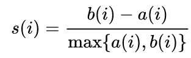
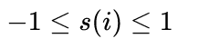

# Episode 3: Optimizing a model

_Learning Outcomes_ : 
1. Choose one or more appropriate ML methods (taught in the course) for the research question / dataset in question
2. For each appropriate ML method A, identify the optimal parameter set (hyperparameter optimization)
    - _Internal Note_: Also define what is hyperparameter optimization
3. Demonstrate the understanding of assumptions pertaining to the associated model of method A, its applicability to data
    - (including how to decide on the number of clusters)
4. Grasp the issue of bias and variance in ML and how ML design choices influence this balance
    - under/over-fitting. can be solved with regularization (GLM,LM), by tuning alogrithm parameters (tree depth, k in KNN)
    - dropout
    - cross-validation
5. Explain the problem of data imbalance and how to solve it properly
    - oversampling (when we have a few data)
    - undersampling (when we have enough data)

## Multi-class problem

In the first part of this lecture we are going to focus on a multi-class dataset and examine some more algorithms: t-sne (dimensionality reduction, visualization), kNN and Decision Trees (supervised problems), while in the second part we'll mainly focus on a regression problem. In the in-between stages we'll introduce more terminology so as to overcome various limitations that might occur. At first, we are going to load [Wine Recognition Dataset](https://scikit-learn.org/stable/datasets/toy_dataset.html#wine-recognition-dataset) from `sklearn.Datasets` package. The wine dataset consists of 178 samples, 13 features each and three classes in total. The targets are [0,1,2] and correpsond to wine-type 1, type 2 and type 3 respectively. We can import and normalize our dataset using the following lines of code. By setting `return_X_y=True` and `as_frame=True` in `datasets.load_wine()` function we import the wine dataset directly in X-y matrix and `DataFrame` format. We are not goint to print the matrices in the console, so as to save some space.

```python
import pandas as pd
from sklearn import datasets
from sklearn.preprocessing import MinMaxScaler

# loading wine dataset -storing directly into X,y dataframes
X,y = datasets.load_wine(return_X_y=True, as_frame=True)

# feature names
feature_names = X.columns

# Normalize
min_max_scaler = MinMaxScaler()
X_normalized = min_max_scaler.fit_transform(X)
X_normalized = pd.DataFrame(X_normalized, columns=feature_names)
```
### Visualizationin

Following up the, more or less, standard routine established in the previous episodes, the first thing we do when loading our dataset is to try to get a sense of it, like how well classes are separated, what's the distribution of them, what's the variance of features and other aspects. This time we will attempt to apply **t-sne** algorithm, so as to reduce dimensions and project our samples into a 2D plot (more or less like we did in the last part of the first episode with PCA). We are not going to utilize the reduced-dimensionality features, however, in the rest of the analysis, because the new features created by t-sne do not have a physical meaning; they are just mathematical objects occured from the combination of real features. This part we'll only contribute to our better understanding of data.

*So what's t-sne?*

**T-Distributed Stochastic Neighbor Embedding (t-SNE)** is an unsupervised, non-linear technique for dimensionality reduction that is particularly well suited for the visualization of high-dimensional datasets. The algorithm calculates a similarity measure between pairs of instances in the high dimensional space and in the low dimensional space. It then tries to optimize these two similarity measures using a cost function. To keep things simple, here’s a brief overview of working of t-SNE:
1. Measures similarities between points in the high dimensional space. For each data point (xi) it centers a Gaussian distribution over that point. Then it measures the density of all points (xj) under that Gaussian distribution and renormalize for all points. This gives us a set of probabilities (Pij) for all points. Those probabilities are proportional to the similarities. All that means is, if data points x1 and x2 have equal values under this gaussian circle then their proportions and similarities are equal and hence you have local similarities in the structure of this high-dimensional space. The Gaussian distribution or circle can be manipulated using what’s called **perplexity**, which influences the variance of the distribution (circle size).
2. Now instead of using a Gaussian distribution we use a Student t-distribution with one degree of freedom, which is also known as the Cauchy distribution. This gives us a second set of probabilities (Qij) in the low dimensional space.
3. The last step is that we want these set of probabilities from the low-dimensional space (Qij) to reflect those of the high dimensional space (Pij) as best as possible. This is implemented by using the KLD divergence as a cost function.

*Question: PCA or t-sne?*

PCA is a linear dimension reduction technique that seeks to maximize variance and preserves large pairwise distances. In other words, things that are different end up far apart. This can lead to poor visualization especially when dealing with non-linear manifold structures. T-SNE differs from PCA by preserving only small pairwise distances or local similarities whereas PCA is concerned with preserving large pairwise distances to maximize variance[[1]](#1).

So, this time we are going to apply t-sne in our dataset. The hyperparameter we would like to tune is **perplexity**; for this reason we'll utilize silhouette coefficient.

### Silhouette coefficient
Silhouette refers to a method of interpretation and validation of consistency within clusters of data. So, although it's mainly used in unsupervised problems, it can definetely be used as an evaluation metric to calculate the stability of classes. For a signle data point i in cluster Ci, the silhouette coefficient is defined as:

<p align="center">
  
</p>

where a(i) is the mean distance between i {\displaystyle i} i and all other data points in the same cluster and b(i) the munimum mean distance of i to all points in any other cluster, of which i is not a member. From the above definition it is clear that:

<p align="center">
  
</p>

Thus an s(i) close to one means that the data is appropriately clustered. If s(i) is close to negative one, then by the same logic we see that i would be more appropriate if it was clustered in its neighbouring cluster. An s(i) near zero means that the datum is on the border of two natural clusters. The mean s(i) over all points of a cluster is a measure of how tightly grouped all the points in the cluster are. Thus the mean s (i) over all data of the entire dataset is a measure of how appropriately the data have been clustered.
 
## Multi-class problem: kNN vs Decision Trees


## References

<a id="1">[1]</a> 
Andre Violante (2018)
An Introduction to t-SNE with Python Example
Towards data science, [Link](https://towardsdatascience.com/an-introduction-to-t-sne-with-python-example-5a3a293108d1)
