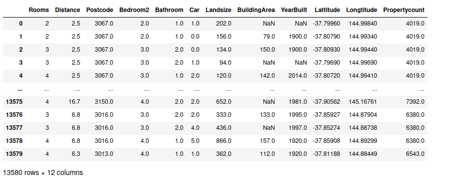
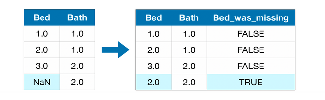
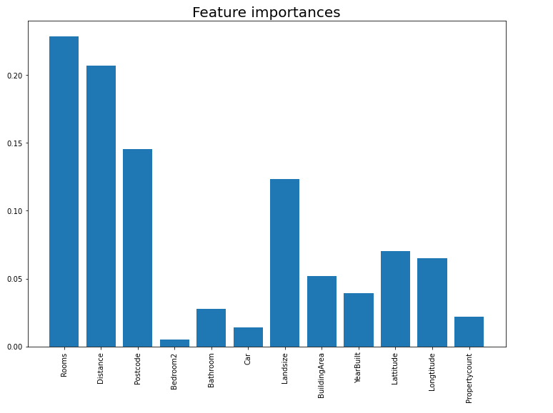
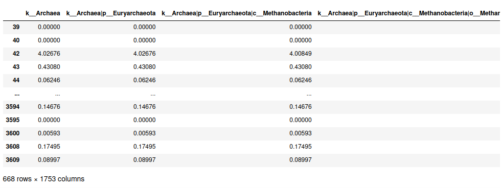

# Episode 4 - Exercises

## Exercise 1
This exercise focuses on how to handle missing values within data. We'll practically tackle with three approaches to dealing with missing values; then we'll compare the effectiveness of these approaches on a real-world dataset. The dataset that we'll use is the [Melbourne Housing dataset](https://www.kaggle.com/dansbecker/melbourne-housing-snapshot/home). Our model will use information such as the number of rooms and land size to predict home price, hence we encounter another regression problem. We're gonna use Random Forest Regressor to predict the target variable. In the end, we'll apply feature selection to our data and check how it affects the final results. The major part of the analysis is based on Kaggle's course [Missing Values](https://www.kaggle.com/alexisbcook/missing-values)[[1]](#1).

## Solution
First of all, let's import our data and separate `X` and `y` vectors (To keep things simple, we'll only focus on numerical features and exclude categorial ones).

```python
import pandas as pd
from sklearn.model_selection import train_test_split

# Load the data
data = pd.read_csv('melb_data.csv')

# Select target
y = data.Price

# To keep things simple, we'll use only numerical predictors
melb_predictors = data.drop(['Price'], axis=1)
X = melb_predictors.select_dtypes(exclude=['object'])
```

The features vector `X` is presented in the following figure. As you can see, some features like `BuildingArea` and `YearBuilt` have some missing values.

<p align="center">
  
</p>

### How to deal with missing values

In general, there are three suggested ways to deal with missing values:

- **Approach 1 - Drop Columns with Missing Values**: Unless most values in the dropped columns are missing, the model loses access to a lot of (potentially useful!) information with this approach. As an extreme example, consider a dataset with 10,000 rows, where one important column is missing a single entry. This approach would drop the column entirely!
- **Approach 2 - Imputation**: Imputation fills in the missing values with some number. For instance, we can fill in the mean value along each column. The imputed value won't be exactly right in most cases, but it usually leads to more accurate models than you would get from dropping the column entirely.
- **Approach 3 - Extension to imputation**: Imputation is the standard approach, and it usually works well. However, imputed values may be systematically above or below their actual values (which weren't collected in the dataset). Or rows with missing values may be unique in some other way. In that case, your model would make better predictions by considering which values were originally missing. In this approach, we impute the missing values, as before. And, additionally, for each column with missing entries in the original dataset, we add a new column that shows the location of the imputed entries (check the following figure). In some cases, this will meaningfully improve results. In other cases, it doesn't help at all.

<p align="center">
  
</p>

### Back to code
First of all, we define a function `score_dataset()` to compare the three different approaches to dealing with missing values. This function reports the mean absolute error (MAE) and R^2 metric from a random forest model.

```python
from sklearn.ensemble import RandomForestRegressor
from sklearn.metrics import mean_absolute_error
from sklearn.metrics import r2_score

# Function for comparing different approaches
def score_dataset(X_train, X_valid, y_train, y_valid):
    model = RandomForestRegressor(n_estimators=50, random_state=0)
    model.fit(X_train, y_train)
    y_pred = model.predict(X_valid)
    return mean_absolute_error(y_valid, y_pred), r2_score(y_valid, y_pred)
```

We also split data into training, validation and testing data.

```python
# Split data to train, validation and test
# Specifying test set
X_train_validation, X_test, y_train_validation, y_test = \
    train_test_split(X, y, test_size=0.2, shuffle = True, random_state = 0)

# Specifying train and validation set
X_train, X_valid, y_train, y_valid = \
    train_test_split(X_train_validation, y_train_validation, test_size=0.25, shuffle = True, random_state = 0)
```

So let's check the scores of the first approach. Since we are working with both training and validation sets, we are careful to drop the same columns in both DataFrames.

```python
# Approach 1: Drop columns with missing values

# Get names of columns with missing values
cols_with_missing = [col for col in X.columns
                     if X[col].isnull().any()]

# Drop columns in training and validation data
reduced_X_train = X_train.drop(cols_with_missing, axis=1)
reduced_X_valid = X_valid.drop(cols_with_missing, axis=1)


mae, r_sq = score_dataset(reduced_X_train, reduced_X_valid, y_train, y_valid)
print("MAE from Approach 1 (Drop columns with missing values):")
print(mae)
print("R^2 from Approach 1 (Drop columns with missing values):")
print(r_sq)
```

~~~
MAE from Approach 1 (Drop columns with missing values):
189951.79428875327
R^2 from Approach 1 (Drop columns with missing values):
0.7450697375309778
~~~

Next, we use `SimpleImputer()` to replace missing values with the mean value along each column. Although it's simple, filling in the mean value generally performs quite well (but this varies by dataset). While statisticians have experimented with more complex ways to determine imputed values (such as *regression imputation*, for instance), the complex strategies typically give no additional benefit once you plug the results into sophisticated machine learning models.

```python
# Approach 2: Imputation

from sklearn.impute import SimpleImputer

# Imputation
my_imputer = SimpleImputer()
imputed_X_train = pd.DataFrame(my_imputer.fit_transform(X_train))
imputed_X_valid = pd.DataFrame(my_imputer.transform(X_valid))

# Imputation removed column names; put them back
imputed_X_train.columns = X_train.columns
imputed_X_valid.columns = X_valid.columns

mae, r_sq = score_dataset(imputed_X_train, imputed_X_valid, y_train, y_valid)
print("MAE from Approach 2 (Imputation):")
print(mae)
print("R^2 from Approach 2 (Imputation):")
print(r_sq)
```

~~~
MAE from Approach 2 (Imputation):
180470.74236610794
R^2 from Approach 2 (Imputation):
0.773063769783658
~~~

Next, we impute the missing values, while also keeping track of which values were imputed.

```python
# Approach 3 (Extension to imputation)

X_train_plus = X_train.copy()
X_valid_plus = X_valid.copy()

# Make new columns indicating what will be imputed
for col in cols_with_missing:
    X_train_plus[col + '_was_missing'] = X_train_plus[col].isnull()
    X_valid_plus[col + '_was_missing'] = X_valid_plus[col].isnull()

# Imputation
my_imputer = SimpleImputer()
imputed_X_train_plus = pd.DataFrame(my_imputer.fit_transform(X_train_plus))
imputed_X_valid_plus = pd.DataFrame(my_imputer.transform(X_valid_plus))

# Imputation removed column names; put them back
imputed_X_train_plus.columns = X_train_plus.columns
imputed_X_valid_plus.columns = X_valid_plus.columns

mae, r_sq = score_dataset(imputed_X_train_plus, imputed_X_valid_plus, y_train, y_valid)
print("MAE from Approach 3 (Extension to imputation):")
print(mae)
print("R^2 from Approach 3 (Extension to imputation):")
print(r_sq)
```

~~~
MAE from Approach 3 (Extension to imputation):
180874.7510994226
R^2 from Approach 3 (Extension to imputation):
0.7711365199079295
~~~

As we can see, Approach 3 performed slightly worse than Approach 2. So, let's focus on second approach. This time, however, we're gonna use train and test set, instead of validation.

```python
# Approach 2: Imputation

from sklearn.impute import SimpleImputer

# Imputation
my_imputer = SimpleImputer()
imputed_X_train = pd.DataFrame(my_imputer.fit_transform(X_train))
imputed_X_test = pd.DataFrame(my_imputer.transform(X_test))

# Imputation removed column names; put them back
imputed_X_train.columns = X_train.columns
imputed_X_test.columns = X_test.columns

# Random forest regressor
model = RandomForestRegressor(n_estimators=50, random_state=0)
model.fit(imputed_X_train, y_train)
```

In the block above we've initialized our model, so let's check its performance in the test set.

```python
# predictions
y_pred = model.predict(imputed_X_test)

print("MAE from Approach 2 - Test set:")
print(mean_absolute_error(y_test, y_pred))
print("R^2 from Approach 2 - Test set:")
print(r2_score(y_test, y_pred))
```

Finally, it would be great if we managed to select the most important features, kind of supervised feature selection. Fortunately, `RandomForestRegressor()` contains `.feature_importances_` attribute, which returns the quantified contribution of each feature separately to the final result. So, like we've done many times before during the course, let's construct a barplot to visualize the scores.

```python
import matplotlib.pyplot as plt

# feature importances
importances = model.feature_importances_

# plot the scores
plt.figure(figsize=(15,10))
plt.bar(imputed_X_train.columns, importances)
plt.xticks(rotation = 'vertical')
plt.title('Feature importances', fontsize = 20)
plt.show()
```

<p align="center">
  
</p>

We can define an arbitary cut-off, let's say `cut-off = 0.05`, meaning that we only keep the features with higher score than the `cut-off`. The number of features is generally short, so we can do it manually. Let's check how the model with less features behaves.

```python
# Feature Selection 
selected_features = ['Rooms', 'Distance', 'Postcode', 'Landsize', 'Lattitude', 'Longtitude', 'BuildingArea']
X_train_selected = X_train[selected_features]
X_test_selected = X_test[selected_features]

# Building the model with less features
# Imputation
my_imputer = SimpleImputer()
imputed_X_train = pd.DataFrame(my_imputer.fit_transform(X_train_selected))
imputed_X_test = pd.DataFrame(my_imputer.transform(X_test_selected))

# Imputation removed column names; put them back
imputed_X_train.columns = X_train_selected.columns
imputed_X_test.columns = X_test_selected.columns

mae, r_sq = score_dataset(imputed_X_train, imputed_X_test, y_train, y_test)
print("MAE from Approach 2 - Test set - Feature selection:")
print(mae)
print("R^2 from Approach 2 - Test set - Feature selection:")
print(r_sq)
```
~~~
MAE from Approach 2 - Test set - Feature selection:
181938.51709224583
R^2 from Approach 2 - Test set - Feature selection:
0.7738357747039819
~~~

Bingo! Performance is slightly lower but features are reduced by half, leading to a particularly decent trade-off.

## Exercise 2
This is the last exercise of our episode and tackles with metagenomic data. The general point of the exercise is to classify diseaces based on "metagenomic features", in general. We'll definetely discuss the dataset and make it clear what these features mean. The file used is the `abundance.csv` file from [Human Metagenomics](https://www.kaggle.com/antaresnyc/human-metagenomics) dataset in Kaggle, which was also used in the analysis part of a research article in July of 2016, titled 'Machine Learning Meta-analysis of Large Metagenomic Datasets: Tools and Biological Insights' [[2]](#2). So let's get started.

### Dataset
First of all, let's import our dataset:

```python
import pandas as pd

data = pd.read_csv('abundance.csv', low_memory = False)
```

We have set `low_memory = False` because some columns have mixed types of data (for example numeric with strings). Our dataset consists of **3610 rows × 3513 columns**, so it's meaningless to print the data table. Our target variable is `disease` column, so:

```python
y = data.pop('disease')
X = data
```

So, let's talk about the columns of `X` matrix. The features of this dataset were generated from [MetaPhlAn2](https://huttenhower.sph.harvard.edu/metaphlan2/) toolkit. MetaPhlAn (Metagenomic Phylogenetic Analysis) is a computational tool for profiling the composition of microbial communities from metagenomic shotgun sequencing data. So, in a nutshell, the toolkit takes as input shotgun sequencing data and generates an accurate estimation of organismal relative abundance (in terms of number of cells rather than fraction of reads). These quantified estimations are expressed as features in `X` matrix, in those features whose names begin with the prefix `k_`, for example `k__Archaea`, `k__Archaea|p__Euryarchaeota`, `k__Archaea|p__Euryarchaeota|c__Methanobacteria` etc. Suffixes 'k\_', 'p\_', 'c\_' etc refer to different [taxonomic ranks](https://en.wikipedia.org/wiki/Taxonomic_rank). Hence, these columns correspond to different organisms that were identified within the metagenomic sample. The rest of data matrix was filled with metadata columns, which were appended as initial columns. Therefore, around the first 210 columns are metadata, and the rest of them are features. However, we're gonna keep metadata columns, because we want to combine numerical and categorical features in this exercise, and check how this combination affects our classification model. 

Now, let's check the distribution of targets:

```python
# Printing claases and corresponding number of samples
y.value_counts()
```

~~~
n                             2054
nd                             475
t2d                            223
obesity                        164
ibd_ulcerative_colitis         148
cirrhosis                      118
leaness                         89
stec2-positive                  52
impaired_glucose_tolerance      49
cancer                          48
n_relative                      47
y                               36
small_adenoma                   26
ibd_crohn_disease               25
 -                              20
large_adenoma                   13
overweight                      10
-                                7
obese                            5
underweight                      1
Name: disease, dtype: int64
~~~

It seems that the distribution of target values is totally non-uniform, including classes with very few samples (class `underweight` also contains a singleton) and many `NaN` values (probably the `n` class refers to `NaN` or `NULL` or something similar). To simplify our lives, we're gonna isolate only samples of several diseases: obesity, ibd\_ulcerative\_colitis, cirrhosis, leaness, stec2-positive, impaired\_glucose\_tolerance and cancer. To succeed this, we use Numpy's `isnin()` function.

```python
import numpy as np

# isolate rows of specific diseases: 
# obesity, ibd_ulcerative_colitis, cirrhosis, leaness, stec2-positive, impaired_glucose_tolerance and cancer
X = X[np.isin(y, ['obesity', 'ibd_ulcerative_colitis', 'cirrhosis', 'leaness', 'stec2-positive', 'impaired_glucose_tolerance', 'cancer'])]
y = y[np.isin(y, ['obesity', 'ibd_ulcerative_colitis', 'cirrhosis', 'leaness', 'stec2-positive', 'impaired_glucose_tolerance', 'cancer'])]
```

Evidently, after the deletion of the majority of rows, there might have occured columns with a single value (zero variance columns). We have to remove those columns, as they provide no information at all. For this reasone, we're gonna use Sklearn's `VarianceThreshold()`, which identifies columns of variance lower than a pre-specified threshold and deletes them. At this initial stage, the `threshold` is set to 0, which is by the way the default parameter. We could possibly also extract near-zero variance features, but this will be done in further steps. The first thing we need to do is to encode categorical features into numerical ones. At first we copy the feature matrix dataframe into a new one and save the feature names into a list. Then we need to extract the categorial featuers using boolean mask:

```python
# Keeping feature names into a list
feature_names = X.columns

# copy dataframe
X_new = X.copy()

# Categorical boolean mask
categorical_feature_mask = X_new.dtypes==object # filter categorical columns using mask and turn it into a list
categorical_cols = X_new.columns[categorical_feature_mask].tolist()
```

`LabelEncoder()` converts each class under specified feature to a numerical value. Instantiate a `LabelEncoder()` object and apply it on each of the categorical columns:

```python
# import labelencoder
from sklearn.preprocessing import LabelEncoder# instantiate labelencoder object
le = LabelEncoder()

# apply le on categorical feature columns
X_new[categorical_cols] = X_new[categorical_cols].apply(lambda col: le.fit_transform(col))
```

If we plot the `X_new` dataframe, we'll verify that categorical features have successfully been encoded into numerical ones. Now, let's apply `VarianceThreshold()`.

```python
from sklearn.feature_selection import VarianceThreshold

# Zero variance
selector = VarianceThreshold()
X_nzv = selector.fit_transform(X_new)

# non-zero feature names
non_zero_feature_names = [feature_names[i] for i,x in enumerate(selector.variances_) if x != 0]

# X non zero
X = X[non_zero_feature_names]
X
```

<p align="center">
  
</p>

Indeed, features have beed reduced, from 3513 to 1840.

### Dataset


## References

<a id="1">[1]</a> 
https://www.kaggle.com/alexisbcook/missing-values

<a id="2">[2]</a> 
Edoardo Pasolli, Duy Tin Truong, Faizan Malik, Levi Waldron, Nicola Segata (2016)
Machine Learning Meta-analysis of Large Metagenomic Datasets: Tools and Biological Insights
Plos Computational Biology, doi: [https://doi.org/10.1371/journal.pcbi.1004977](https://doi.org/10.1371/journal.pcbi.1004977)


