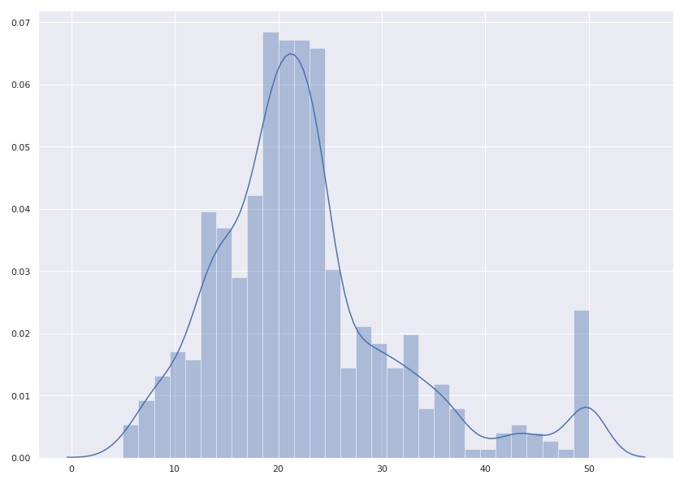
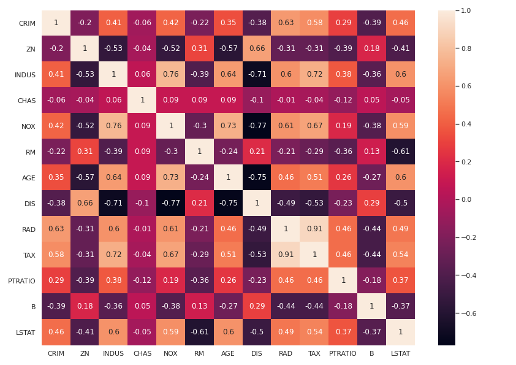
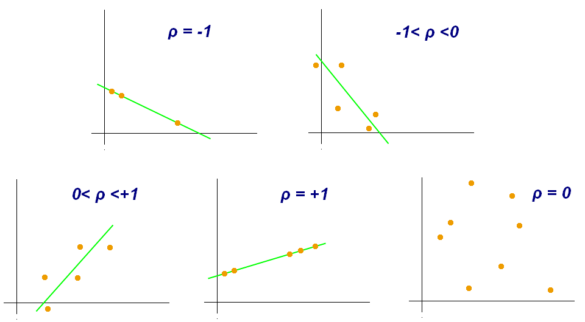
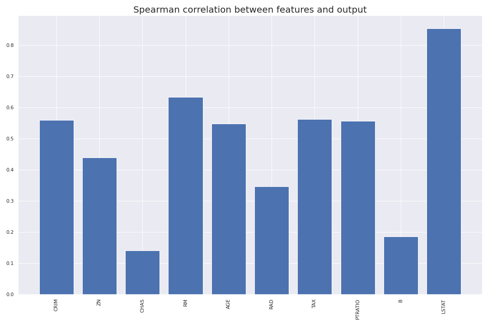

# Episode 4: Feature Selection

_Learning Outcomes_
1. Identify the need for feature selection
2. Apply feature selection to choose optimal features
3. Define different methods for data preprocessing, and apply them to the given dataset.
    - _Internal Note_: Data Imputation, Data Normalization and Data Restructuring 


## General
Feature selection is the process of identifying and selecting a subset of input variables that are most relevant to the target variable. Perhaps the simplest case of feature selection is the case where there are numerical input variables and a numerical target for regression predictive modeling. This is because the strength of the relationship between each input variable and the target can be calculated, called correlation, and compared relative to each other. 

Feature selection can also be used in classification problems as well. Moreover, we sometimes prefer to apply feature selection in a totally unsupervised way, without taking into account the outputs (numerical or categorical). The importance of unsupervised feature selection is to avoid dependencies between features. For instance, suppose that among other features, are two features A and B, that are connected by the following formula: xA = 5*xB (the value of feature B equals five times the value of feature A). We say that the two features A and B are **linearly dependent**. The problem with that is that technically use the same information twice; we don't actually need both of them because this might have a negative effect in our model.

Concerning the importance of feature selection process, the most popular answer is that it assists in finding both patterns between features (like dependencies that we already mentioned) and how each one of them affects the total output. By isolating a subset of the most informative features we clarify which of them play the most significant role, so, in a way, we "whiten" the model. Quick reminder that many ML techniques are called Black-Box algorithms, especially neural networks, because it's practiacally impossible to identify the decisions that a neural network made at every layer; but even if we had enough patience and confidence to examine all different layers, we might still wouldn't know why these decisions were taken.

There is also a less popular view regarding the importance of feature selection, that is the **denoising** of data. To illustrate, suppose we have a dataset of houses and we want to predict their price based on their feaatures. Suppose that, among others, there is a feature specifying the color on the walls of the corresponding house. Logically speaking, the walls' color is totally unrelated with the price of the house, it's just noise. However, ML algorithms are designed in such a way to force detecting even a tiny correlation between the features and the output, which might hurt our model. Feature selection process might probably pop out the specific feature (noise). 

Generally, features can be distinguished in three main categories; noise features, those with little significance and those of high significance. Feature selection aims to identify only features of the third category. The boundaries between the three categories are more fuzzy rather than well-determined. Anyway, there is a wrong impression that whenever we pop out a feature, we lose information. It depends; sometimes we get rid of useless noise.

## Feature Selection - Regression
As we promised in the last episode, we'll begin our analysis with the Boston Houses dataset. So let's load the dataset in the same way we did and normalize data:

```python
# Packages
import pandas as pd
from sklearn.datasets import load_boston
import seaborn as sns 

# Loading boston houses
boston_houses = load_boston(return_X_y=False)

# as data frame
X = pd.DataFrame(boston_houses.data, columns=boston_houses.feature_names)
y = pd.DataFrame(boston_houses.target, columns = ['Av. Price'])
```

As you've already noticed, we have also imported `seaborn`, which is a widely used package for plotting purposes, especially for fitting, distribution and other statistical/ML stuff. Now, let’s first plot the distribution of the target variable. We will use the `distplot()` function from the `seaborn` library.

```python
import matplotlib.pyplot as plt

sns.set(rc={'figure.figsize':(11.7,8.27)})
sns.distplot(y.values, bins=30)
plt.show()
```

<p align="center">
  
</p>

We see that the target values are distributed almost normally with few outliers. And now we move on to the feature selection part.

At the beggining, we usually apply some **unsupervised feature selection** method, so as to exclude linear dependencies among features. When referring to unsupervised feature selection, we mean that the information from output variable is totally ignored, as we focus only on the relationship between features. For this reason, we create a **correlation matrix** that measures the linearity between the variables. The correlation matrix can be formed by using the `.corr()` function from the `pandas.DataFrame` library[[2]](#2). We will use the `heatmap()` function from the `seaborn` library to plot the correlation matrix. Let's first print the matrix and then discuss further about it.

```python
# Creating correlation matrix
correlation_matrix = X.corr().round(2)

# annot = True to print the values inside the square
plt.figure()
sns.heatmap(data=correlation_matrix, annot=True)
plt.show()
```

<p align="center">
  
</p>

The default method for calculating correlation between features using `.corr()` function is **Pearson correlation coefficient**. The correlation coefficient is a measure of linear correlation between two sets of data. It is the covariance of two variables, divided by the product of their standard deviations; thus it is essentially a normalised measurement of the covariance, such that the result always has a value between −1 and 1. If the value is close to 1, it means that there is a strong positive correlation between the two variables. When it is close to -1, the variables have a strong negative correlation[[3]](#3). Some examples are presented in the following figure.

<p align="center">
  
</p>

Now, based on the correlation matrix we've printed, let's exclude linear dependencies. Thankfully, the total number of features is relatively small and, hence, we can do the process manually. The features `RAD`, `TAX` have a correlation of 0.91. These feature pairs are strongly correlated to each other. We should not select both these features together for training the model. Same goes for the pairs `DIS` and `AGE`, `DIS` and `NOX`, `DIS` and `INDUS`, `NOX` and `AGE`, `NOX` and `INDUS`, `TAX` and `INDUS` which have an absolute correlation higher thatn 0.7. A nice idea to solve this problem is to drop features `INDUS`, `NOX` and `DIS` and keep `AGE` and `TAX`. This is done by using the `.drop()` function. The `inplace` argument determines whether to return a copy of the initial dataframe (False) or do operation inplace and return None (True).

```python
# Exclude INDUS, NOX and DIS
X.drop(columns=['INDUS', 'NOX', 'DIS'], inplace=True)
```

Next, we are goint to apply some **supervised feature selection** method, meaning that this time we'll mainly consider the connection between each feature separately with the output variable. Let's remind us the useful image from the second episode.

<p align="center">
  
</p>

In our case, we have numerical inputs and outputs, so we end up with two choices: Pearson's and Spearman's coefficinets. As we already discussed, Pearson's coefficient checks the linearity between two variables. However, if we go back to the previous episode, we'll notice that the optimal degree of polynomial features occured from cros-validation process was `degree = 2`. Hence, at least one feature is connected quadratically with the output. So it seems obvious that Pearson's coefficient is not the optimal criterion.

On the other hand, **Spearman's rank correlation coefficient** assesses how well the relationship between two variables can be described using a monotonic function. While Pearson's correlation assesses linear relationships, Spearman's correlation assesses monotonic relationships (whether linear or not). If there are no repeated data values, a perfect Spearman correlation of +1 or −1 occurs when each of the variables is a perfect monotone function of the other[[4]](#4).

Therefore, we're going to calculate Spearman's coefficient between each one of the remaining columns and output variable. But prior to this step, let's rescale data, because at this point we start mixing up target variable in our analysis. Basically, normalization is only required when calculating distances, that is the pre-modeling phase. It's not actually important at this step, but let's do this now to get rid of it.

```python
from sklearn.preprocessing import PolynomialFeatures
from sklearn.preprocessing import MinMaxScaler

#### Normalization

# feature names
feature_names = X.columns

# Normalize
min_max_scaler = MinMaxScaler()
X_normalized = min_max_scaler.fit_transform(X)
X_normalized = pd.DataFrame(X_normalized, columns=feature_names)
```

And now Spearman's coefficient time. The coefficient is calculated by `spearmanr()` function from `scipy.stats` library. Anyway, not something that unusual to mention in the following code, just to remind that we are interested in the absolute values of the coefficient, because we want to detect either increasing or decreasing monotonical relationship between features and target variable.

```python
from scipy.stats import spearmanr

# Correlations
spearman_corr_array = []

for col in X_normalized:
    spearman_corr_array.append(spearmanr(X_normalized[col], y['Median Price'])[0])

# taking absolute values:
abs_spearman = [abs(ele) for ele in spearman_corr_array]

# plot the scores
plt.figure(figsize=(15,10))
plt.bar(X_normalized.columns, abs_spearman)
plt.xticks(rotation = 'vertical')
plt.title('Spearman correlation between features and output', fontsize = 20)
plt.show()
```

<p align="center">
  
</p>

`LSTAT` feature is the most closely correlated feature with the target variable, according to Spearman's coefficient, followed by `RM`, whose score however is much lower. If we define a threshold of 0.6 absolute value of Spearman's coefficient, we end up selection only these two features.

```python
# Selecting only LSTAT and RM
X_selected = X_normalized[['LSTAT', 'RM']]
```

The following code is more or less similar to the previous episode. We apply polynomial transofmation of `degree = 2` to features and apply Linear Regression. There is no need to apply cross-validation, because we work under the assumption that the optimal degree was calculated in the previous episode. So we only train and test our model. Let's check the results.

```python
from sklearn.model_selection import train_test_split
from sklearn.linear_model import LinearRegression
from sklearn.metrics import mean_squared_error

#### Polynomial transformation

# Optimal degree
deg = 2

# Transforming features
poly_model = PolynomialFeatures(degree=deg, include_bias = False)
poly_model.fit(X_selected)
X_poly = poly_model.transform(X_selected)

# Fit - no validation, as it was done in the previous episode

# train - test split
X_train, X_test, y_train, y_test = train_test_split(X_poly, y, test_size=0.3, shuffle = True, random_state = 0)

# Linear regression
model = LinearRegression(fit_intercept = True, copy_X=True, normalize = False)
model.fit(X_train, y_train)

# test - metrics
y_pred = model.predict(X_test)

print('Test set results:')

# MSE
mse = mean_squared_error(y_test, y_pred)
print('MSE: ' + str(mse))

# R square
r_sq = model.score(X_test, y_test)
print('R^2: ' + str(r_sq))
```

~~~
Test set results:
MSE: 23.805568624080962
R^2: 0.7141004599281642
~~~

Metrics are absolutely better than the model of the previous episode. So, it's obvious now that we've succeded denoising our model for a better performance!

## Feature Selection - Classification
For the purpose of studying feature selection in classification problems, we're gonna use Bearst Cancer dataset, to enrich the analysis of second episode. It's highly recommended to open up a new notebook at this point. So, let's load our data.

```python
import pandas as pd
```

## References

<a id="1">[1]</a> 
Jason Brownlee (2020)
How to Perform Feature Selection for Regression Data
Machine Learning Mastery, [Link](https://machinelearningmastery.com/feature-selection-for-regression-data/)

<a id="2">[2]</a> 
Animesh Agarwal (2018)
Linear Regression on Boston Housing Dataset
Towards Data Science, [Link](https://towardsdatascience.com/linear-regression-on-boston-housing-dataset-f409b7e4a155)

<a id="3">[3]</a> 
https://en.wikipedia.org/wiki/Pearson_correlation_coefficient

<a id="4">[4]</a> 
https://en.wikipedia.org/wiki/Spearman%27s_rank_correlation_coefficient
