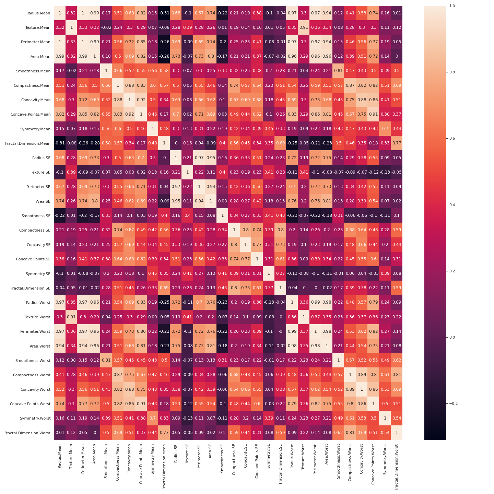
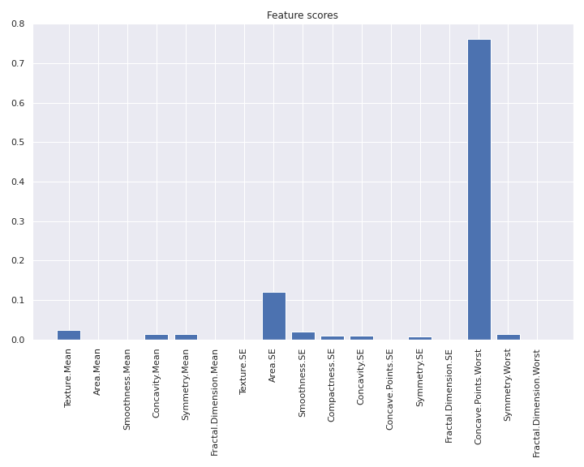

# Episode 4: Feature Selection

_Learning Outcomes_
1. Identify the need for feature selection
2. Apply feature selection to choose optimal features
3. Define different methods for data preprocessing, and apply them to the given dataset.
    - _Internal Note_: Data Imputation, Data Normalization and Data Restructuring 


## General
Feature selection is the process of identifying and selecting a subset of input variables that are most relevant to the target variable. Perhaps the simplest case of feature selection is the case where there are numerical input variables and a numerical target for regression predictive modeling. This is because the strength of the relationship between each input variable and the target can be calculated, called correlation, and compared relative to each other. 

Feature selection can also be used in classification problems as well. Moreover, we sometimes prefer to apply feature selection in a totally unsupervised way, without taking into account the outputs (numerical or categorical). The importance of unsupervised feature selection is to avoid dependencies between features. For instance, suppose that among other features, are two features A and B, that are connected by the following formula: xA = 5*xB (the value of feature B equals five times the value of feature A). We say that the two features A and B are **linearly dependent**. The problem with that is that technically use the same information twice; we don't actually need both of them because this might have a negative effect in our model.

Concerning the importance of feature selection process, the most popular answer is that it assists in finding both patterns between features (like dependencies that we already mentioned) and how each one of them affects the total output. By isolating a subset of the most informative features we clarify which of them play the most significant role, so, in a way, we "whiten" the model. Quick reminder that many ML techniques are called Black-Box algorithms, especially neural networks, because it's practiacally impossible to identify the decisions that a neural network made at every layer; but even if we had enough patience and confidence to examine all different layers, we might still wouldn't know why these decisions were taken.

There is also a less popular view regarding the importance of feature selection, that is the **denoising** of data. To illustrate, suppose we have a dataset of houses and we want to predict their price based on their feaatures. Suppose that, among others, there is a feature specifying the color on the walls of the corresponding house. Logically speaking, the walls' color is totally unrelated with the price of the house, it's just noise. However, ML algorithms are designed in such a way to force detecting even a tiny correlation between the features and the output, which might hurt our model. Feature selection process might probably pop out the specific feature (noise). 

Generally, features can be distinguished in three main categories; noise features, those with little significance and those of high significance. Feature selection aims to identify only features of the third category. The boundaries between the three categories are more fuzzy rather than well-determined. Anyway, there is a wrong impression that whenever we pop out a feature, we lose information. It depends; sometimes we get rid of useless noise.

## Feature Selection - Regression
As we promised in the last episode, we'll begin our analysis with the Boston Houses dataset. So let's load the dataset in the same way we did and normalize data:

```python
# Packages
import pandas as pd
from sklearn.datasets import load_boston
import seaborn as sns 

# Loading boston houses
boston_houses = load_boston(return_X_y=False)

# as data frame
X = pd.DataFrame(boston_houses.data, columns=boston_houses.feature_names)
y = pd.DataFrame(boston_houses.target, columns = ['Av. Price'])
```

As you've already noticed, we have also imported `seaborn`, which is a widely used package for plotting purposes, especially for fitting, distribution and other statistical/ML stuff. Now, let’s first plot the distribution of the target variable. We will use the `distplot()` function from the `seaborn` library.

```python
import matplotlib.pyplot as plt

sns.set(rc={'figure.figsize':(11.7,8.27)})
sns.distplot(y.values, bins=30)
plt.show()
```

<p align="center">
  
</p>

We see that the target values are distributed almost normally with few outliers. And now we move on to the feature selection part.

At the beggining, we usually apply some **unsupervised feature selection** method, so as to exclude linear dependencies among features. When referring to unsupervised feature selection, we mean that the information from output variable is totally ignored, as we focus only on the relationship between features. For this reason, we create a **correlation matrix** that measures the linearity between the variables. The correlation matrix can be formed by using the `.corr()` function from the `pandas.DataFrame` library[[2]](#2). We will use the `heatmap()` function from the `seaborn` library to plot the correlation matrix. Let's first print the matrix and then discuss further about it.

```python
# Creating correlation matrix
correlation_matrix = X.corr().round(2)

# annot = True to print the values inside the square
plt.figure()
sns.heatmap(data=correlation_matrix, annot=True)
plt.show()
```

<p align="center">
  
</p>

The default method for calculating correlation between features using `.corr()` function is **Pearson correlation coefficient**. The correlation coefficient is a measure of linear correlation between two sets of data. It is the covariance of two variables, divided by the product of their standard deviations; thus it is essentially a normalised measurement of the covariance, such that the result always has a value between −1 and 1. If the value is close to 1, it means that there is a strong positive correlation between the two variables. When it is close to -1, the variables have a strong negative correlation[[3]](#3). Some examples are presented in the following figure.

<p align="center">
  
</p>

Now, based on the correlation matrix we've printed, let's exclude linear dependencies. Thankfully, the total number of features is relatively small and, hence, we can do the process manually. The features `RAD`, `TAX` have a correlation of 0.91. These feature pairs are strongly correlated to each other. We should not select both these features together for training the model. Same goes for the pairs `DIS` and `AGE`, `DIS` and `NOX`, `DIS` and `INDUS`, `NOX` and `AGE`, `NOX` and `INDUS`, `TAX` and `INDUS` which have an absolute correlation higher thatn 0.7. A nice idea to solve this problem is to drop features `INDUS`, `NOX` and `DIS` and keep `AGE` and `TAX`. This is done by using the `.drop()` function. The `inplace` argument determines whether to return a copy of the initial dataframe (False) or do operation inplace and return None (True).

```python
# Exclude INDUS, NOX and DIS
X.drop(columns=['INDUS', 'NOX', 'DIS'], inplace=True)
```

Next, we are goint to apply some **supervised feature selection** method, meaning that this time we'll mainly consider the connection between each feature separately with the output variable. Let's remind us the useful image from the second episode.

<p align="center">
  
</p>

In our case, we have numerical inputs and outputs, so we end up with two choices: Pearson's and Spearman's coefficinets. As we already discussed, Pearson's coefficient checks the linearity between two variables. However, if we go back to the previous episode, we'll notice that the optimal degree of polynomial features occured from cros-validation process was `degree = 2`. Hence, at least one feature is connected quadratically with the output. So it seems obvious that Pearson's coefficient is not the optimal criterion.

On the other hand, **Spearman's rank correlation coefficient** assesses how well the relationship between two variables can be described using a monotonic function. While Pearson's correlation assesses linear relationships, Spearman's correlation assesses monotonic relationships (whether linear or not). If there are no repeated data values, a perfect Spearman correlation of +1 or −1 occurs when each of the variables is a perfect monotone function of the other[[4]](#4).

Therefore, we're going to calculate Spearman's coefficient between each one of the remaining columns and output variable. But prior to this step, let's rescale data, because at this point we start mixing up target variable in our analysis. Basically, normalization is only required when calculating distances, that is the pre-modeling phase. It's not actually important at this step, but let's do this now to get rid of it.

```python
from sklearn.preprocessing import PolynomialFeatures
from sklearn.preprocessing import MinMaxScaler

#### Normalization

# feature names
feature_names = X.columns

# Normalize
min_max_scaler = MinMaxScaler()
X_normalized = min_max_scaler.fit_transform(X)
X_normalized = pd.DataFrame(X_normalized, columns=feature_names)
```

And now Spearman's coefficient time. The coefficient is calculated by `spearmanr()` function from `scipy.stats` library. Anyway, not something that unusual to mention in the following code, just to remind that we are interested in the absolute values of the coefficient, because we want to detect either increasing or decreasing monotonical relationship between features and target variable.

```python
from scipy.stats import spearmanr

# Correlations
spearman_corr_array = []

for col in X_normalized:
    spearman_corr_array.append(spearmanr(X_normalized[col], y['Median Price'])[0])

# taking absolute values:
abs_spearman = [abs(ele) for ele in spearman_corr_array]

# plot the scores
plt.figure(figsize=(15,10))
plt.bar(X_normalized.columns, abs_spearman)
plt.xticks(rotation = 'vertical')
plt.title('Spearman correlation between features and output', fontsize = 20)
plt.show()
```

<p align="center">
  
</p>

`LSTAT` feature is the most closely correlated feature with the target variable, according to Spearman's coefficient, followed by `RM`, whose score however is much lower. If we define a threshold of 0.6 absolute value of Spearman's coefficient, we end up selection only these two features.

```python
# Selecting only LSTAT and RM
X_selected = X_normalized[['LSTAT', 'RM']]
```

The following code is more or less similar to the previous episode. We apply polynomial transofmation of `degree = 2` to features and apply Linear Regression. We don't apply cross-validation here, because we work under the assumption that the optimal degree was calculated in the previous episode, to save time. So we only train and test our model. Let's check the results. Metrics are absolutely better than the model of the previous episode. It seems that we've succeded in denoising our model for a better performance!

```python
from sklearn.model_selection import train_test_split
from sklearn.linear_model import LinearRegression
from sklearn.metrics import mean_squared_error

#### Polynomial transformation

# Optimal degree
deg = 2

# Transforming features
poly_model = PolynomialFeatures(degree=deg, include_bias = False)
poly_model.fit(X_selected)
X_poly = poly_model.transform(X_selected)

# Fit - no validation, as it was done in the previous episode

# train - test split
X_train, X_test, y_train, y_test = train_test_split(X_poly, y, test_size=0.3, shuffle = True, random_state = 0)

# Linear regression
model = LinearRegression(fit_intercept = True, copy_X=True, normalize = False)
model.fit(X_train, y_train)

# test - metrics
y_pred = model.predict(X_test)

print('Test set results:')

# MSE
mse = mean_squared_error(y_test, y_pred)
print('MSE: ' + str(mse))

# R square
r_sq = model.score(X_test, y_test)
print('R^2: ' + str(r_sq))
```

~~~
Test set results:
MSE: 23.805568624080962
R^2: 0.7141004599281642
~~~


> ## Important comment
> 
> In the previous episode, we optimized the `degree` hyperparameter based on the initial dataset, without applying any feature seleciton technique. Hence, we used the complete dataset for hyperparameter optimization. Here, we first selected the features and then proceed to the polynomial transformation of the remaining features. We have to keep in mind, though, that now the optimal degree value may have possibly changed. There is no guarantee at all that the optimal hyperparameter values remain constant before and after feature selection. Luckily, here we've succeeded a much better performance, but it could have been worse as well. The standard pipeline is to optimize hyperparameters after the feature selection process.

## Feature Selection - Classification
For the purpose of studying feature selection in classification problems, we're gonna use Bearst Cancer dataset, to enrich the analysis of second episode. It's highly recommended to open up a new notebook at this point. So, let's load our data.

```python
import pandas as pd

# Loading breast cancer dataset
breast_cancer_data = pd.read_csv('breast_cancer_data.csv', header=0, index_col=0)

# Removing the first column (ID)
breast_cancer_data = breast_cancer_data.iloc[:,1:]

# separating X and Y matrix
tumors = breast_cancer_data.pop('Diagnosis')
X, y = breast_cancer_data, tumors
```

Secondly, let's standarize our features this time, so as to try something new (escape from the routine of normalization).

```python
from sklearn.preprocessing import StandardScaler

# feature names
feature_names = X.columns

# data standarization
X_scaled = StandardScaler().fit_transform(X)

# as data frame
X_scaled = pd.DataFrame(X_scaled, columns=feature_names)
```

Thirdly, let's check the distribution of output lablels, so as to ensure that both classes have a sufficient number of elements:

```python
# Print classes and element counts
B, M = y.value_counts(sort=True) #sort=True (default) in order to be sure B, M are in the right order (alphabetical)
print('Number of Benign: ',B)
print('Number of Malignant : ',M)
```

~~~
Number of Benign:  357
Number of Malignant :  212
~~~

Now, a few words about this particular set of data that we haven't said so far. More specifically, it has to do with the features. Ten real-valued features are computed for each cell nucleus of the image:
- Radius (mean of distances from center to points on the perimeter) 
- Texture (standard deviation of gray-scale values)
- Perimeter 
- Area 
- Smoothness (local variation in radius lengths) 
- Compactness (perimeter^2 / area - 1.0) 
- Concavity (severity of concave portions of the contour) 
- Concave points (number of concave portions of the contour) 
- Symmetry 
- Fractal dimension ("coastline approximation" )

The mean, standard error and "worst" or largest (mean of the three largest values) of these features were computed for each image, resulting in 30 features. For instance, field 3 is Mean Radius, field 13 is Radius SE, field 23 is Worst Radius[[5]](#5). As a result, we expect the features to be highly correlated. This hypothesis can be vertified by the correlation matrix.

```python
# Unsupervised - correlation matrix
correlation_matrix = X_scaled.corr(method='pearson').round(2)

# annot = True to print the values inside the square
plt.figure(figsize=(20,20))
sns.heatmap(data=correlation_matrix, annot=True)
plt.show()
```

<p align="center">
  
</p>

The plot of the correlation matrix isn't always managable, especially when we talk about high dimensional data (e.g. number of dimensions greater than 100). I mean, we can't always scan it manually, since the number of its elements grows quadratically with respect to the number of features. Hencel, the following code will indicate which tuples of features are highly correlated with an absolute value of Pearson's coefficient greater than 0.9:

```python
# Detect which features have correlation higher than 0.9
for i in range(len(feature_names)):
    for j in range(i):
        feature_1 = feature_names[i]
        feature_2 = feature_names[j]
        
        if abs(correlation_matrix.iloc[i,j]) > 0.9:
            print('{0} - {1}: {2}'.format(feature_1, feature_2, correlation_matrix.iloc[i,j]))
```

~~~
Perimeter.Mean - Radius.Mean: 1.0
Area.Mean - Radius.Mean: 0.99
Area.Mean - Perimeter.Mean: 0.99
Concave.Points.Mean - Concavity.Mean: 0.92
Perimeter.SE - Radius.SE: 0.97
Area.SE - Radius.SE: 0.95
Area.SE - Perimeter.SE: 0.94
Radius.Worst - Radius.Mean: 0.97
Radius.Worst - Perimeter.Mean: 0.97
Radius.Worst - Area.Mean: 0.96
Texture.Worst - Texture.Mean: 0.91
Perimeter.Worst - Radius.Mean: 0.97
Perimeter.Worst - Perimeter.Mean: 0.97
Perimeter.Worst - Area.Mean: 0.96
Perimeter.Worst - Radius.Worst: 0.99
Area.Worst - Radius.Mean: 0.94
Area.Worst - Perimeter.Mean: 0.94
Area.Worst - Area.Mean: 0.96
Area.Worst - Radius.Worst: 0.98
Area.Worst - Perimeter.Worst: 0.98
Concave.Points.Worst - Concave.Points.Mean: 0.91
~~~

Comments:
- Features: `Perimeter`, `Area`, `Radius` (Worst, Mean and SE) are more or less highly correlated. Hence, a logical choice would be to keep only `Area` feature and exlude the rest.
- Features: `Concave.Points.Mean` and `Concavity.Mean` are also highly correlated. Hence, a logical choice would be to keep only `Concavity.Mean` feature, so as to also get rid of the last correlation, between `Concave.Points.Worst` and `Concave.Points.Mean`.
- `Texture.Worst` and `Texture.Mean` are highly correlated too, so we'll keep only `Texture.Mean`.

```python
# Drop out features to avoid correlations
to_drop = ['Perimeter.Mean', 'Perimeter.Worst', 'Perimeter.SE', 'Radius.Mean', 'Radius.SE', \
           'Radius.Worst', 'Concave.Points.Mean', 'Texture.Worst']
X_scaled.drop(columns=to_drop, inplace=True)
```
Same goes for tuples of features with correlation coefficient within the interval [0.8, 0.9] (which is still high enough though).

```python
# Detect which features have correlation higher than 0.8 and lower than 0.9
for i in range(len(feature_names)):
    for j in range(i):
        feature_1 = feature_names[i]
        feature_2 = feature_names[j]
        
        if abs(correlation_matrix.iloc[i,j]) > 0.8 and abs(correlation_matrix.iloc[i,j]) <= 0.9:
            print('{0} - {1}: {2}'.format(feature_1, feature_2, correlation_matrix.iloc[i,j]))
```

~~~
Concavity.Mean - Compactness.Mean: 0.88
Concave.Points.Mean - Radius.Mean: 0.82
Concave.Points.Mean - Perimeter.Mean: 0.85
Concave.Points.Mean - Area.Mean: 0.82
Concave.Points.Mean - Compactness.Mean: 0.83
Radius.Worst - Concave.Points.Mean: 0.83
Perimeter.Worst - Concave.Points.Mean: 0.86
Area.Worst - Concave.Points.Mean: 0.81
Area.Worst - Area.SE: 0.81
Smoothness.Worst - Smoothness.Mean: 0.81
Compactness.Worst - Compactness.Mean: 0.87
Concavity.Worst - Compactness.Mean: 0.82
Concavity.Worst - Concavity.Mean: 0.88
Concavity.Worst - Compactness.Worst: 0.89
Concave.Points.Worst - Compactness.Mean: 0.82
Concave.Points.Worst - Concavity.Mean: 0.86
Concave.Points.Worst - Perimeter.Worst: 0.82
Concave.Points.Worst - Concavity.Worst: 0.86
Fractal.Dimension.Worst - Compactness.Worst: 0.81
~~~

Some of the features above are already excluded. At the current step, we choose to exclude `Area.Worst`, `Smoothness.Worst`, `Compactness.Worst`, `Concavity.Worst` and `Compactness.Mean`.

```python
# Drop out features to avoid correlations
to_drop = ['Area.Worst', 'Smoothness.Worst', 'Compactness.Worst', 'Concavity.Worst', 'Compactness.Mean']
X_scaled.drop(columns=to_drop, inplace=True)
```

We reduced the number of features from 30 to 17 and we proceed to the supervised part. Firstly, we are going to explain some stuff concerning feature importance topic.

**Feature importance** refers to techniques that assign a score to input features based on how useful they are at predicting a target variable. There are many types and sources of feature importance scores, although popular examples include statistical correlation scores, coefficients calculated as part of linear models, decision trees, and permutation importance scores. Actually, feature importance is a superset of the statistical methods already mentioned (ANOVA, Pearson's and Spearman's coefficient, etc). Apart from them, it contatins any method nested within the modeling process that somehow assigns scores to features and indicates which of them contribute the most. For example, linear machine learning algorithms fit a model where the prediction is the weighted sum of the input values. These algorithms find a set of coefficients to use in the weighted sum in order to make a prediction. These coefficients can be used directly as a crude type of feature importance score[[6]](#6).

Decision tree algorithms like classification and regression trees (CART) offer importance scores based on the reduction in the criterion used to select split points, like Gini or entropy. Thus, Decision Trees are intrinsic feature selection methods, meaning that the feature selection is done simultaneously with the modeling phase. Python provides `feature_importances_` attribute in `DecisionTreeClassifier()` to determine the scores of each feature. Hence, in the following code, we split data into training and testing set and apply `DecisionTreeClassifier()` to select the most important feature. We skip the cross-validation step, because we don't determine the `max_depth` parameter; in this case, then nodes are expanded until all leaves are pure or until all leaves contain less than `min_samples_split` samples, whose default value equals 2. ([More info](https://scikit-learn.org/stable/modules/generated/sklearn.tree.DecisionTreeClassifier.html))

```python
# decision tree for feature importance on a classification problem
from sklearn.tree import DecisionTreeClassifier
from matplotlib import pyplot as plt
from sklearn.model_selection import train_test_split

# feature names
feature_names = X_scaled.columns

# Splitting - train test
X_train, X_test, y_train, y_test = train_test_split(X_scaled, y, test_size=0.3, random_state = 0)

# define the model
model = DecisionTreeClassifier()

# fit the model
model.fit(X_train, y_train)

# get importance
importance = model.feature_importances_

# summarize feature importance
for i,v in enumerate(importance):
    print('{0}: {1}'.format(feature_names[i], v))

# plot feature importance
plt.figure(figsize=(10,8))
plt.bar(feature_names, importance)
plt.xticks(rotation = 'vertical')
plt.title('Feature scores')
plt.show()
```

~~~
Texture.Mean: 0.02498201061312569
Area.Mean: 0.0
Smoothness.Mean: 0.0
Concavity.Mean: 0.014460252335057036
Symmetry.Mean: 0.013409342066251584
Fractal.Dimension.Mean: 0.0
Texture.SE: 0.0
Area.SE: 0.12085429022281288
Smoothness.SE: 0.021080255642524484
Compactness.SE: 0.009902283372001166
Concavity.SE: 0.010164175822968571
Concave.Points.SE: 0.0
Symmetry.SE: 0.008045605239750949
Fractal.Dimension.SE: 0.0
Concave.Points.Worst: 0.7627984864815059
Symmetry.Worst: 0.014303298204001688
Fractal.Dimension.Worst: 0.0
~~~

<p align="center">
  
</p>

Clearly, the most significant features are `Area.SE` and `Concave.Points.Worst`. So, we isolate them and rebuild a `DecisionTreeClassifier()` model, using only these two features, test and evaluate our model, using `classification_report` function. Results are presented below.

```python
from sklearn.metrics import classification_report

# Selectin features
X_train = X_train[['Area.SE', 'Concave.Points.Worst']]
X_test = X_test[['Area.SE', 'Concave.Points.Worst']]

# Model
model = DecisionTreeClassifier()

# fit the model
model.fit(X_train, y_train)

# Predict
y_pred = model.predict(X_test)

# Classification report
print(classification_report(y_true=y_test, y_pred=y_pred))
```

~~~
             precision    recall  f1-score   support

           B       0.94      0.93      0.93       108
           M       0.88      0.90      0.89        63

    accuracy                           0.92       171
   macro avg       0.91      0.92      0.91       171
weighted avg       0.92      0.92      0.92       171
~~~

Bingo! We've just selected only 2 out of the initial set of 30 features. That's definitely a great success! :)

## Εpilogue - Theoretical stuff: Data Imputation and Data Restructuring
Although we haven't faced it here, it's really common for data matrices to have missing values and thus be incomplete. **Imputation** is the process of replacing missing data with substituted values. There are three main problems that missing data causes: missing data can introduce a substantial amount of bias, make the handling and analysis of the data more arduous, and create reductions in efficiency. Imputation preserves all cases by replacing missing data with an estimated value based on other available information. Once all missing values have been imputed, the data set can then be analysed using standard techniques for complete data[[7]](#7). For instance, some basic techniques in data imputation are replacing missing values with the average of the rest or applying some regression proceduce, while there are also more complex techniques.

On the other hand, **Data Restructuring** is the process to restructure the source data to the target data during data transformation. Data Restructuring is an integral part in data warehousing. A very common set of processes is used in running large data warehouses. This set of process is called Extract, Transform, and Load (ETL).

The general flow of ETL involves extracting data from outside sources, then transforming based on business rules and requirements so that the data fit the business needs and finally, data is loaded in to the data warehouse.

## References

<a id="1">[1]</a> 
Jason Brownlee (2020)
How to Perform Feature Selection for Regression Data
Machine Learning Mastery, [Link](https://machinelearningmastery.com/feature-selection-for-regression-data/)

<a id="2">[2]</a> 
Animesh Agarwal (2018)
Linear Regression on Boston Housing Dataset
Towards Data Science, [Link](https://towardsdatascience.com/linear-regression-on-boston-housing-dataset-f409b7e4a155)

<a id="3">[3]</a> 
https://en.wikipedia.org/wiki/Pearson_correlation_coefficient

<a id="4">[4]</a> 
https://en.wikipedia.org/wiki/Spearman%27s_rank_correlation_coefficient

<a id="5">[5]</a> 
Thomas Roncen (2019)
Breast Cancer data set feature selection
Kaggle, [Link](https://www.kaggle.com/quantumofronron/breast-cancer-data-set-feature-selection)

<a id="6">[6]</a> 
Jason Brownlee (2020)
How to Calculate Feature Importance With Python
Machine Learning Mastery, [Link](https://machinelearningmastery.com/calculate-feature-importance-with-python/)

<a id="7">[7]</a> 
https://en.wikipedia.org/wiki/Imputation_(statistics)

<a id="8">[8]</a> 
Editorial Team (2008)
What is Data Restructuring
Geek Interview, [Link](http://www.learn.geekinterview.com/data-warehouse/data-structure/what-is-data-restructuring.html)
