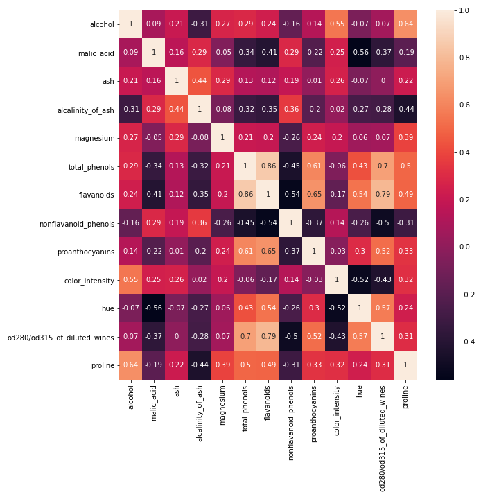
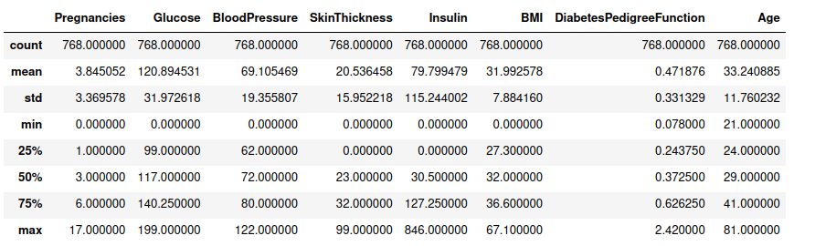

# Episode 5: Putting it all together

_Learning Outcomes_
1. Visualize the results of an ML method, and provide an interpretation
2. Sketch an ML pipeline (strategy) by combining the appropriate software packages/libraries to new data: 
    - _Internal Note_: Define method A/B in the final lesson
3. Identify alternative methods B, appropriate for a new research question / new data
    - _Internal Note_: method B is not taught in the course, to be performed using resources shared in course (stretch goal, as an optional aspect)


The last episode of this machine learning course can be devided into two main parts. In the first part, we'll talk about clustering, as we haven't studied it systematically in the previous episodes. We'll explain hierarchical clustering method and we'll attempt to visualize some stuff for a better interpretation. In the second part, we're going to combine the individual steps of ML into a inegrated pipeline, by utilizing Python's tools. So, let's jump directly into clustering part.

## Clustering
As we already mentioned, cluster analysis or clustering is the task of grouping a set of objects in such a way that objects in the same group (called a cluster) are more similar (in some sense) to each other than to those in other groups. Cluster analysis itself is not one specific algorithm, but the general task to be solved. It can be achieved by various algorithms that differ significantly in their understanding of what constitutes a cluster and how to efficiently find them. Popular notions of clusters include groups with small distances between cluster members, dense areas of the data space, intervals or particular statistical distributions.

Clustering is more or less like abstract art; it definitely depends on how you interpret the data. The appropriate clustering algorithm and parameter settings (including parameters such as the distance function to use, a density threshold, the number of expected clusters or the evaluation of them) depend on the individual data set and intended use of the results. Cluster analysis as such is not an automatic task, but an iterative process of knowledge discovery or interactive multi-objective optimization that involves trial and failure[[1]](#1). 

In order to stop constantly recycling the same theoretical explanations of clustering and get a more practical sense, first of all we need a dataset. We're going to use the Wine Types dataset from the third episode, but we're going to ignore the labels vector. Actually, we'll consider it as metadata information, such as the location that each bottle of wine was produced (let's say 0 for France, 1 for Italy and 2 for Spain). By the way, this is a very common trick that data analysts use; when dealing with a vector of metadata, you can either conduct the analysis supervisedly, by considering it as a targets vector and utilizing its information in the analysis part, or conduct the analysis the analysis unsupervisedly and, afterwards, attempt to correlate your results with metadata. At any case, the second scenario is always legitimate, because the information from metadata comes to confirm the patterns extracted from data itself. Hence, let's import the dataset:

```python
import pandas as pd
from sklearn import datasets
from sklearn.preprocessing import MinMaxScaler

# loading wine dataset -storing directly into X,y dataframes
X,y = datasets.load_wine(return_X_y=True, as_frame=True)

# feature names	
feature_names = X.columns

# Normalize
min_max_scaler = MinMaxScaler()
X_normalized = min_max_scaler.fit_transform(X)
X_normalized = pd.DataFrame(X_normalized, columns=feature_names)
```

Now, let's introduce some basic material about hierarchical clustering, a widely used technique that we're going to apply to our data.

### Hierarchical clustering
In data mining and statistics, **hierarchical clustering** (also called hierarchical cluster analysis or HCA) is a method of cluster analysis which seeks to build a hierarchy of clusters. Strategies for hierarchical clustering generally fall into two types:
- **Agglomerative**: This is a "bottom-up" approach: each observation starts in its own cluster, and pairs of clusters are merged as one moves up the hierarchy.
- **Divisive**: This is a "top-down" approach: all observations start in one cluster, and splits are performed recursively as one moves down the hierarchy.

In general, the merges and splits are determined in a greedy manner. In our example, we're going to focus on Agglomerative Clustering and, thus, we're intrested in the merging part. Merging is accomplished in several ways, which are called **linkage methods**. Some linkage methods are: single-linkage, complete-linkage, unweighted average linkage(UPGMA), Weighted average linkage(WPGMA) etc. The results of hierarchical clustering are usually presented in a dendrogram. Except for the special case of single-linkage, none of the algorithms can be guaranteed to find the optimum solution[[2]](#2). However, it depends on how you define "optimum". I mean, single-linkage clustering provides an optimum solution in terms of the distribution of data, but not necessarily the solution that achieves the highest correlation with metadata. Hence, there are plenty of options within the clustering procedure, like which approach to follow (Agglomerative or Divisive) and which linkage method and distance metric to use. Actually, there is no best option, it depends on data. Here, this "optimization" part is done by me, but genearally, you might have to search over all possible choices to detect which fits better on your data.

### Coding time
First of all, let's check for linear dependencies, based on correlation matrix:

```python
import seaborn as sns
import matplotlib.pyplot as plt

# Creating correlation matrix
correlation_matrix = X_normalized.corr(method='pearson').round(2)

# annot = True to print the values inside the square
plt.figure(figsize=(10,10))
sns.heatmap(data=correlation_matrix, annot=True)
plt.show()
```

<p align="center">
  
</p>

Features `total_phenols` and `flavanoids` seem to be highly dependent. So, let's drop out `total_phenols`. (I also tried to exclude `flavanoids` instead, but final results were not as desired. On the other hand, we talk about only one correlation out of 13 features in total, so we don't expect to make that difference if we finally keep it in the data set. Anyway.)

```python
# Exclude flavanoids
X_normalized.drop(columns=['total_phenols'], inplace=True)
```

Now, we are going to apply hierarchical clustering, using `AgglomerativeClustering()` function from `sklearn.cluster` library. Also, we'll evaluate clustering using the average silhouette score. The first argument passed to `AgglomerativeClustering()` function is `n_clusters`, where you specify in how many clusters you wish to separate your data, so the model keeps the most robust ones, based on linkage method. Evidently, linkage method is specified in `linkage` argument, where we specify that we'll apply complete linkage. The `affinity` argument determines the metric to calculate distances (here we have numerical normalized data, hence euclidean seems to be the best choice) and `compute_full_tree` argument determines whether to stop early the construction of the tree at `n_clusters`. This is useful to decrease computation time if the number of clusters is not small compared to the number of samples. So let's check the output.

```python
# Calculation of silhouette score
from sklearn.cluster import AgglomerativeClustering
from sklearn.metrics import silhouette_score

number_of_clusters = list(range(2,8))
silhouette_scores = []

for num_of_cluster in number_of_clusters:
    cluster = AgglomerativeClustering(n_clusters=num_of_cluster, affinity='euclidean', linkage='complete', compute_full_tree = True)
    cluster.fit_predict(X_normalized)
    silhouette_scores.append(silhouette_score(X_normalized, cluster.labels_))

# Plotting
plt.figure(figsize=(8,6))
plt.plot(number_of_clusters, silhouette_scores)
plt.xlabel('Num of clusters')
plt.ylabel('Silhouette score')
plt.title('Silhouette score vs number of clusters')
plt.show()
```

<p align="center">
  
</p>

Silhouette finds a peak at `n_clusters = 3`, which is the number of different labels we have (remember that we use the `y` vector as metadata and what we've done up to this point is totally unsupervised). So we need to check how correlated these clusters are with the information from metadata. We'll use a visualized approach for a better interpretation and then we'll calculate the correlation mathematically.

First of all, we need to plot the dendrogram to get a sense of its structure and next to define the clusters that data can be splitted to. We will use the `scipy` package to create the dendrograms for our dataset. More specifically, we'll use `dendrogram()` function from `scipy.cluster.hierarchy` library. This function takes the output of the `linkage()` function of the same library and plots the desired dendrogram. Evidently, we specify the argument `method = complete`, as we previously used the complete linkage in Agglomerative clustering. So, let's execute the following cell:

```python
import scipy.cluster.hierarchy as shc

plt.figure(figsize=(20, 15))
plt.title("Wine types dendrogram")
ddata = shc.dendrogram(shc.linkage(X_normalized, method='complete'), labels=list(y.values))
plt.show()
```

<p align="center">
  
</p>

The different colors correspond to different clusters that occur from the default value of `color_threshold` argument in `dendrogram()` function. Basically, we haven't given any specific value to this argument, so it takes the default value, which is 0.7*{max value at y axis}. In our case, the max value at y axis is around 2, which means color threshold is around 1.4, so if we draw a horizontal line at `y = 1.4` and cut the main tree into subtrees based on this line, all the subtrees that occur correspond to clusters and are given different colors. In our case, silhouette metric finds a peak at `n_clusters = 3`, which means that we need to select the value of `color_threshold` argument properly, so as our dendrogramm to be splitted into three subtrees. Starting from the top and going down, if we `color_threshold = 1.9`, the tree is splitted into two subtrees; but if we set `color_threshold = 1.75` we achieve the desired number of three subtrees, and so we do. In the following code, apart from setting the `color_threshold`, we also draw a horizontal line to indicate how we split the tree into subtrees. Finally, we assign colors to the leaves of the trees, whoose labels (metadata) are in x axis. The colors are assigned properly, so as to match the colors of the corresponding clusters. Let's check the output:

```python
import scipy.cluster.hierarchy as shc

plt.figure(figsize=(20, 20))
plt.title("Wine types")
ddata = shc.dendrogram(shc.linkage(X_normalized, method='complete'), labels=list(y.values), color_threshold=1.75)

# Assignment of colors to labels, selected properly to match the dendrogram colors.
label_colors = {'0': 'red', '1': 'orange', '2': 'green'}

ax = plt.gca()
ax.tick_params(axis='x', which='major', labelsize=20)
xlbls = ax.get_xmajorticklabels()
for lbl in xlbls:
    lbl.set_color(label_colors[lbl.get_text()])

plt.hlines(y = 1.75, xmin=0, xmax = 2000)
plt.show()
```

<p align="center">
  
</p>

Clearly, clusters and labels are highly correlated! For a better understanding of the correlation, we'll construct a generalized confusion matrix, using the following code. To explain further, each row corresponds to a cluster; we isolate all the elements of the corresponding cluster and check how they are distributed into the three different classes :) !

```python
import numpy as np

# Initialization - zero matrix
conf_matrix = pd.DataFrame(np.zeros((3,3)), columns= ['Class 0', 'Class 1', 'Class 2'], index = ['Cluster 0','Cluster 1','Cluster 2'])

# Generalized confusion matrix
for i in range(3):
    for j in range(3):
        this_cluster_indices = [x for x in range(len(clusters)) if clusters[x] == i]
        conf_matrix.iloc[i,j] = list(y[this_cluster_indices].values).count(j)

print(conf_matrix)
```

~~~
           Class 0  Class 1  Class 2
Cluster 0     57.0      4.0      0.0
Cluster 1      2.0     63.0      0.0
Cluster 2      0.0      4.0     48.0
~~~

## Putting it all together
This is the last part of the course and, for this reason, has a summarizing role. We'll use a new dataset, called Pima Indians Diabetes Dataset, which is uploaded as `diabetes.csv` in our github repository. Actually it's a widely used dataset and can be easily found online, with a simple google search ([Link](https://www.kaggle.com/uciml/pima-indians-diabetes-database)). This dataset is originally from the National Institute of Diabetes and Digestive and Kidney Diseases. The objective of the dataset is to diagnostically predict whether or not a patient has diabetes, based on certain diagnostic measurements included in the dataset. Several constraints were placed on the selection of these instances from a larger database. In particular, all patients here are females at least 21 years old of Pima Indian heritage[[3]](#3).

Before starting our summary/pipeline section, it should be mentioned here that a significant part of the following analysis is similar to the analysis in this [Link](https://www.kaggle.com/pouryaayria/a-complete-ml-pipeline-tutorial-acu-86) [[4]](#4). So, let's import our dataset and separate `X` and `y` matrices.

```python
# Importing pandas package
import pandas as pd

# Loading file
diabetes = pd.read_csv('diabetes.csv', header=0, index_col=None)

# separating X and Y matrix
targets = diabetes.pop('Outcome')
X, y = diabetes, targets
```

Now it's time to systematize the basic steps of the ML pipeline.

### 1. Data Overviw - Visualization
The general overview of data is presented in the following table. Hopefully, there are no missing values. Furthermore, all features could be considered as numerical, with either taking discrete or continuous values.

Features             |  Targets
:-------------------------:|:-------------------------:
  |  

It's highly recommended to have a look at the distribution of features in the first place and check how they interact with the targets vector. For this reason, we're going to use two functions. The first one is `.describe()` attribute function, which can be called by any `pandas.DataFrame` object. This function returns useful information concerning the distribution of features, meaning the average value, the standard deviation, interquartile analysis, etc. 

```python
X.describe()
```

<p align="center">
  
</p>

The second function is `pairplot()` inside `seaborn` package. This function plots the 2D distribution for every tuple of features, which assists in detecting which tuples of features are more suitable for separating data. This function is really helpful for getting a better interpretation of data, especially when the number of features, like in our case, is relatively small.

```python
# Plotting libraries
import seaborn as sns
import matplotlib.pyplot as plt

# Re-merging for pairplot function
diabetes['Outcome'] = y

# Visualization
g = sns.pairplot(diabetes, hue='Outcome', palette="husl")
```

<p align="center">
  
</p>

Having seen how data are distributed, let's move on to the next step.

### 2. Data Pre-processing: Data cleaning and Exclude linear dependencies (unsupervised feature selection)
It seems that our data suffer from outliers. For example, have a look at `Pregnancies` feature. 17 times pregnancy is a little bite strange, isn't it? Is it an outlier? Basically, in order to answer that, we need to deepen more into Outliers investigation - Data filtering field, which is a bit more advanced and is not covered within this course. If you are interested, though, to check how it works, you might have a look at algorithms like Isolation Forest, Minimum Covariance Determinant, One-Class SVM, etc. You might, also, be interested in visiting this [link](https://machinelearningmastery.com/model-based-outlier-detection-and-removal-in-python/) for more information.

The next important step is to check the distribution of the targets vector. Remember that in the case of classification problem we alwyas need to check the target distribution. If the distribution of target is not balance, we must treat our data more carefully. For example we can use several methods to resampling our data. Fortunately, there is no need to respample or delete data this time, as we have an adequate number of samples in each class:

```python
# Distribution of targets vector
diabetes_negative = list(y.values).count(0)
diabetes_positive = list(y.values).count(1)

print("Diabetes negative: {0}".format(diabetes_negative))
print("Diabetes positive: {0}".format(diabetes_positive))
```

~~~
Diabetes negative: 500
Diabetes positive: 268
~~~

And now let's check if we have any linear dependencies to apply an initial unsupervised feature selection:

```python
import seaborn as sns
import matplotlib.pyplot as plt

# Creating correlation matrix
correlation_matrix = X.corr(method='pearson').round(2)

# annot = True to print the values inside the square
plt.figure(figsize=(10,10))
sns.heatmap(data=correlation_matrix, annot=True)
plt.show()
```

<p align="center">
  
</p>

Unfortunately, features seem to be relatively uncorrelated, according to Pearson's coefficient, and the same holds for Spearman's too (This can be confirmed by you, if you set the argument `method = spearman` in `.corr()` function). Generally speaking, in this data pre-processing part we often apply normalization - standarization of data, but this time we'll put this step in the next part, in which we'll combine different pipelines.

### 3. Pipelines: Normalization/Standarization - Train - Validation
In this step we're going to show you an alternative technique of finding the best model, using Python's pipelines. More specifically, we are going to combine 12 different models:
- Decision Tree Classifier with `max_depth = 3`
- Decision Tree Classifier with `max_depth = 4`
- Decision Tree Classifier with `max_depth = 5`
- SVM - `degree = 1` (linear), `C = 0.1`
- SVM - `degree = 1` (linear), `C = 1`
- SVM - `degree = 2` (poly), `C = 0.1`
- SVM - `degree = 2` (poly), `C = 1`
- SVM - `degree = 3` (poly), `C = 0.1`
- SVM - `degree = 3` (poly), `C = 1`
- kNN - `n_neighbors = 5`
- kNN - `n_neighbors = 10`
- kNN - `n_neighbors = 15`

To do so, first we're going to import some useful libraries:

```python
# Necessary libraries
from pandas import set_option
from pandas.tools.plotting import scatter_matrix
from sklearn.preprocessing import StandardScaler
from sklearn.model_selection import train_test_split
from sklearn.model_selection import KFold
from sklearn.model_selection import StratifiedKFold
from sklearn.model_selection import cross_val_score
from sklearn.model_selection import GridSearchCV
from sklearn.metrics import classification_report
from sklearn.metrics import confusion_matrix
from sklearn.metrics import accuracy_score
from sklearn.pipeline import Pipeline
from sklearn.neighbors import KNeighborsClassifier
from sklearn.svm import SVC
from sklearn.tree import DecisionTreeClassifier
```

And split data into train-validation and test set:

```python
# Split data
X_train, X_test, y_train, y_test =train_test_split(X,y,test_size=0.25,random_state=0)
```

The idea is simple: we are going to apply 5-fold cross validation in the training set for each algorithm separately. Then, we're going to place a `MinMaxScaler()` and a `StandardScaler()` at the beginning and repeat each process again, so as to detect the most suitable combination. At first, we define `GetBasedModel()` the following function that returns a list of our models.

```python
# Spot-Check Algorithms
def GetBasedModel():
    
    basedModels = []
    
    # Decision Trees
    basedModels.append(('DT, depth = 3'   , DecisionTreeClassifier(max_depth=3)))
    basedModels.append(('DT, depth = 4'   , DecisionTreeClassifier(max_depth=4)))
    basedModels.append(('DT, depth = 5'   , DecisionTreeClassifier(max_depth=5)))
    
    # SVM
    basedModels.append(('SVM, deg = 1, c = 0.1', SVC(kernel = 'linear', C = 0.1, random_state = 0)))
    basedModels.append(('SVM, deg = 1, c = 1',   SVC(kernel = 'linear', C = 1, random_state = 0)))
    basedModels.append(('SVM, deg = 2, c = 0.1', SVC(kernel = 'poly', degree = 2, C = 0.1, random_state = 0)))
    basedModels.append(('SVM, deg = 2, c = 1',   SVC(kernel = 'poly', degree = 2, C = 1, random_state = 0)))
    basedModels.append(('SVM, deg = 3, c = 0.1', SVC(kernel = 'poly', degree = 3, C = 0.1, random_state = 0)))
    basedModels.append(('SVM, deg = 3, c = 1',   SVC(kernel = 'poly', degree = 3, C = 1, random_state = 0)))
    
    # kNN
    basedModels.append(('kNN, neighboors = 5', KNeighborsClassifier(n_neighbors = 5)))
    basedModels.append(('kNN, neighboors = 10', KNeighborsClassifier(n_neighbors = 10)))
    basedModels.append(('kNN, neighboors = 15', KNeighborsClassifier(n_neighbors = 15)))
    
    return basedModels
```

And now we define the main routine function called `BasedLine2()`, that applies 5-fold cross validation and calculates the average accuracy as a score. This function, when called, it also prints the results in the console.

```python
def BasedLine2(X_train, y_train,models):
    
    # Test options and evaluation metric
    num_folds = 5
    scoring = 'accuracy'

    results = []
    names = []
    for name, model in models:
        kfold = StratifiedKFold(n_splits=num_folds)
        cv_results = cross_val_score(model, X_train, y_train, cv=kfold, scoring=scoring)
        results.append(cv_results)
        names.append(name)
        msg = "%s: %f (%f)" % (name, cv_results.mean(), cv_results.std())
        print(msg)
        
    return names, results
```

If we execute the two functions, the results are the following: ( `BasedLine2()` also returns two objects that contain the results. These objects are used to create the overall `DataFrame` of results.)

```python
models = GetBasedModel()
names,results = BasedLine2(X_train, y_train.values.ravel(), models)
```

~~~
models = GetBasedModel()

names,results = BasedLine2(X_train, y_train.values.ravel(), models)

DT, depth = 3: 0.706917 (0.037627)
DT, depth = 4: 0.721511 (0.021266)
DT, depth = 5: 0.703559 (0.041499)
SVM, deg = 1, c = 0.1: 0.755738 (0.039947)
SVM, deg = 1, c = 1: 0.759016 (0.035129)
SVM, deg = 2, c = 0.1: 0.741064 (0.038472)
SVM, deg = 2, c = 1: 0.750780 (0.031813)
SVM, deg = 3, c = 0.1: 0.736132 (0.029572)
SVM, deg = 3, c = 1: 0.744249 (0.036237)
kNN, neighboors = 5: 0.708570 (0.032776)
kNN, neighboors = 10: 0.719912 (0.021052)
kNN, neighboors = 15: 0.716660 (0.025945)
~~~

Each line contains information about which scenario we are studying, the corresponding score (average accuracy) and standard deviation (the number in the parenthesis). Results are stored into a `Dataframe` format, using the function `ScoreDataFrame()`, which is defined below:

```python
def ScoreDataFrame(names,results):
    def floatingDecimals(f_val, dec=3):
        prc = "{:."+str(dec)+"f}" 
    
        return float(prc.format(f_val))

    scores = []
    for r in results:
        scores.append(floatingDecimals(r.mean(),4))

    scoreDataFrame = pd.DataFrame({'Model':names, 'Score': scores})
    return scoreDataFrame
```

```python
# Storing results into results matrix
basedLineScore = ScoreDataFrame(names,results)
basedLineScore
```

<p align="center">
  
</p>

The next step is to place either a `StandrardScaler()` or a `MinMaxScaler()` at the beginning of the model. We're going to apply both, so let's define `GetScaledModel()` function as follows. This function has a similar to `GetBasedModel()`; apart from adding a scaler at the beginning, an important thing that should be mentioned is that we used `Pipeline()` function from `sklearn.pipeline` library. The role of this function is to simulate a pipeline, in order to facilitate the user.

```python
from sklearn.preprocessing import StandardScaler
from sklearn.preprocessing import MinMaxScaler


def GetScaledModel(nameOfScaler):
    
    if nameOfScaler == 'standard':
        scaler = StandardScaler()
    elif nameOfScaler =='minmax':
        scaler = MinMaxScaler()

    pipelines = []
    
    # DT
    pipelines.append((nameOfScaler+' DT, depth = 3'  , Pipeline([('Scaler', scaler),('DT, depth = 3'  , DecisionTreeClassifier(max_depth=3))])))
    pipelines.append((nameOfScaler+' DT, depth = 4'  , Pipeline([('Scaler', scaler),('DT, depth = 4'  , DecisionTreeClassifier(max_depth=4))])))
    pipelines.append((nameOfScaler+' DT, depth = 5'  , Pipeline([('Scaler', scaler),('DT, depth = 5'  , DecisionTreeClassifier(max_depth=5))])))
    
    # SVM
    pipelines.append((nameOfScaler+' SVM, deg = 1, c = 0.1' , Pipeline([('Scaler', scaler),('SVM, deg = 1, c = 0.1' , SVC(kernel = 'linear', C = 0.1, random_state = 0))])))
    pipelines.append((nameOfScaler+' SVM, deg = 1, c = 1' , Pipeline([('Scaler', scaler),('SVM, deg = 1, c = 1' , SVC(kernel = 'linear', C = 1, random_state = 0))])))
    pipelines.append((nameOfScaler+' SVM, deg = 2, c = 0.1' , Pipeline([('Scaler', scaler),('SVM, deg = 2, c = 0.1' , SVC(kernel = 'poly', degree = 2, C = 0.1, random_state = 0))])))
    pipelines.append((nameOfScaler+' SVM, deg = 2, c = 1' , Pipeline([('Scaler', scaler),('SVM, deg = 2, c = 1' , SVC(kernel = 'poly', degree = 2, C = 1, random_state = 0))])))
    pipelines.append((nameOfScaler+' SVM, deg = 3, c = 0.1' , Pipeline([('Scaler', scaler),('SVM, deg = 3, c = 0.1' , SVC(kernel = 'poly', degree = 3, C = 0.1, random_state = 0))])))
    pipelines.append((nameOfScaler+' SVM, deg = 3, c = 1' , Pipeline([('Scaler', scaler),('SVM, deg = 3, c = 1' , SVC(kernel = 'poly', degree = 3, C = 1, random_state = 0))])))

    # kNN
    pipelines.append((nameOfScaler+' kNN, neighboors = 5' , Pipeline([('Scaler', scaler),('KNN, neighboors = 5' , KNeighborsClassifier(n_neighbors = 5))])))
    pipelines.append((nameOfScaler+' kNN, neighboors = 10' , Pipeline([('Scaler', scaler),('KNN, neighboors = 10' , KNeighborsClassifier(n_neighbors = 10))])))
    pipelines.append((nameOfScaler+' kNN, neighboors = 15' , Pipeline([('Scaler', scaler),('KNN, neighboors = 15' , KNeighborsClassifier(n_neighbors = 15))])))
    
    return pipelines 
```

Now, let's apply a `StandardScaler()` at the beginning:

```python
# Pipeline: Standard scaler + method + 5 fold cross validation
models = GetScaledModel('standard')
names,results = BasedLine2(X_train, y_train.values.ravel(),models)
scaledScoreStandard = ScoreDataFrame(names,results)
compareModels = pd.concat([basedLineScore,
                        scaledScoreStandard], axis=1)
```

~~~
standard DT, depth = 3: 0.706917 (0.037627)
standard DT, depth = 4: 0.721511 (0.021266)
standard DT, depth = 5: 0.714941 (0.037424)
standard SVM, deg = 1, c = 0.1: 0.755751 (0.032588)
standard SVM, deg = 1, c = 1: 0.757377 (0.033564)
standard SVM, deg = 2, c = 0.1: 0.646568 (0.016153)
standard SVM, deg = 2, c = 1: 0.674277 (0.028960)
standard SVM, deg = 3, c = 0.1: 0.701933 (0.034522)
standard SVM, deg = 3, c = 1: 0.736146 (0.043870)
standard kNN, neighboors = 5: 0.726376 (0.015204)
standard kNN, neighboors = 10: 0.703625 (0.034382)
standard kNN, neighboors = 15: 0.734560 (0.033712)
~~~

And, now, repeat the process for a `MinMaxScaler()`:

```python
# Pipeline: Minmax scaler + method + 5 fold cross validation
models = GetScaledModel('minmax')
names,results = BasedLine2(X_train, y_train.values.ravel() ,models)

scaledScoreMinMax = ScoreDataFrame(names,results)
compareModels = pd.concat([basedLineScore,
                           scaledScoreStandard,
                          scaledScoreMinMax], axis=1)
```

~~~
minmax DT, depth = 3: 0.706917 (0.037627)
minmax DT, depth = 4: 0.719885 (0.023703)
minmax DT, depth = 5: 0.713341 (0.031559)
minmax SVM, deg = 1, c = 0.1: 0.646581 (0.008144)
minmax SVM, deg = 1, c = 1: 0.757350 (0.029542)
minmax SVM, deg = 2, c = 0.1: 0.760616 (0.042429)
minmax SVM, deg = 2, c = 1: 0.765547 (0.040592)
minmax SVM, deg = 3, c = 0.1: 0.762282 (0.036501)
minmax SVM, deg = 3, c = 1: 0.759043 (0.048337)
minmax kNN, neighboors = 5: 0.708503 (0.025540)
minmax kNN, neighboors = 10: 0.716633 (0.044513)
minmax kNN, neighboors = 15: 0.715034 (0.039163)
~~~

The complete results matrix is the following:

<p align="center">
  
</p>

It seems that a MinMax scaler, combined with a kernel-SVM model of with `degree=2` and `C=0.1` is the most suitable pipeline for our data.

### 4. Testing - Evaluation - Supervised Feature Selection
The testing part involves re-training the model with the best performance in the validation set. Hence, we create such a model apply the determined pipeline. Classification results are presented below:

```python
# feature names
feature_names = X.columns

# Scaler
scaler = MinMaxScaler()

# model
model = SVC(kernel='poly', degree=2, C=1)

# data normalization
X_train_norm = scaler.fit_transform(X_train)
X_test_norm = scaler.fit_transform(X_test)


# The output of MinMaxScaler() is a numpy array
# So we convert it to pandas.DataFrame
X_train_norm = pd.DataFrame(X_train, columns = feature_names)
X_test_norm = pd.DataFrame(X_test, columns = feature_names)

# fitting
model.fit(X_train_norm, y_train.values.ravel())
y_pred = model.predict(X_test_norm)

# Print classification report
print(classification_report(y_pred=y_pred, y_true=y_test))
```

~~~
              precision    recall  f1-score   support

           0       0.82      0.91      0.86       107
           1       0.72      0.55      0.63        47

    accuracy                           0.80       154
   macro avg       0.77      0.73      0.74       154
weighted avg       0.79      0.80      0.79       154
~~~

The disadvantage, here, is that we can't apply any supervised feature selection here. Feature importances make sense only to Linear SVM, where the importance is defined as the  multiplicative factor (weight) that multiplies each feature. A decent idea would be to apply Linear SVM in our model with `C=1`, combined with MinMaxScaler, because the corresponding score is relatively high, combined with the optimum solution. Let's check the results:

```python
# Linear model

# model
linear_model = model = SVC(kernel='linear', C=1)
linear_model.fit(X_train_norm, y_train.values.ravel())
y_pred = linear_model.predict(X_test_norm)

# Print classification report
print(classification_report(y_pred=y_pred, y_true=y_test))
```

~~~
              precision    recall  f1-score   support

           0       0.84      0.91      0.87       107
           1       0.74      0.62      0.67        47

    accuracy                           0.82       154
   macro avg       0.79      0.76      0.77       154
weighted avg       0.81      0.82      0.81       154
~~~

It seems that almost all evalutation metrics are higher than those of the previous results. This is not necessarily unexpected or a paradox. Previously, the optimum solution is defined as the best combination of processes that fit better to train and validation set (or maybe cross validation process). However, the performance is strictly connected with the distribution of data on those sets. It's more than possible that a different pipeline similar performance in cross-validation might succed better results in the testing set. This probability, however, decreases when talking about pipelines with relatively low performance in cross-validation part.

So, now, let's check how features contribute to the final classification:

```python
# Feature importances
importances = linear_model.coef_

# plot the scores
plt.figure(figsize=(15,10))
plt.bar(list(feature_names), importances.tolist()[0])
plt.xticks(rotation = 'vertical')
plt.title('Featues importances', fontsize = 20)
plt.show()
```
<p align="center">
  
</p>

Luckily for us, only `DiabetesPedigreeFunction` feature seems to play the most important role. We decide to keep the top-3 features with the highest values, which are `DiabetesPedigreeFunction`, `Pregnancies` and `BMI`, and repeat the process of Linear SVM, to evaluate the new dataset consisting of 3 features in total. Results are presented below:

```python
# Feature Selection
X_train_fs = X_train_norm[['DiabetesPedigreeFunction', 'Pregnancies', 'BMI']]
X_test_fs = X_test_norm[['DiabetesPedigreeFunction', 'Pregnancies', 'BMI']]

# linear model
linear_model = model = SVC(kernel='linear', C=1)
linear_model.fit(X_train_fs, y_train.values.ravel())
y_pred = linear_model.predict(X_test_fs)

# Print classification report
print(classification_report(y_pred=y_pred, y_true=y_test))
```

~~~
              precision    recall  f1-score   support

           0       0.77      0.93      0.84       107
           1       0.71      0.36      0.48        47

    accuracy                           0.76       154
   macro avg       0.74      0.65      0.66       154
weighted avg       0.75      0.76      0.73       154
~~~

It seems that we have successfully selected three out of 8 features in total, with a relatively small effect on the evaluation metrics as a trade-off.

## Εpilogue - Theoretical stuff: AB testing
bla bla...cd

## References

<a id="1">[1]</a> 
https://en.wikipedia.org/wiki/Hierarchical_clustering

<a id="2">[2]</a> 
https://en.wikipedia.org/wiki/Hierarchical_clustering

<a id="3">[3]</a> 
https://www.kaggle.com/uciml/pima-indians-diabetes-database

<a id="4">[4]</a> 
A Complete ML Pipeline Tutorial (ACU ~ 86%)
Kaggle, [Link](https://www.kaggle.com/pouryaayria/a-complete-ml-pipeline-tutorial-acu-86)

